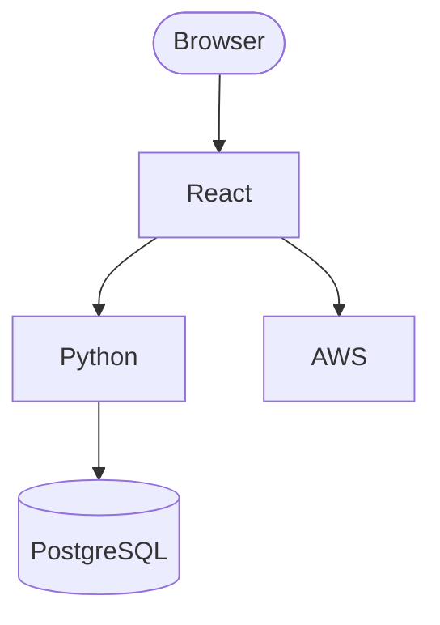

# Architecture — taskia

## Stack



## Data Model

```mermaid
erDiagram
  %% No entities defined
```

## Key Decisions

- File structure: feature-based
- Error handling: Result pattern
- Auth model: RBAC

<!-- nybo:managed-block:start v1 -->
### Dockerized local development environment (added 2026-09-14, feature: dockerize-local-env)
Local development runs via docker-compose orchestrating three services (PostgreSQL, FastAPI backend, Vite frontend) on a shared network, with source volumes mounted for hot-reload.
The backend reads DATABASE_URL to connect to the dockerized PostgreSQL service; the existing sqlite:///:memory: fallback in src/db/base.py is preserved when DATABASE_URL is unset (tests, non-Docker local runs).
The Vite dev server proxies to the backend's docker-compose service name rather than a fixed host URL.
A Makefile wraps day-to-day operations (up, down, build, logs, test, migrate) as single-invocation commands.
**Rationale:** Hoy correr la app localmente requiere un venv de Python, `npm install`, y confiar en el fallback de SQLite en memoria — nada de eso refleja producción (PostgreSQL) ni es reproducible entre máquinas. Un entorno dockerizado con comandos `make` simples baja la fricción de onboarding y acerca el desarrollo local a producción.
<!-- nybo:managed-block:end v1 -->
