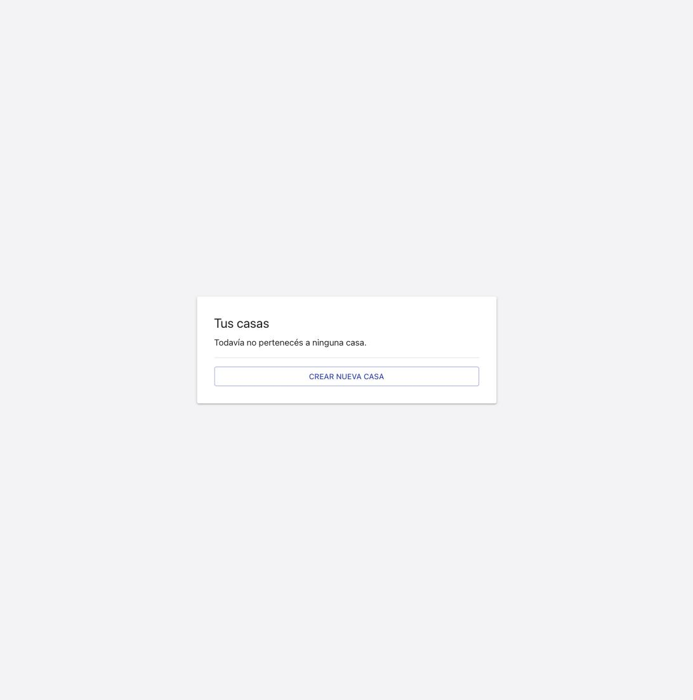

### Goal

Empaquetar el frontend React/Vite existente como app Android instalable via Capacitor, sin cambiar el comportamiento de la web actual. 4 tareas: T1 base URL de API configurable (VITE_API_BASE_URL), T2 CORS en el backend (CORS_ALLOWED_ORIGINS), T3 scaffold nativo Android via Capacitor, T4 docs + verificacion end-to-end. Compilar/correr el APK final en Android Studio queda fuera del alcance de este entorno (sin Android SDK/JDK/Gradle) — documentado como paso manual del usuario.

### Observations

- [DOMAIN candidate] tsconfig.json no incluia `"vite/client"` en `compilerOptions.types` — `import.meta.env` (usado por `apiBaseUrl.ts`, T1) no tipaba sin esto. Agregado a `types` (sin dependencia nueva, `vite` ya la trae en `node_modules/vite/client.d.ts`). Cualquier modulo futuro que lea `import.meta.env` ya queda cubierto.
[DOMAIN candidate] El servicio `backend` de docker-compose solo monta `./src` y `./tests` (no la raiz del repo) — un test que verifica archivos de raiz (`capacitor.config.ts`, `android/`, `.gitignore`) no es visible dentro del contenedor aunque matchee `pytest.ini`. `tests/integration/infra/capacitor_config.test.py` (T3) corre via `.venv/bin/python3 -m pytest` (host), no via `docker compose exec backend` — documentado explicitamente en el propio archivo de test.

### Verification

### Build
`[AUTO]` `npm run build` (`tsc --noEmit && vite build`) — sin errores. Requirio agregar `"vite/client"` a `tsconfig.json`'s `compilerOptions.types` (ver Observations) para tipar `import.meta.env` en `apiBaseUrl.ts`.

### Tests
`[AUTO]` Backend, via docker (`docker compose exec backend python -m pytest tests/`): **367 passed** (363 preexistentes + 4 nuevos de T2 en `tests/integration/api/cors.test.py`, incluyendo TC-003/TC-004). Cero regresion.

`[AUTO]` Frontend (`npm run test -- --run`, host — el Node del contenedor frontend no puede correr el flag de vitest de este repo): **139 passed** (129 preexistentes + 10 nuevos de T1: 2 en `tests/unit/frontend/apiBaseUrl.test.tsx` (TC-001/TC-002 a nivel de modulo) + 8 en `tests/unit/frontend/authClient.test.tsx` extendido (TC-001/TC-002 sobre `fetchAutenticado`/`registrar`/`login`, mas los casos de no-string/ya-absoluto)). Cero regresion.

`[AUTO]` T3 estructural (`tests/integration/infra/capacitor_config.test.py`, **5 passed**), corrido via `.venv/bin/python3 -m pytest` (host) — el servicio `backend` de docker-compose solo monta `./src`/`./tests`, no la raiz del repo (`capacitor.config.ts`, `android/`, `.gitignore`), asi que estos 5 tests fallan con `FileNotFoundError` dentro del contenedor por diseno del volumen, no por una regresion (ver Observations). Confirmado corriendo la suite completa via host (`.venv/bin/python3 -m pytest tests/`): **371 passed, 1 skipped** (el skip es preexistente — `postgres_migrations.test.py` requiere `DATABASE_URL` real, se salta fuera de docker) — 367 (docker) + 5 (host-only) = 372 tests totales de la spec, matcheando el host run.

### Coverage
No hay una herramienta de coverage configurada en el proyecto (`stack.yaml`'s `quality_tools.coverage.tool: null`) — no aplica un umbral, consistente con el resto de las specs de este repo.

### Test cases & progress
Los 6 TC de `spec.md` resuelven a tests reales:
- TC-001/TC-002 (REQ-001): `tests/unit/frontend/apiBaseUrl.test.tsx` + extension de `authClient.test.tsx`.
- TC-003/TC-004 (REQ-002): `tests/integration/api/cors.test.py`.
- TC-005/TC-006 (REQ-003/REQ-004): `tests/integration/infra/capacitor_config.test.py`.

### Manual test cases
Ninguno declarado `[MANUAL]` en spec.md — las 6 TC son automatizables ([UNIT]/[INTEGRATION]) y todas resuelven a un test real (ver arriba).

### Live evidence
`[AUTO]` Smoke combinado T1+T2 (Done When de T4) — la unica forma de probar que base URL configurable y CORS funcionan juntos, no solo por separado:
1. Build throwaway (`npx vite build --outDir dist-smoke`) con `VITE_API_BASE_URL=http://127.0.0.1:8001`.
2. Backend standalone en :8001 (`.venv/bin/python3 -m uvicorn src.api.main:app --port 8001`, sqlite en memoria) con `CORS_ALLOWED_ORIGINS=http://127.0.0.1:4173,...`.
3. `dist-smoke/` servido en :4173 (`python3 -m http.server 4173`) — origen distinto al backend, simulando el WebView de Capacitor.
4. Navegacion real via Claude in Chrome: registro de un usuario nuevo + login, ambos cross-origin. Confirmado via `read_network_requests`: `OPTIONS /auth/login` (200, preflight CORS), `POST /auth/login` (200), `GET /casas/mias` (200, con el JWT), sin errores en consola. La UI navega a la pantalla autenticada "Tus casas".
5. Screenshot: `./screenshots/t4-smoke-cors-baseurl-login.jpg`.

Cleanup: procesos de smoke terminados, `dist-smoke/` borrado, `dist/`/`android/` reconstruidos con el build default (sin `VITE_API_BASE_URL`) para que el estado commiteado de `android/` refleje el comportamiento de produccion por default, no la config del smoke.

### Judgment log
- **J001**: `tsconfig.json` no tenia `"vite/client"` en `types` — `import.meta.env` (T1) no tipaba. Agregado sin nueva dependencia (los tipos ya vienen con `vite`, ya instalado). Dentro de mi autoridad de `spec-deviation` (ajuste de config necesario para que el codigo pedido por la spec compile, no un cambio de alcance).
- **J002**: `tests/integration/infra/capacitor_config.test.py` (nombrado en `run-plan.json`) no puede correr via `docker compose exec backend` porque ese servicio no monta la raiz del repo — decidido correrlo via `.venv/bin/python3 -m pytest` (host), igual que el resto de tests de infra basados en filesystem de este repo (`tests/integration/infra/*.test.sh` tampoco corren en docker). Documentado en el propio test file y en Observations. No es una regresion ni un gap de cobertura — los 5 tests pasan, solo requieren el contexto de filesystem completo del host.
- **J003**: El smoke combinado de T4 uso un backend standalone (uvicorn directo en :8001) en vez de reconfigurar el `docker compose` backend ya corriendo en :8000 con un `CORS_ALLOWED_ORIGINS` de prueba — evita modificar `docker-compose.yml` (fuera del alcance de esta spec) o reiniciar el stack compartido de desarrollo. El comportamiento de CORS probado es identico (mismo `src/api/main.py`).

### Security
Sin cambios de superficie de seguridad mas alla de lo ya declarado en la spec (`allow_methods=["*"]`/`allow_headers=["*"]` documentado y aceptado explicitamente en `00-overview.md`'s Tradeoffs — app personal/domestica, sin datos de terceros).

### Design principles
N/A — sin cambios de UI/diseno en esta spec (empaquetado, no una feature de producto).

### Wiki alignment
`docs/android.md` (nuevo) documenta el flujo completo; `.nybo/foundation/stack.yaml`'s `dev_runbook` referencia el doc via un `run_targets` adicional, sin duplicar contenido.
