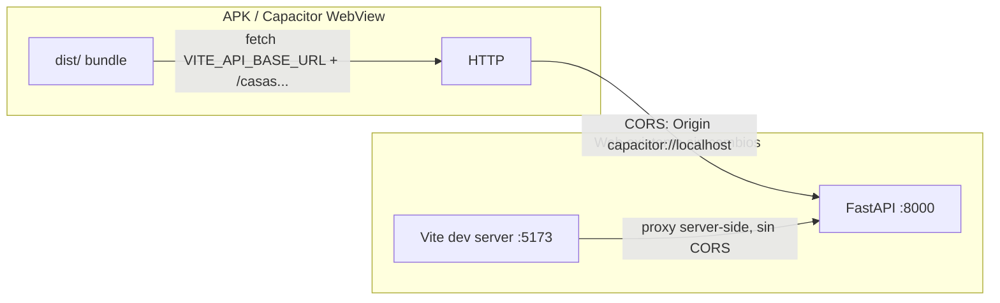

# Overview: android-capacitor-app

## Arquitectura



Los dos flujos (web vía proxy de Vite, app vía URL absoluta + CORS)
conviven sin interferirse: el proxy de Vite nunca corre dentro del APK,
y `VITE_API_BASE_URL` vacío (default) dej a la web exactamente como
está.

## T1 — Base URL de API configurable

Nuevo módulo `src/frontend/config/apiBaseUrl.ts`, mismo patrón testeable
que `apiProxyTarget.ts` (que resuelve el proxy target de Vite, un
problema análogo — no lo reutiliza directamente porque ese módulo lee
`process.env` en tiempo de build/Node, mientras este lee `import.meta.
env` en tiempo de ejecución del bundle):

```typescript
export function getApiBaseUrl(
  env: Record<string, string | undefined> = import.meta.env
): string {
  return env.VITE_API_BASE_URL || "";
}
```

`authClient.ts` es el único lugar que arma URLs de request directamente
(los ~10 clientes de API siguen pasando rutas relativas como
`${API_BASE}/${casaId}/...` sin ningún cambio — ver Tradeoffs):

- `fetchAutenticado(input, init)`: si `input` es un string que empieza
  con `/`, se le antepone `getApiBaseUrl()` antes de llamar a `fetch`.
  Con el default `""`, el resultado es exactamente `input` — cero
  cambio de comportamiento.
- Los dos `fetch("/auth/registro", ...)`/`fetch("/auth/login", ...)`
  directos (login/registro corren ANTES de tener JWT, no pasan por
  `fetchAutenticado`) reciben el mismo prefijo.

## T2 — CORS en el backend

`src/api/main.py` agrega `CORSMiddleware` de FastAPI. Orígenes
permitidos vía variable de entorno `CORS_ALLOWED_ORIGINS` (lista
separada por comas), con un default de desarrollo que cubre los
esquemas que usa Capacitor:

```python
CORS_ALLOWED_ORIGINS_DEFAULT = "capacitor://localhost,http://localhost,https://localhost"
```

`allow_credentials=True` (el JWT viaja en el header `Authorization`,
no en cookies, pero mantenerlo en `True` no rompe nada y evita tener
que revisitar esto si algún día se agrega algo cookie-based).
`allow_methods=["*"]`, `allow_headers=["*"]` — este backend no expone
nada sensible a un origen no listado explícitamente; no hay necesidad
de una política más fina todavía.

Una request sin header `Origin` (el flujo web actual, same-origin vía
el proxy de Vite) no activa ninguna lógica de CORS — `CORSMiddleware`
solo actúa sobre requests que sí traen `Origin`, así que TC-004 (cero
regresión en la suite existente) se cumple por construcción de la
librería, no por una condición nueva que haya que mantener.

## T3 — Proyecto Android + Capacitor

- `package.json`: `@capacitor/core`, `@capacitor/android`
  (`dependencies`); `@capacitor/cli` (`devDependencies`).
- `capacitor.config.ts` (raíz del repo):
  ```typescript
  import type { CapacitorConfig } from "@capacitor/cli";

  const config: CapacitorConfig = {
    appId: "com.taskia.app",
    appName: "taskia",
    webDir: "dist",
    android: {
      // Backend local/LAN sin TLS durante desarrollo — sin esto,
      // Android 9+ bloquea el tráfico HTTP plano por default.
      allowMixedContent: true,
    },
    // Modo live-reload (opcional, comentado por default): descomentar
    // y apuntar a la IP de LAN del servidor de Vite (`npm run dev --
    // -- host`) para iterar sin recompilar el APK en cada cambio.
    // server: { url: "http://<ip-de-lan>:5173", cleartext: true },
  };

  export default config;
  ```
- `npx cap add android` genera `android/` (proyecto Gradle nativo,
  commiteado — convención estándar de Capacitor, ver Tradeoffs).
- Network security config (`android/app/src/main/res/xml/network_
  security_config.xml`, referenciado desde `AndroidManifest.xml` vía
  `android:networkSecurityConfig`) permitiendo cleartext — necesario
  incluso con `allowMixedContent` en `capacitor.config.ts`, que solo
  cubre contenido mixto dentro de una página HTTPS, no una app que
  parte de `capacitor://` y llama a un backend `http://` plano.
- `.gitignore`: agregar `android/app/build/`, `android/.gradle/`,
  `android/local.properties`, `android/app/release/`, `*.keystore`,
  `*.jks` (nunca commitear una clave de firma).

## T4 — Docs + verificación

Nueva sección en `.nybo/foundation/stack.yaml`'s `dev_runbook` (o un
`docs/android.md` si el runbook no es el lugar natural para pasos
manuales largos) con la secuencia completa: build con
`VITE_API_BASE_URL` seteada a la IP de LAN del backend, `npx cap sync
android`, abrir en Android Studio, correr en emulador/dispositivo. Esta
tarea también corre la suite completa (backend + frontend) para
confirmar cero regresión en el resto de la app.

## Tradeoffs

- **Live-reload vs bundle de producción**: se deja el modo live-reload
  como bloque comentado en `capacitor.config.ts`, no como dos configs
  separadas — evita mantener dos archivos de config por una diferencia
  de 2 líneas; el costo es tener que editar el archivo a mano para
  alternar entre "compilar de verdad" y "iterar rápido".
- **`android/` commiteado**: es la convención estándar de Capacitor
  (a diferencia de `node_modules/`, el proyecto Gradle SÍ se versiona,
  solo sus artifacts de build no) — permite abrir el proyecto en
  Android Studio sin un paso de generación previo en cada clone.
- **CORS permisivo (`allow_methods=["*"]`, `allow_headers=["*"]`)**:
  aceptable para este proyecto (app personal/doméstica, sin datos de
  terceros ni superficie pública) — no se introduce una política más
  fina porque no hay ningún origen no confiable que debiera ser
  bloqueado hoy.
- **Sin backend público**: esta spec asume que la app se prueba contra
  el backend dockerizado local por IP de LAN, igual que ya es posible
  hoy para la web responsive — un backend desplegado públicamente es
  un problema aparte, fuera de alcance.
