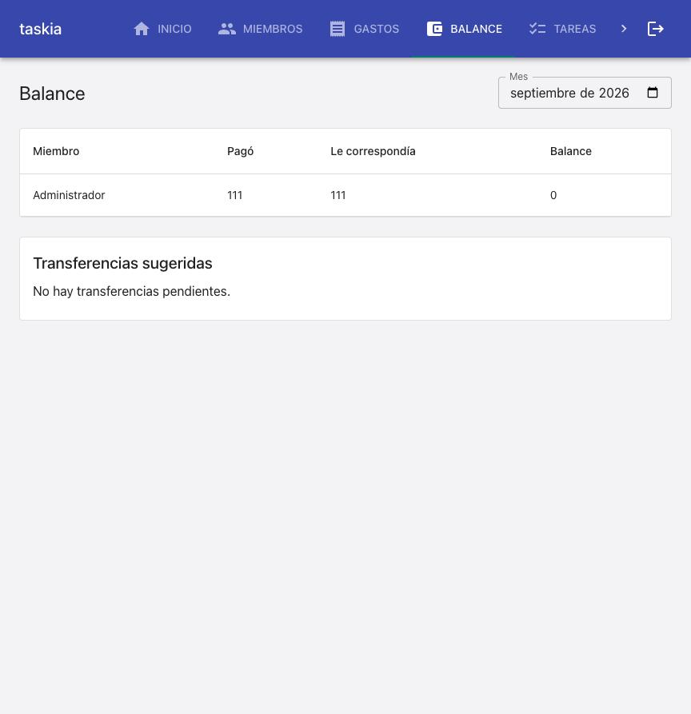
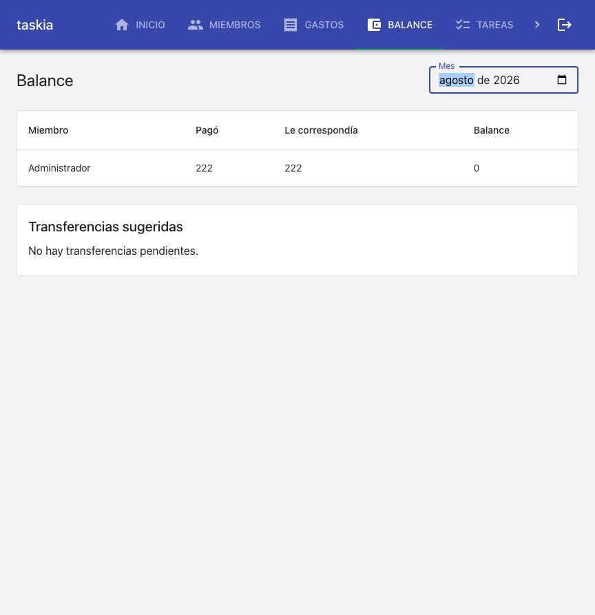

### Goal

Implementar las 3 tareas de la spec: `calcular_balance` filtra por mes con
default = mes actual (T1), la ruta HTTP y el cliente propagan el query
param `mes` (T2), y `Balance.tsx` agrega un selector de mes nativo que
refetchea al cambiar (T3).

### Judgment

- **J001** — Dos tests preexistentes en `tests/unit/services/balance_service.test.py`
  (`test_balance_pablo_mas_30000_ana_menos_30000_segun_ejemplo_del_documento`,
  `test_transferencia_sugerida_exacta_entre_deudor_y_acreedor`) fechaban
  sus gastos de prueba en enero de 2026 y llamaban a `calcular_balance(casa.id)`
  sin `mes`, asumiendo el comportamiento viejo ("todo el historial"). Con
  el nuevo default (mes calendario actual — REQ-001, cambio deliberado
  documentado en `00-overview.md`), ambos rompían porque enero ya no es
  "hoy". Se actualizaron para pasar `mes="2026-01"` explícito — preserva
  la intención original del test (verificar la matemática de agregación
  pago/correspondía/transferencias) sin depender de la fecha del sistema.
  Esto es exactamente la clase de regresión que el gate de T1
  ("`pytest tests/` completo sigue en verde") existe para atrapar.
- **J002** — El mock de fetch en `tests/unit/frontend/MuiRestyle.test.tsx`
  usaba `url.endsWith("/balance")` para reconocer la llamada a
  `obtenerBalance`. Como `Balance.tsx` ahora siempre pasa `mes` (T3), la
  URL real es `.../balance?mes=YYYY-MM` y ya no termina en `/balance`. Se
  cambió el matcher a `url.includes("/balance")` — el resto del test
  (verificar que los controles son de Material UI) no depende de la
  fecha del sistema y sigue intacto.

### Observations

- `dashboard_service.armar_dashboard` en efecto no necesitó ningún
  cambio: sigue llamando `calcular_balance(casa_id)` sin `mes` y hereda
  el nuevo default (mes actual) automáticamente, confirmado tanto por
  test (`test_dashboard_service_no_rompe_con_el_nuevo_default`) como en
  vivo (la card "Balance" del dashboard mostró el balance neto del mes
  actual sin cambios de código).

### Verification

- `.venv/bin/python3 -m pytest tests/` — 147 passed (140 baseline + 5
  nuevos en `balance_mensual.test.py` [T1] + 2 nuevos en
  `gastos_routes.test.py` [T2]).
- `npm run test -- --run` (vitest) — 70 passed (67 baseline + 3 nuevos en
  `Balance.test.tsx` [T3]).
- `npm run build` — `tsc --noEmit` + `vite build` sin errores de tipos.
- `npm run lint` — `eslint src/frontend` limpio.
- Coverage: sin tool de cobertura configurado en este proyecto
  (`stack.yaml` → `quality_tools.coverage.tool: null`) — gap preexistente,
  no introducido por esta spec. Ver Suggestions [S001].

**Live smoke check** (docker-compose local, ya estaba levantado 20hs —
no se reinició; backend con `--reload` recogió el código nuevo sin
restart manual). Escenario pedido: un gasto de este mes y uno del mes
anterior, confirmar que el balance sin `mes` (default) solo refleja el
de este mes.

1. Registrado un Usuario real (`smoke-balance-mensual@example.com`) vía
   `POST /auth/registro`, creada una Casa real vía `POST /casas` — sin
   fixtures ni mocks, todo contra el backend real en `:8000`.
2. Registrados 2 gastos reales vía `POST /casas/{id}/gastos`: uno con
   `fecha` = hoy (2026-09-15, $111), otro con `fecha` = 2026-08-31
   ($222).
3. `GET /casas/{id}/balance` (sin `mes`) → refleja únicamente el gasto de
   $111 (TC-001 en vivo). `GET .../balance?mes=2026-08` → refleja
   únicamente el de $222 (TC-002 en vivo). `GET .../balance?mes=fecha-invalida`
   → `400` (TC-003 en vivo).
4. Confirmado también en el navegador (`:5173`, login real como el
   Usuario de smoke): la pantalla Balance carga con el selector de mes
   preseleccionado en "septiembre de 2026" y la tabla muestra Pagó/Le
   correspondía = 111 (TC-004 en vivo). 
5. Cambiando el selector a "agosto de 2026", la tabla se refresca sin
   recargar la página y pasa a mostrar 222 — confirma que el cambio de
   selector dispara una nueva consulta al backend con ese mes (TC-005 en
   vivo). 
6. El dashboard (`INICIO`) se revisó en la misma sesión: la card
   "Balance" sigue mostrando el balance neto sin selector (sin cambios,
   como documenta `00-overview.md`) — confirma que
   `dashboard_service.armar_dashboard` no se rompió con el nuevo default.

### Curation

- `.nybo/memory/domains/services.md`: sin cambios estructurales — el
  patrón "un parámetro de filtro con default resuelto server-side"
  encaja en el estilo ya documentado de `balance_service`/servicios de
  agregación; no amerita una entrada nueva de convención.
- No se crearon dominios nuevos ni ADRs — el cambio es una extensión
  contenida de `services`/`frontend`, ya cubiertos.
