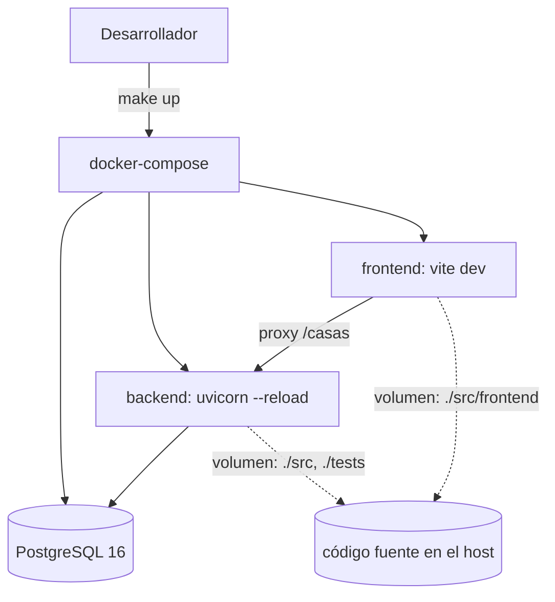

# Dockerizar el Entorno Local — Solution Overview

## File Index
- [spec.md](../spec.md)
- [10-verify.md](10-verify.md)
- [99-progress.md](99-progress.md)

### Task Index
| Task | File | Description | Dependencies |
|---|---|---|---|
| T1 | [01-plan-01-backend-dockerfile.md](01-plan-01-backend-dockerfile.md) | Dockerfile backend + DATABASE_URL + compatibilidad Postgres | — |
| T2 | [01-plan-02-frontend-dockerfile.md](01-plan-02-frontend-dockerfile.md) | Dockerfile frontend (Vite dev, hot-reload) + proxy env-aware | — |
| T3 | [01-plan-03-docker-compose.md](01-plan-03-docker-compose.md) | docker-compose.yml: db + backend + frontend, red, healthcheck | T1, T2 |
| T4 | [01-plan-04-makefile.md](01-plan-04-makefile.md) | Makefile + .env.example + docs de uso local | T3 |

## Problem & Solution
- Correr taskia localmente hoy requiere un venv de Python y `npm install` manuales, y usa SQLite en memoria (no refleja producción).
- Se agregan dos `Dockerfile` (backend, frontend) y un `docker-compose.yml` que orquesta ambos más un servicio `db` (PostgreSQL 16), en una red común, con volúmenes montando el código fuente para hot-reload en los dos lados.
- `DATABASE_URL` se inyecta solo dentro de Docker; `src/db/base.py` no cambia su fallback a `sqlite:///:memory:`.
- Un Makefile envuelve los comandos de `docker compose` más usados para que nadie necesite memorizar su sintaxis.

## Architecture

## UX/UI
Ninguna pantalla nueva — este spec es infraestructura de desarrollo, no producto.

## Tradeoffs
- Frontend en modo dev (Vite + hot-reload) en vez de build de producción servido por nginx — decisión ya tomada con el usuario: prioriza velocidad de iteración sobre fidelidad a producción para este entorno local.
- PostgreSQL en vez de SQLite en el contenedor — decisión ya tomada: prioriza paridad con producción (stack.yaml ya declara PostgreSQL) sobre la simplicidad de no orquestar una base aparte. El fallback SQLite de los tests no se toca.
- Los volúmenes montan el código fuente completo (no solo `dist`/build) para que el hot-reload de ambos servicios funcione sin reconstruir la imagen en cada cambio.

## API/Data Contracts
Ninguno nuevo — este spec no agrega ni cambia endpoints, solo el entorno de ejecución.

## Service Integrations
- **PostgreSQL 16** (imagen oficial `postgres:16-alpine`), como servicio `db` de `docker-compose`, reemplazando el fallback SQLite solo dentro de este entorno.
