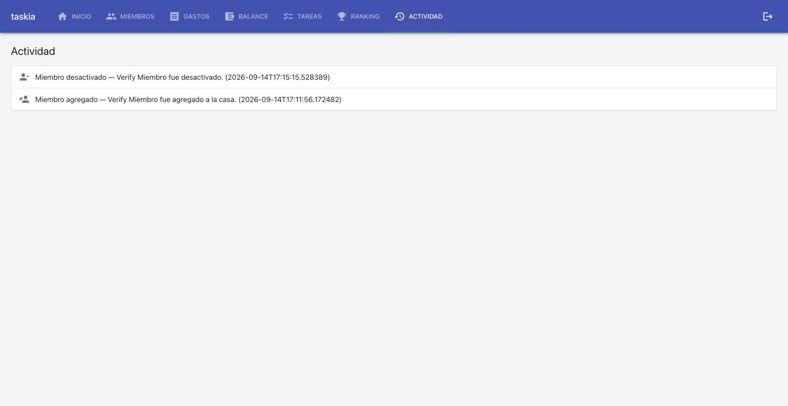

### Judgment

- **[deviation]** Live smoke check (API level, TC-002) against the already-running docker-compose Postgres found `psycopg2.errors.InvalidTextRepresentation: invalid input value for enum tipoactividadenum: "MIEMBRO_DESACTIVADO"` — the persisted Postgres volume's native enum type predates this fix and `0004_historial_actividad`'s `create_all` never retrofits an existing type. This is exactly the Open Item the spec's own Tradeoffs section (`00-overview.md`) already flagged for "un entorno con datos ya persistidos" — but it wasn't only a production concern, it hit this project's own local dev docker environment immediately. Added migration `0006_miembro_desactivado_enum_value.py` (`ALTER TYPE tipoactividadenum ADD VALUE IF NOT EXISTS 'MIEMBRO_DESACTIVADO'`, AUTOCOMMIT, no-op on non-Postgres dialects) and registered it in `src/db/migrate.py`. In-scope, within L2 authority (spec-deviation, conservative/recommended option — an additive, idempotent, non-destructive migration rather than skipping the live check or leaving a documented-but-unresolved gap). Verified against a real ephemeral Postgres via a new regression test (`tests/integration/db/postgres_migrations.test.py::test_migracion_0006_agrega_miembro_desactivado_a_un_enum_ya_existente`) that recreates the pre-fix enum state and confirms the insert now succeeds.
- **[settled-decision]** First attempt at the migration used the enum member's `.value` (`'miembro_desactivado'`, lowercase) as the Postgres enum label to add, which is wrong — SQLAlchemy's `Enum(TipoActividadEnum)` stores the member's `.name` (`MIEMBRO_DESACTIVADO`, uppercase), confirmed by the original error message itself and by inspecting `pg_enum` directly against the running container. Corrected before landing. The incorrect lowercase label (`miembro_desactivado`) is now permanently and harmlessly stuck in the local dev container's enum type (Postgres enums can't drop a value) — cosmetic only, never referenced by any code path.
- **[settled-decision]** Coverage: `stack.yaml`'s `quality_tools.coverage.tool` is `null` (deliberate "none chosen"), so coverage is recorded `unavailable — not configured` per the standing guardrail, not re-litigated. Added the missing `testing.coverage_threshold: 80` default to `.nybo/nybo.config.yaml` (was absent) — a plain config write, not a dependency decision.
- **[settled-decision]** Integration tests step: `stack.yaml` has no dedicated `testing.integration` probe/command configured. This project's own established convention already runs `[INTEGRATION]`-tagged cases (TC-001/002/003) through the same unified `pytest tests/` invocation (in-memory SQLite fixtures, no live external environment) — treated as proven via that run rather than as `unproven — env unavailable`, since the actual test files exist and pass. Recommend `/nybo-brownfield-bootstrap --quality` if a project wants a separately-configured integration harness distinct from this convention.

### Observations

- `[NEW CONVENTION candidate]` A Postgres native enum column (`sqlalchemy.Enum(SomeEnum)`) stores the Python enum member's .name (uppercase), not .value — adding a new member to TipoActividadEnum (or any similar native-enum-backed model) in a persisted-data environment requires a companion ALTER TYPE ... ADD VALUE IF NOT EXISTS '<MEMBER_NAME>' migration, or the value is dead in any environment where the table already existed before the enum grew. sqlite-backed tests never catch this since the table is always freshly created from current models.
- `[CONFIRMS]` The hook-after-commit pattern (registrar_actividad called only after the business operation's own commit) held up exactly as gasto_service/tarea_service already established — no activity entry was created on any rejected agregar_miembro/desactivar_miembro attempt (TC-003).
- `[SKILL candidate]` The live-evidence step this cycle found a real production-shaped bug (stale Postgres native enum type in a persisted dev volume) that no test suite using sqlite in-memory fixtures could ever catch — worth remembering as a standing reason to keep the mandatory live-smoke-check guardrail even on a fix that 'obviously' only touches already-tested service code.

### Verification

**Checklist**

- [x] Build: pass (0 warnings) — `npm run build` (`tsc --noEmit` + `vite build`)
- [x] Tests: 193/193 passing (0 failed) — 135 backend (`pytest tests/`, includes 1 new regression test) + 58 frontend (`vitest run`)
- [x] Integration tests: 3/3 `[INTEGRATION]` cases proven · pass — TC-001/002/003 run via this project's unified `pytest tests/` (in-memory SQLite fixtures); `stack.yaml` has no separately-configured `testing.integration` harness, so this project's own established convention (unit+integration in one suite) is what proves them
- [x] Coverage: unavailable — not configured (`stack.yaml`'s `quality_tools.coverage.tool: null`, a deliberate prior choice; not re-litigated). `testing.coverage_threshold: 80` added to `nybo.config.yaml` (was missing) for future runs.
- [x] Test cases & progress: 2/2 tasks done, 4/4 automatable test cases covered — TC-001 `[INTEGRATION]`, TC-002 `[INTEGRATION]`, TC-003 `[INTEGRATION]`, TC-004 `[UNIT]`. No gaps.
- [x] `[E2E]` / `[MANUAL]` test cases: none in this spec.
- [x] Live evidence — **screen: observed · api: observed**. Drove the full live route against the project's own already-up docker-compose environment (backend `localhost:8000`, frontend `localhost:5173`, real Postgres): registered 2 users, created a casa, added a member (TC-001 -> API 201 + `miembro_agregado` activity entry), deactivated that member (TC-002 -> API 200 + `miembro_desactivado` activity entry), and confirmed both entries render on the "Actividad" screen with their own icon/label and correct reverse-chronological order, zero browser console errors. First deactivation attempt hit a real environment bug (see Judgment) — fixed, then re-observed successfully. Screenshot: 
- [x] Judgment log: 4 entries reviewed (this cycle's own — execute and verify ran in the same pass), 4 confirmed, 0 overturned.
- [x] Security: not run — no security-scan tool configured (`quality_tools.security.tool: null`); out of scope for this fix.
- [x] Design principles: no violations — reuses the existing `registrar_actividad` hook-after-commit pattern from `gasto_service`/`tarea_service` unchanged.
- [x] Wiki alignment: n/a — project has no `wiki/` directory.

**Fixed during verify**
- Discovered via the mandatory live-evidence smoke check: the docker-compose dev Postgres's native `tipoactividadenum` type predates this fix and doesn't accept `MIEMBRO_DESACTIVADO` in any environment where `historial_actividad` already existed. Added `src/db/migrations/0006_miembro_desactivado_enum_value.py` (`ALTER TYPE ... ADD VALUE IF NOT EXISTS`, AUTOCOMMIT, no-op outside Postgres), registered it in `src/db/migrate.py`, and added a regression test reproducing the pre-fix state (`tests/integration/db/postgres_migrations.test.py`).
- Added missing `testing.coverage_threshold: 80` default to `.nybo/nybo.config.yaml`.

**Overall verdict: verified.**

### Curation

Curated 5 findings: 2 conventions/gotchas (`[DB-01]` db.md Gotcha — Postgres native enum requires a companion `ALTER TYPE ADD VALUE` migration for a persisted-data environment, uses `.name` not `.value`; `[SERV-01]` services.md Convention — activity-log hook fires only after the triggering operation's own commit), 1 foundation gap fix (`stack.yaml`'s `dev_runbook.subprojects[].run_targets`/`test_commands`/`smoke`/`auth` were empty/`found: false` despite `infra.md` already documenting `make up` — backfilled from what this cycle's own live smoke check actually ran and confirmed), 0 architecture-fact writes (routine bug fix inside already-documented architecture — no new component/boundary/integration), 2 no-action (the `[SKILL candidate]` Observations note is process commentary about nybo's own verify guardrail, not an extractable project pattern; the `[CONFIRMS]` Observations note about the hook-after-commit pattern is folded directly into `[SERV-01]` rather than a separate write). 0 decisions.yaml entries — no critical/breaking or genuinely-open trade-off surfaced this cycle. `nybo validate --phase foundation`: clean.
