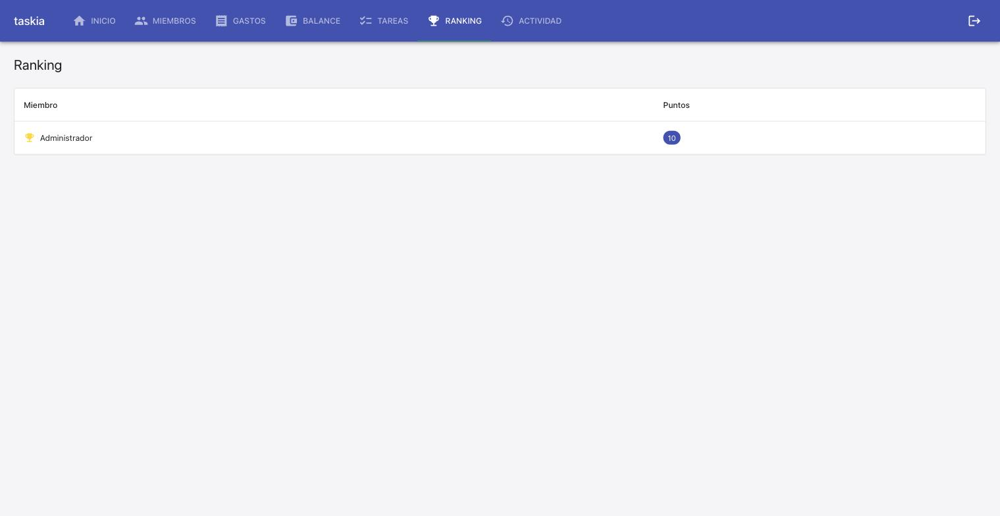
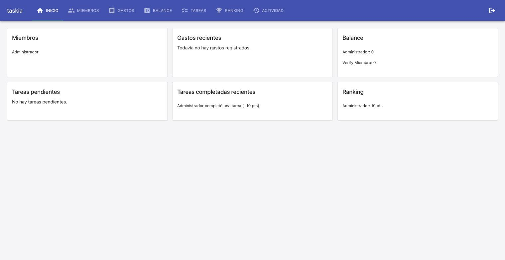

### Judgment

- **J001** [spec-deviation, settled at L2] While driving the live smoke check, found a third raw-UUID leak the spec text did not name: InicioCasa's own inline "Ranking" card (`entrada.miembroId` in the dashboard summary, distinct from the full `/ranking` page). Same root cause, same fix pattern already added to this file (`nombreDe`) — fixed it too (TDD: added a failing InicioCasa test, then applied the one-line fix). Kept in scope since it directly serves the spec's stated Outcome ("Ranking y dashboard muestran nombres, no UUIDs") even though the literal Requirements table only named two of the three spots.
- **J002** [environment-blocker path, resolved] No `dev_runbook`/`quality_tools.coverage` recorded for the live smoke check or coverage. Ran bounded discovery: found `make up` (docker compose: Postgres+FastAPI:8000+Vite:5173) documented in README/Makefile — wrote it to `.nybo/memory/domains/testing.md` (TEST-01) and `.nybo/foundation/stack.yaml`'s `dev_runbook.run_targets`/`auth`, then used it to drive the live smoke check (Branch A thereafter). Coverage stayed `unavailable — not configured` (`quality_tools.coverage.tool: null` is a recorded human decision, not re-litigated) — recommend `/nybo-brownfield-bootstrap --quality` before the next build.

### Observations

- `[CONFIRMS]` The `miembros.find((m) => m.id === id)?.nombre ?? id` name-resolution pattern (established in `Gastos.tsx`/`Balance.tsx`) generalizes cleanly to a third and fourth call site (`Ranking.tsx`, `InicioCasa.tsx` — both its "Tareas completadas recientes" and inline "Ranking" card). Any screen rendering a `miembroId`/`miembro_id` should resolve it this way rather than showing the raw id.
- `[NOTE]` Discovered and recorded this project's live dev-runbook (`make up` — docker compose: Postgres + FastAPI :8000 + Vite :5173, no seeded test users) into `.nybo/memory/domains/testing.md` (TEST-01) and `.nybo/foundation/stack.yaml`'s `dev_runbook`, since neither existed before this cycle.

### Verification

**Feature:** fix-nombres-miembro-ranking-dashboard-2026-09-14

- [x] Build: pass (0 warnings)
- [x] Tests: 61/61 passing (0 failed) — 57 pre-existing + 4 new (TC-001, TC-002, TC-003, plus one deviation test for InicioCasa's inline Ranking card)
- [x] Integration tests: not configured — `testing.integration` absent from `.nybo/foundation/stack.yaml`; remedy: `/nybo-brownfield-bootstrap --quality`
- [x] Coverage: unavailable — not configured (`quality_tools.coverage.tool: null`, a recorded human decision) — threshold 80%; remedy: `/nybo-brownfield-bootstrap --quality`
- [x] Test cases & progress: 1/1 tasks done, 3/3 automatable test cases covered — `[UNIT]` TC-001, TC-002, TC-003 (no gaps)
- [x] `[E2E]` / `[MANUAL]` test cases: none in this spec
- [x] Live evidence — screen: **observed**. Route driven: registered a user via `POST /auth/registro`, logged in through the Login screen, opened the pre-existing "Casa Verify" casa, created a task ("Sacar la basura", 10 pts, responsable "Administrador") in Tareas, marked it completed, then viewed Ranking and Inicio. Ranking page shows "Administrador" (not the UUID) with 10 pts. Inicio's "Tareas completadas recientes" shows "Administrador completó una tarea (+10 pts)". Inicio's own inline "Ranking" card (an in-scope deviation fix, see Judgment J001) shows "Administrador: 10 pts". Environment: `make up` (docker compose: Postgres + FastAPI :8000 + Vite :5173), discovered and recorded this cycle (Judgment J002). Screenshots: , . api: n/a — outcome is not an API-level fact (pure client-side presentation).
- [x] Judgment log: 2 entries reviewed (J001, J002), 2 confirmed, 0 overturned
- [ ] Security: not run this cycle (pure client-side presentation change, no new attack surface)
- [x] Design principles: no violation — reuses the existing `nombreDe`/nullish-fallback pattern already established in `Gastos.tsx`/`Balance.tsx`, no new abstraction introduced
- [x] Wiki alignment: no user-visible capability change (bugfix only), nothing to sync

### Fixed during verify
- none — all fixes (including the InicioCasa inline-Ranking-card deviation) were made during execute/TDD, before this verify pass ran

Note: no quality tools configured for this project (coverage/integration) — run `nybo-brownfield-bootstrap --quality` to enable full `/nybo-ship` quality-report coverage.

### Curation

**Feature:** fix-nombres-miembro-ranking-dashboard-2026-09-14 (in-loop, silent — BUILD cycle 1)

- **New convention** — `frontend.md` `[FRON-01]`: the `lista.find(...)?.nombre ?? id` name-resolution pattern (nullish fallback), now instantiated in 4 places (`Gastos.tsx`, `Balance.tsx`, `Ranking.tsx`, `InicioCasa.tsx`). Applied directly.
- **Foundation gap** (×2, already applied live during the verify pass so the smoke check could run): `.nybo/memory/domains/testing.md` created (`[TEST-01]` — `make up` dev-runbook/auth recipe); `.nybo/foundation/stack.yaml`'s `dev_runbook.run_targets`/`auth` filled in. Both logged here for the record.
- **Architecture skim:** concluded "nothing core changed" — pure client-side presentation fix, no new component/service boundary, no data-flow/trust-boundary change. No `architecture.md` write.
- **No action:** `conventions.yaml`/`design-principles.yaml`/`security.yaml`/`code-practice.yml` — none relevant to this change; nothing to reconcile.
- **Decisions:** none newly deferred this pass (D001, coverage/integration tooling, was already recorded during verify).

Curated 4 findings: 1 convention, 0 gotchas, 0 stale-reference fixes, 0 foundation-deviation reconciliations, 0 patches, 0 skill candidates, 0 deprecations, 0 architecture-fact writes, 0 Observations notes (already written during verify), 0 new decisions.yaml entries, 1 no-action (reason given).
