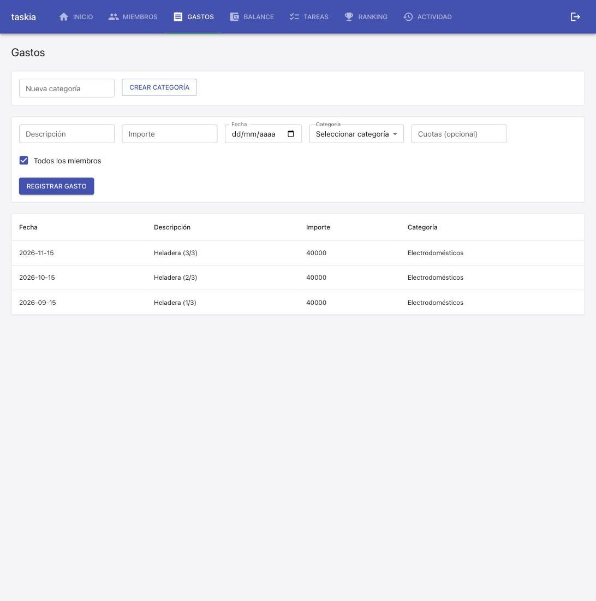
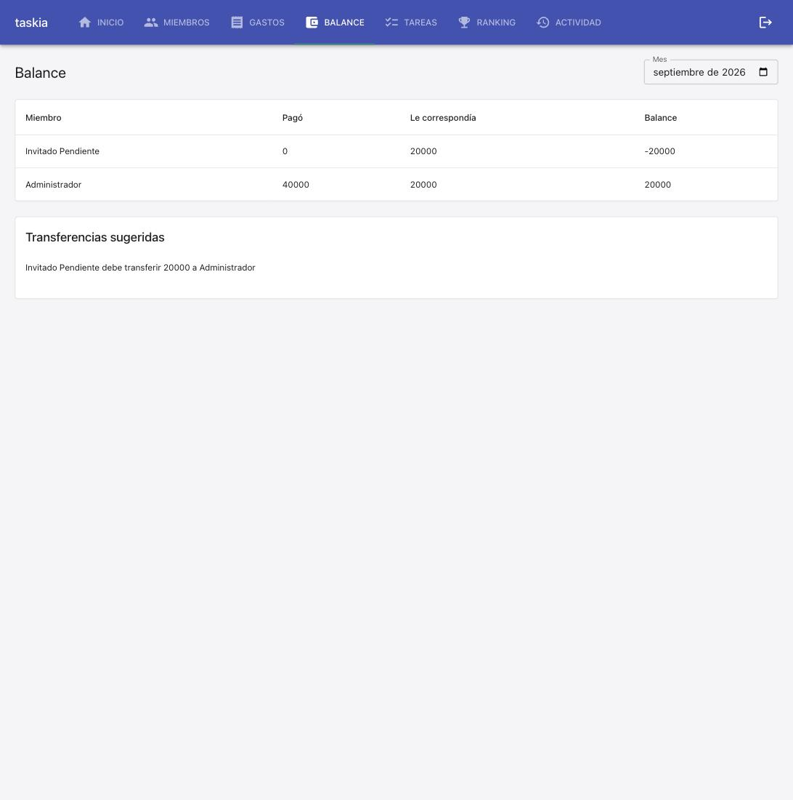
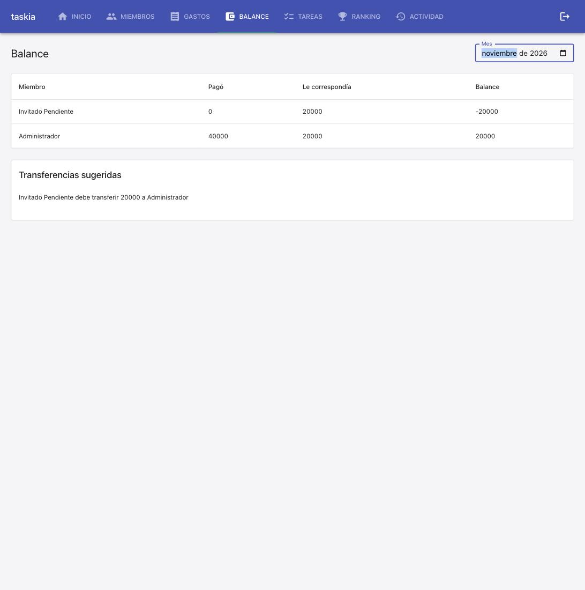

### Goal

Implementar el registro de un gasto en cuotas: al cargar un gasto, poder indicar cuotas>=2 para generar esa cantidad de gastos mensuales consecutivos, compartiendo un identificador de grupo, sin alterar el comportamiento existente de un gasto sin cuotas (spec gastos-en-cuotas, 4 tareas: modelo+migracion, servicio, API, frontend).

### Judgment

- **J001** spec.md REQ-003 dice explícitamente que `cuotas` "ausente/1" se comporta igual que hoy, mientras que REQ-004 solo rechaza "0 o negativo" — pero el task file 01-plan-02 describe la validación como "cuotas >= 2 (ValidationError si no)", lo que rechazaría cuotas=1. Prioricé spec.md (fuente de verdad de Requirements/Test Cases) sobre la redacción del task file: `cuotas=1` toma exactamente el mismo camino de código que `cuotas=None` (sin cuota_grupo_id/numero/total, sin sufijo en la descripción); solo 0 o negativo son rechazados. Agregué 2 tests de regresión (cuotas=1, cuotas negativo) además de las 7 TC de la spec para dejar esta interpretación explícita y protegida.
- **J002** Confirmé el próximo número de migración leyendo `_MIGRACIONES` en `src/db/migrate.py` en vez de asumir `0008` a ciegas — `invitar-miembro-pendiente` ya había mergeado `0007_miembro_email_invitacion`, así que `0008_gasto_cuotas` es efectivamente el siguiente libre. Verificado corriendo `postgres_migrations.test.py` contra el Postgres real de docker-compose (3/3 tests, incluida la corrida idempotente x2).

### Observations

- El patrón "vacío -> undefined, nunca 0/1 por default" ya establecido en `fix-validacion-puntos-tarea` (Tareas.tsx, campo puntos) se reutilizó sin modificaciones para el campo Cuotas de Gastos.tsx — confirma que ese patrón ya es una convención estable del proyecto para campos numéricos opcionales en formularios, aplicable más allá de la spec donde se originó.
- Reconfirmado (segunda vez, spec anterior `invitar-miembro-pendiente` [S002] ya lo había reportado): `nybo results write`/`set` sobrescribió/truncó contenido ya escrito de `### Judgment`/`### Observations` al hacer llamadas sucesivas — el frontmatter (`judgment.entries`, `observations.entries`) quedó correcto pero el body perdió texto. Corregido a mano editando el archivo directamente; documentado de nuevo en Suggestions [S002] de esta spec, referenciando el reporte original.

### Verification

- `.venv/bin/python3 -m pytest tests/` — 165 passed, 1 skipped (154 baseline
  + 9 nuevos en `gasto_cuotas.test.py` [T2] + 3 nuevos en
  `gastos_routes.test.py` [T3]; el 1 skip preexistente es
  `test_dsn_externa_nunca_se_toca_directamente`, que requiere
  `DATABASE_URL` apuntando a Postgres — se corrió aparte, ver abajo).
- `npm run test -- --run` (vitest) — 74 passed (72 baseline + 2 nuevos en
  `Gastos.test.tsx` [T4], cubriendo TC-007 y el caso "cuotas vacío no
  envía la clave").
- `npm run build` — `tsc --noEmit` + `vite build` sin errores de tipos.
- `npm run lint` — `eslint src/frontend` limpio.
- Migración `0008_gasto_cuotas` verificada contra Postgres real (docker
  compose): `docker compose exec backend python3 -m pytest
  tests/integration/db/postgres_migrations.test.py` — 3/3 passed,
  incluida la corrida idempotente de `run_migrations` dos veces seguidas.
- Coverage: sin tool de cobertura configurado en este proyecto
  (`stack.yaml` → `quality_tools.coverage.tool: null`) — gap
  preexistente, no introducido por esta spec (ver `balance-mensual`
  Suggestions [S001]).

**Live smoke check** (docker-compose local, ya estaba levantado 21hs —
no se reinició; backend con `--reload` recogió el código nuevo y volvió
a correr `run_migrations` en cada restart automático, incluida la 0008).
Escenario pedido: registrar un gasto real en 3 cuotas desde la UI,
confirmar 3 gastos en el historial con fechas/descripciones correctas,
confirmar que el balance de este mes solo refleja la primera.

1. Casa real ya existente de un smoke anterior (`Casa Smoke Test`), sin
   categorías ni gastos propios — se creó la categoría "Electrodomésticos"
   real vía el formulario "Nueva categoría".
2. Registrado un gasto real vía el formulario "Nuevo gasto": descripción
   "Heladera", importe 120000, fecha 15/09/2026, categoría
   "Electrodomésticos", campo "Cuotas (opcional)" = 3 — apareció el texto
   de ayuda "Se van a crear 3 gastos, uno por mes." antes de enviar.
3. Tras "Registrar gasto", el historial mostró exactamente 3 filas:
   "Heladera (1/3)" $40.000 en 2026-09-15, "Heladera (2/3)" $40.000 en
   2026-10-15, "Heladera (3/3)" $40.000 en 2026-11-15 (TC-001/TC-003 en
   vivo). 
4. Pantalla Balance, mes por defecto (septiembre de 2026): Administrador
   "Pagó" = 40000 — únicamente la primera cuota, no el total de $120.000
   (TC-006 en vivo). 
5. Cambiando el selector de mes a diciembre de 2026 (sin cuotas en ese
   mes) el balance vuelve a 0 — confirma que el filtro por mes realmente
   re-consulta al backend en vez de mostrar un valor cacheado. Cambiando
   a noviembre de 2026, Administrador "Pagó" = 40000 nuevamente — la
   tercera cuota, en su propio mes (TC-006 en vivo, el "dentro de 2
   meses" pedido). 

### Curation

- `.nybo/memory/domains/services.md`: agregada `[SERVP-02]` — aritmética
  de meses con stdlib (`calendar.monthrange`), nunca `python-dateutil`.
  Es la segunda vez independiente que el proyecto usa esta técnica
  (`balance_service._rango_mes` fue la primera, sin convención
  documentada) — cruza el umbral de "visto dos veces" que justifica
  registrarlo como patrón reutilizable.
- `.nybo/memory/domains/frontend.md`: sin cambios — el patrón "vacío ->
  undefined" reutilizado por T4 ya está documentado (gotcha de
  `fix-validacion-puntos-tarea-2026-09-14`); no amerita una entrada
  nueva, solo confirma que sigue vigente.
- No se crearon dominios nuevos ni ADRs — el cambio es una extensión
  contenida de `db`/`services`/`frontend`, ya cubiertos.
