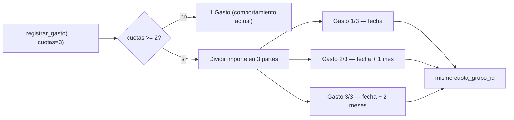

# Solution Overview — Registrar un gasto en cuotas

## File Index
- [../spec.md](../spec.md)
- [10-verify.md](10-verify.md)
- [99-progress.md](99-progress.md)

### Task Index

| Task | File | Description | Dependencies |
|---|---|---|---|
| T1 | [01-plan-01-columnas-cuota.md](01-plan-01-columnas-cuota.md) | `Gasto` guarda grupo/número/total de cuota; migración | — |
| T2 | [01-plan-02-registrar-gasto-en-cuotas.md](01-plan-02-registrar-gasto-en-cuotas.md) | `registrar_gasto` genera N gastos cuando `cuotas` ≥ 2 | T1 |
| T3 | [01-plan-03-api-cuotas.md](01-plan-03-api-cuotas.md) | `GastoCreate`/ruta exponen `cuotas` | T2 |
| T4 | [01-plan-04-frontend-cuotas.md](01-plan-04-frontend-cuotas.md) | `Gastos.tsx` ofrece cargar en cuotas | T3 |

## Problema y solución
`registrar_gasto` hoy crea siempre exactamente un `Gasto`. Se extiende
con un parámetro `cuotas: Optional[int] = None` — cuando es ≥ 2, la
función divide `importe` en `cuotas` partes (reutilizando
`_dividir_importe`, ya usado para repartir entre participantes, con la
misma lógica de ajuste de redondeo) y crea una fila `Gasto` por parte,
con fechas consecutivas mes a mes. Cada cuota es un `Gasto` normal en
todo sentido — mismo `categoria_id`, mismos participantes/reparto,
mismo hook de actividad — la única diferencia es que hay `cuotas` de
ellos en vez de uno solo, vinculados por un identificador de grupo.

## Arquitectura
Sin componentes nuevos — extiende el modelo `Gasto` (T1) y la función
`registrar_gasto` ya existente (T2). No se toca `balance_service`
(ya lo resuelve `balance-mensual`, dependencia externa de esta spec) ni
`dashboard_service`.

## Data Model
- `Gasto.cuota_grupo_id: Optional[GUID]` — compartido entre todas las
  cuotas de una misma compra; `NULL` para un gasto sin cuotas.
- `Gasto.cuota_numero: Optional[int]`, `Gasto.cuota_total: Optional[int]`
  — ambos `NULL` juntos para un gasto sin cuotas, ambos poblados juntos
  para una cuota (`cuota_numero` entre 1 y `cuota_total`).
- Migración `0008_gasto_cuotas.py` — aditiva, mismo patrón que `0006`/`0007`.

## Tradeoffs
- **La respuesta de `POST /casas/{id}/gastos` sigue devolviendo un solo
  `Gasto` (la primera cuota) en vez de la lista completa** — el
  frontend ya vuelve a pedir el listado completo (`cargar()`) después
  de crear, así que devolver las N cuotas en la respuesta del POST no
  aporta nada que el refresco no muestre ya, y evita cambiar la forma
  de respuesta de un endpoint ya usado por otras pantallas
  (`InicioCasa`, que también llama a `registrarGasto` indirectamente a
  través del mismo contrato).
- **Sumar meses sin agregar una dependencia nueva**: se calcula a mano
  (`year`/`month`/`calendar.monthrange` para el día, sin `dateutil`) —
  el proyecto no tiene esa dependencia hoy y el cálculo es acotado.

## API/Data Contracts
- `GastoCreate` (`src/api/routes/gastos.py`): agrega `cuotas: Optional[int] = None`.
- `GastoOut`: agrega `cuota_grupo_id`, `cuota_numero`, `cuota_total`
  (todos `Optional`, `None` para un gasto sin cuotas) — aditivo.
- `NuevoGasto` (`gastosClient.ts`): agrega `cuotas?: number`.
