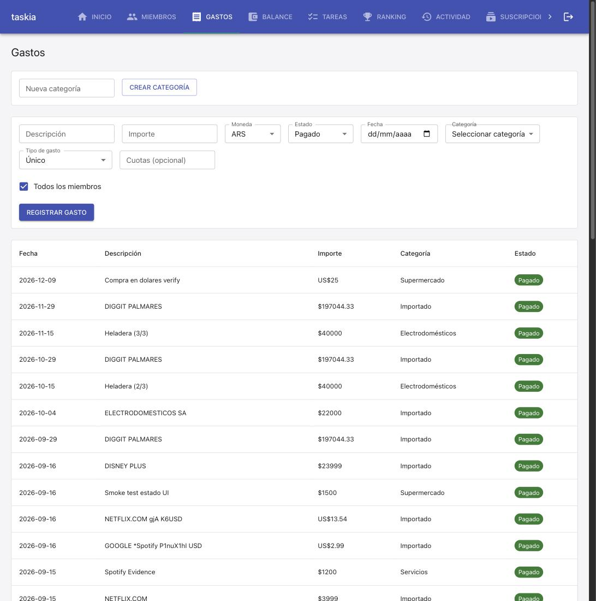

### Goal

Implementar el spec gastos-estado-pago: columna estado en Gasto (pagado default / a_pagar), propagacion en registrar_gasto/_crear_gastos_en_cuotas/registrar_gasto_cuotas_restantes, estado="a_pagar" explicito en los generadores automaticos (suscripcion_service, resumen_importer_service), nueva actualizar_estado_gasto, endpoint PATCH /casas/{casa_id}/gastos/{gasto_id}, y UI (selector Estado + chip clickeable) en Gastos.tsx. TC-001 a TC-010.

### Observations

- [FRON-02 candidate] Un select nativo (<Select native>) cuyas opciones incluyen texto que tambien aparece en un chip/label en otra parte de la misma pantalla (aca: 'A pagar' como <option> del selector Estado, y como texto del Chip en el listado) puede ambiguar consultas de test por texto (screen.findByText). Los tests de Gastos.test.tsx para TC-010 tuvieron que apuntar al chip via getByRole('button', {name: ...}) en vez de findByText — vale la pena documentar como convencion de testing para cualquier pantalla futura con la misma forma (un selector y una visualizacion que comparten las mismas etiquetas).

### Verification

### Build
- `npm run build` (tsc --noEmit && vite build): OK, sin errores.

### Tests
- Backend: `.venv/bin/python3 -m pytest tests/` -> 260 passed, 1 skipped (skip preexistente, no relacionado con esta spec: `test_dsn_externa_nunca_se_toca_directamente`, requiere `DATABASE_URL` apuntando a Postgres real fuera del contenedor).
- Frontend: `npm run test -- --run` -> 97 passed (18 archivos), incluye 16 tests en `Gastos.test.tsx` (6 nuevos/actualizados para TC-009/TC-010 y la propagacion de `estado`).
- Lint: `npm run lint` -> sin errores.

### Coverage
- Sin herramienta de coverage configurada en `stack.yaml` (`quality_tools.coverage.tool: null`) -- no hay umbral automatizable que aplicar; cada TC-xxx automatable resuelve a un test real (ver abajo), que es el gate duro efectivamente disponible.

### Test cases & progress
- `[TC-001]` PASS -- `tests/integration/services/gasto_estado.test.py::test_tc001_gasto_sin_estado_persiste_pagado_por_default`
- `[TC-002]` PASS -- `tests/integration/services/gasto_estado.test.py::test_tc002_gasto_con_estado_a_pagar_persiste_asi`
- `[TC-003]` PASS -- `tests/integration/services/gasto_estado.test.py::test_tc003_las_3_cuotas_heredan_el_mismo_estado_a_pagar`
- `[TC-004]` PASS -- `tests/integration/services/gasto_estado.test.py::test_tc004_gasto_generado_por_suscripcion_nace_a_pagar` (cubre `crear_suscripcion` y `generar_gastos_pendientes`)
- `[TC-005]` PASS -- `tests/integration/services/gasto_estado.test.py::test_tc005_gastos_creados_al_importar_un_resumen_nacen_a_pagar` (consumo normal + cuotas restantes + suscripcion detectada, via `importar_resumen` real con PDF sintetico)
- `[TC-006]` PASS -- `tests/integration/services/gasto_estado.test.py::test_tc006_actualizar_estado_gasto_cambia_en_ambos_sentidos`
- `[TC-007]` PASS -- `tests/integration/api/gastos_estado_routes.test.py::test_tc007_registrar_gasto_con_estado_invalido_devuelve_400` y `::test_tc007_patch_estado_con_valor_invalido_devuelve_400` (creacion y update)
- `[TC-008]` PASS -- `tests/integration/services/gasto_estado.test.py::test_tc008_cambiar_estado_no_afecta_calcular_balance` (control: mismos montos antes/despues, `balance_service.py` no tocado)
- `[TC-009]` PASS -- `tests/unit/frontend/Gastos.test.tsx` -- "TC-009: con Estado en 'A pagar', el body enviado incluye estado: 'a_pagar'"
- `[TC-010]` PASS -- `tests/unit/frontend/Gastos.test.tsx` -- "TC-010: un clic en el chip de estado llama a la API de actualización y el chip pasa a Pagado"

Las 4 tareas (T1-T4) del checklist quedan `[x]`.

### Manual test cases
- Ninguna marcada `[MANUAL]` en spec.md -- todas las 10 son `[INTEGRATION]`/`[UNIT]`, automatizadas arriba.

### Live evidence
- **Migracion contra Postgres real (docker)**: `tests/integration/db/postgres_migrations.test.py::test_las_4_migraciones_corren_limpias_contra_postgres_real` corrida contra un Postgres 16 efimero via Docker -- PASS. Confirma `gastos.estado` existe, `NOT NULL`, y que `run_migrations` corrido 3 veces seguidas (incluye la migracion nueva `0013_gasto_estado`) es idempotente.
- **Smoke manual contra docker-compose real** (stack ya levantado, `make migrate` aplicado sin error):
  - `POST /casas/{id}/gastos` sin `estado` -> `estado: "pagado"` en la respuesta.
  - `POST /casas/{id}/gastos` con `estado: "a_pagar"` -> persiste `"a_pagar"`.
  - `GET /casas/{id}/balance?mes=2026-09` ANTES y DESPUES de un `PATCH .../gastos/{id}` que cambia el estado de dos gastos -> montos (`pago`/`correspondia`/`balance`) identicos byte a byte.
  - `PATCH .../gastos/{id}` con `estado: "otro"` -> 400.
  - UI real (`http://localhost:5173`, casa existente con datos reales): formulario "Nuevo gasto" con selector Estado (Pagado/A pagar) junto a Moneda; al enviar con "A pagar" seleccionado, el gasto aparece en el listado con un chip naranja "A pagar"; un clic sobre ese chip llama al PATCH y el chip pasa a verde "Pagado" sin recargar la pagina. Ver captura:

    

### Judgment log
Ver seccion `## Judgment` de este mismo archivo (J001, J002).

### Security
Sin cambios de superficie de seguridad: el nuevo endpoint `PATCH` reutiliza `resolver_actor_en_casa` (mismo guard de membresia activa que el resto de las rutas de gastos) -- no se agrega ningun check nuevo de permisos ni se debilita ninguno existente.

### Design principles
Clarity/Consistency/OOP respetados: `estado` sigue exactamente el mismo patron ya establecido para `moneda`/`tarjeta_id` (columna `String` simple sin enum nativo, constante de validacion en `gasto_service.py`, propagacion explicita en cada generador automatico). Ningun archivo nuevo supera 500 lineas.

### Wiki alignment
`.nybo/memory/domains/services.md`/`db.md`/`api.md`/`frontend.md` ya documentaban este mismo patron para `moneda` -- esta spec lo confirma una 4ta vez (ver `## Observations`), candidato a promocion a convencion formal en curate.

### Curation

- Convention added: `.nybo/memory/domains/services.md` `[SERVP-05]` — 4ta confirmacion (moneda, tarjeta_id, estado) del patron "atributo puramente informativo de Gasto, validado contra constante fija, propagado explicitamente en cada generador automatico".
- Convention added: `.nybo/memory/domains/frontend.md` `[FRONP-01]` — disambiguar queries de test por rol (`getByRole`) cuando un `<Select native>` y un `Chip`/label comparten el mismo texto visible en la misma pantalla.
- J001/J002 (Judgment, cycle 1): decisiones dentro de la autoridad del builder, ya documentadas en `## Judgment` — no requieren entrada en decisions.yaml.
- Sin architecture facts (ningun componente/servicio/integracion nueva; extension aditiva sobre el patron ya existente de `moneda`).
- Sin foundation gaps nuevos (dev_runbook/testing.md ya documentaban el smoke contra docker-compose, confirmado funcionando en esta misma corrida).
- Sin decisions.yaml entries -- ningun hallazgo critico/breaking ni trade-off abierto.
