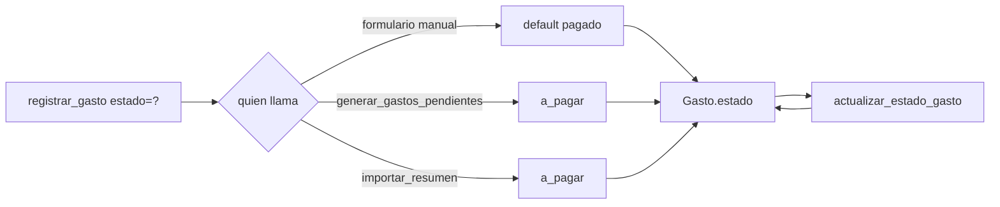

# Solution Overview — Estado de pago de un gasto

## File Index
- [../spec.md](../spec.md)
- [10-verify.md](10-verify.md)
- [99-progress.md](99-progress.md)

### Task Index

| Task | File | Description | Dependencies |
|---|---|---|---|
| T1 | [01-plan-01-columna-estado.md](01-plan-01-columna-estado.md) | `Gasto` guarda `estado`; migración | — |
| T2 | [01-plan-02-servicios-estado.md](01-plan-02-servicios-estado.md) | `registrar_gasto`/generadores automáticos propagan `estado`; `actualizar_estado_gasto` | T1 |
| T3 | [01-plan-03-api-estado.md](01-plan-03-api-estado.md) | `GastoCreate`/`GastoOut` exponen `estado`; endpoint de actualización | T2 |
| T4 | [01-plan-04-frontend-estado.md](01-plan-04-frontend-estado.md) | Selector en el formulario; chip clickeable en el listado | T3 |

## Problema y solución
`Gasto` gana una columna `estado` (`"pagado"` | `"a_pagar"`, default
`"pagado"`) — mismo patrón que `moneda` (columna `String`, validada en
el servicio contra un conjunto fijo, sin enum nativo de Postgres).
`registrar_gasto` acepta `estado` opcional; `_crear_gastos_en_cuotas`
propaga el mismo valor a las N cuotas. Los dos generadores automáticos
existentes (`suscripcion_service.generar_gastos_pendientes`/
`crear_suscripcion`, y `resumen_importer_service.importar_resumen`)
pasan explícitamente `estado="a_pagar"` en cada llamada a
`registrar_gasto`/`registrar_gasto_cuotas_restantes`/
`registrar_suscripcion_detectada`. Una función nueva,
`actualizar_estado_gasto`, permite cambiarlo después.

## Arquitectura
Sin componentes nuevos — extiende `Gasto` (T1), `gasto_service.py`
(T2, `registrar_gasto`/`_crear_gastos_en_cuotas`/nueva
`actualizar_estado_gasto`), y las llamadas ya existentes en
`suscripcion_service.py`/`resumen_importer_service.py` (T2, un
argumento nuevo en llamadas ya existentes, sin nueva lógica de negocio
en esos archivos). API (T3) y `Gastos.tsx` (T4).

## Data Model
- `Gasto.estado: str` — `NOT NULL DEFAULT 'pagado'`, valores
  `"pagado"`/`"a_pagar"`.
- Migración `0013_gasto_estado.py` — aditiva, mismo patrón que
  `0010`/`0011`/`0012`.

## Tradeoffs
- **Sin enum nativo de Postgres**: mismo criterio ya elegido para
  `moneda` — evita el gotcha ya documentado de valores de enum en
  mayúsculas por nombre de miembro, no por valor.
- **Estado por gasto, no por participante**: decisión explícita del
  usuario — no existe hoy una UI de reparto por miembro que justifique
  el costo de un estado por `GastoParticipante`.
- **No afecta `calcular_balance`**: decisión explícita del usuario —
  `balance_service.py` no se toca en esta spec.
- **Cualquier miembro puede cambiar el estado** (no solo Administrador):
  mismo nivel de permiso que registrar un gasto — no es una acción
  administrativa, es una marca de seguimiento personal de la casa.

## API/Data Contracts
- `GastoCreate`: agrega `estado: Optional[str] = None` (default
  `"pagado"` si ausente).
- `GastoOut`: agrega `estado: str` (aditivo).
- `PATCH /casas/{casa_id}/gastos/{gasto_id}` — body `{estado: "pagado" |
  "a_pagar"}`, responde `GastoOut` actualizado. Endpoint nuevo (hoy no
  existe ninguna forma de editar un gasto ya creado).
- `NuevoGasto`/`Gasto` (frontend, `gastosClient.ts`): agregan
  `estado?: 'pagado' | 'a_pagar'` / `estado: string`.
