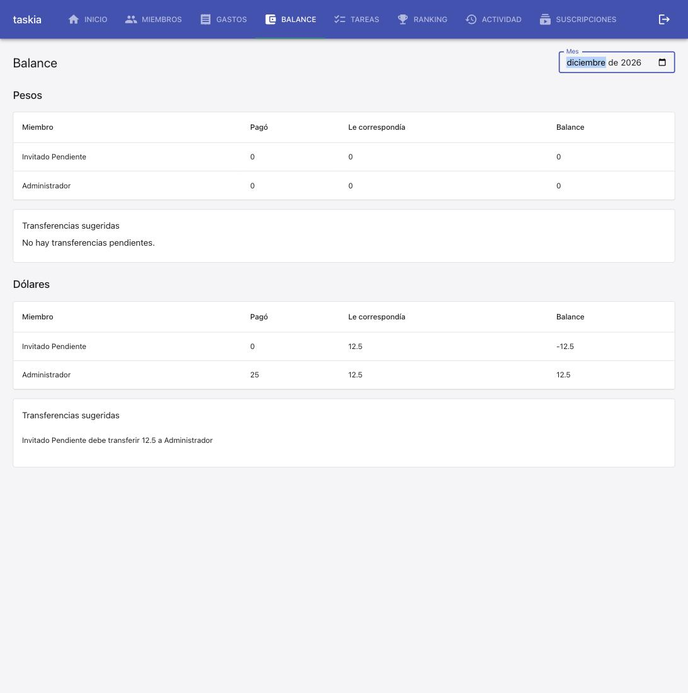

### Goal

Multi-moneda (ARS/USD) en gastos, cuotas y suscripciones: columna `moneda` (migración 0010), propagación/validación en servicios, `calcular_balance` agrupado por (miembro, moneda) sin filas USD en 0, `sugerir_transferencias` sin cruzar monedas, API y frontend (selector Moneda, Balance en secciones Pesos/Dólares) — 4 tareas, 10 TC, foundation para `tarjetas-credito`/`importar-resumen-tarjeta`.

### Judgment

- **J001** Verifiqué `_MIGRACIONES` (`src/db/migrate.py`) antes de nombrar la migración — `0009_suscripciones` era la última mergeada a `main`, así que `0010` era el próximo libre. No asumido a ciegas.
- **J002** `moneda` usa default de Python (`Column(..., default="ARS")`), no `server_default` — mismo patrón que `Suscripcion.activa`/`cuota_grupo_id`. Contra el docker-compose real (tablas preexistentes), la `ALTER TABLE ... DEFAULT 'ARS'` de 0010 sí deja un default real a nivel de columna; en Postgres efímero (`create_all` desde cero) el default es solo del ORM. Confirmado con ambos caminos (test + smoke en vivo).
- **J003** El "formulario de alta" de una suscripción (00-overview.md) es el mismo form "Nuevo gasto" de `Gastos.tsx` (tipo "Suscripción mensual"), no uno propio en `Suscripciones.tsx` — confirmado leyendo el código antes de tocarlo. Un solo selector Moneda cubre ambos flujos; `Suscripciones.tsx` solo ganó el prefijo US$/$.
- **J004** `moneda` nunca se envía como `"ARS"` explícito en el body (mismo patrón vacío→undefined que `cuotas`) — el selector muestra "ARS" preseleccionado visualmente, pero el body omite la clave salvo que se elija "USD".

### Observations

- Confirmado por 3ª vez: default de Python en el `Column` (no `server_default`) es la convención estable de este proyecto para columnas aditivas simples.
- Confirmado de nuevo: patrón "vacío/default → undefined en el body" (ya visto en `cuotas`, campo `puntos`) sigue siendo la convención transversal del frontend para opcionales con default de backend.

### Verification

- `pytest tests/` — 203 passed, 1 skipped (179 baseline + 24 nuevos: T1 db, T2 servicios, T3 API). Skip preexistente sin relación (requiere `DATABASE_URL` a Postgres).
- `npm run test -- --run` — 85 passed (79 baseline + 6 nuevos T4: TC-009/TC-010 + controles).
- `npm run build`/`npm run lint` — sin errores.
- Migración 0010 verificada 2 veces contra Postgres real: contenedor efímero (idempotencia x2 + insert ORM) y docker-compose local ya levantado (`--reload` aplicó 0010 solo, tablas preexistentes; `information_schema` confirmó default real `'ARS'`).
- TC-001 a TC-010: todas resueltas por test automatizado — ninguna quedó `[E2E]`/`[MANUAL]`.
- Coverage: sin tool configurado (`stack.yaml`) — gap preexistente, no introducido acá.

**Live smoke** (docker-compose local, arriba ~3hs, nunca reiniciado manualmente):
1. Vía API: gasto ARS + gasto USD mismo día → `GET .../balance` devolvió 2 filas separadas, nunca sumadas.
2. Vía UI real: gasto USD ($25) mostró `US$25` en el historial; gasto ARS mostró `$500`.
3. Balance con actividad en ambas monedas → 2 secciones "Pesos"/"Dólares" independientes, cada una con su tabla y transferencias propias, sin total combinado (TC-010).
   
4. Mes sin actividad USD → solo se renderiza "Pesos" (control TC-004/TC-010).
