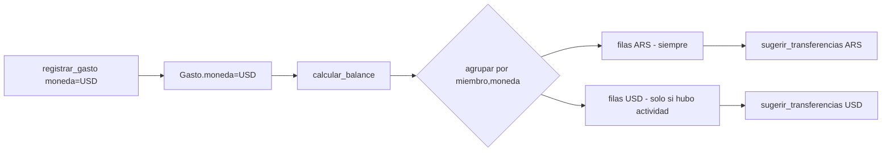

# Solution Overview — Multi-moneda en gastos, cuotas y suscripciones

## File Index
- [../spec.md](../spec.md)
- [10-verify.md](10-verify.md)
- [99-progress.md](99-progress.md)

### Task Index

| Task | File | Description | Dependencies |
|---|---|---|---|
| T1 | [01-plan-01-columna-moneda.md](01-plan-01-columna-moneda.md) | `Gasto`/`Suscripcion` guardan `moneda`; migración | — |
| T2 | [01-plan-02-servicios-moneda.md](01-plan-02-servicios-moneda.md) | `registrar_gasto`/`crear_suscripcion`/`calcular_balance`/`sugerir_transferencias` propagan y separan por moneda | T1 |
| T3 | [01-plan-03-api-moneda.md](01-plan-03-api-moneda.md) | Esquemas de gastos/suscripciones/balance exponen `moneda` | T2 |
| T4 | [01-plan-04-frontend-moneda.md](01-plan-04-frontend-moneda.md) | Selector de moneda en los formularios; Balance renderiza secciones separadas | T3 |

## Problema y solución
Hoy `Gasto`/`Suscripcion` no tienen moneda — todo se asume pesos. Se
agrega una columna `moneda` a ambos (default `"ARS"`), y `calcular_balance`
pasa de agrupar por `miembro_id` a agrupar por `(miembro_id, moneda)`.
`sugerir_transferencias` recibe la misma lista plana multi-moneda y
agrupa internamente antes de emparejar — nunca compara balances de
monedas distintas. Ningún componente hace conversión de moneda: no hay
tipo de cambio en ningún lado del sistema.

## Arquitectura
Sin componentes nuevos. Extiende `Gasto`/`Suscripcion` (T1),
`gasto_service`/`suscripcion_service`/`balance_service` (T2), los
esquemas Pydantic de `gastos.py`/`suscripciones.py` (T3, aditivo — no
toca `dashboard.py`: `DashboardResponse.balance` ya reutiliza
`BalancePorMiembroOut`, así que hereda `moneda` sin cambios) y las
pantallas Gastos/Suscripciones/Balance (T4). `InicioCasa.tsx` (mini-
balance del dashboard) se filtra a solo ARS — vista rápida, no reemplaza
a la pantalla Balance completa (asunción documentada, no pedida
explícitamente).

## Data Model
- `Gasto.moneda: str` — `NOT NULL DEFAULT 'ARS'`, valores `"ARS"`/`"USD"`.
- `Suscripcion.moneda: str` — mismo tipo/default.
- `BalancePorMiembro` (dataclass, `balance_service.py`): agrega
  `moneda: str`. `calcular_balance` ahora devuelve una lista plana con
  una fila por `(miembro, moneda)` en vez de una fila por miembro.
- `Transferencia` (dataclass): agrega `moneda: str`.
- Migración `0010_gasto_suscripcion_moneda.py` — aditiva, mismo patrón
  que `0006`/`0007`/`0008`.

## Tradeoffs
- **Balance como lista plana con `moneda` por fila, no un dict anidado
  por moneda**: mantiene `BalanceResponse`/`DashboardResponse` con la
  misma forma de lista que ya consumen `Balance.tsx`/`InicioCasa.tsx` —
  el frontend agrupa por `moneda` al renderizar (T4), evitando romper el
  contrato que ya usa el dashboard.
- **Sin tipo de cambio en ningún lado**: decisión explícita del usuario
  (pesos y dólares totalmente separados) — no se agrega ninguna
  dependencia ni servicio externo de cotización.
- **Suscripción sin edición de moneda**: no existe hoy un endpoint para
  editar una suscripción ya creada (solo cancelar) — la moneda queda
  fija desde la creación, consistente con el resto de sus campos.

## API/Data Contracts
- `GastoCreate`/`SuscripcionCreate`: agregan `moneda: Optional[str] = None` (default `"ARS"` si ausente).
- `GastoOut`/`SuscripcionOut`: agregan `moneda: str` (aditivo).
- `BalancePorMiembroOut`/`TransferenciaOut`: agregan `moneda: str` (aditivo).
- `NuevoGasto`/`NuevaSuscripcion` (frontend): agregan `moneda?: 'ARS' | 'USD'`.
