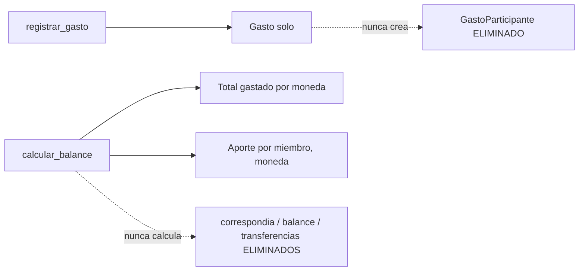

# Solution Overview — Gastos sin reparto entre participantes

## File Index
- [../spec.md](../spec.md)
- [10-verify.md](10-verify.md)
- [99-progress.md](99-progress.md)

### Task Index

| Task | File | Description | Dependencies |
|---|---|---|---|
| T1 | [01-plan-01-eliminar-gasto-participante.md](01-plan-01-eliminar-gasto-participante.md) | Elimina `GastoParticipante`; `gasto_service` deja de repartir | — |
| T2 | [01-plan-02-balance-total-casa.md](01-plan-02-balance-total-casa.md) | `balance_service`: total de la casa + aportes informativos | T1 |
| T3 | [01-plan-03-api-balance-sin-reparto.md](01-plan-03-api-balance-sin-reparto.md) | API/`dashboard_service` reflejan el nuevo contrato | T2 |
| T4 | [01-plan-04-frontend-sin-reparto.md](01-plan-04-frontend-sin-reparto.md) | `Gastos.tsx` sin selector; `Balance.tsx`/`InicioCasa.tsx` rediseñados | T3 |

## Problema y solución
`GastoParticipante` y todo el reparto que generaba se eliminan por
completo — un `Gasto` es simplemente una salida de fondos de la casa.
`balance_service.calcular_balance` se reescribe: en vez de agregar por
`(miembro, moneda)` con pago/correspondía/balance, agrega por moneda
(total gastado de la casa) y por `(miembro, moneda)` solo para el
aporte (cuánto pagó), sin ninguna cifra de deuda. `sugerir_
transferencias`/`Transferencia` se eliminan — sin reparto no hay ninguna
deuda entre miembros que sugerir saldar (esa función pasa a vivir,
conceptualmente, en la spec `prestamos-entre-miembros`, como un
registro explícito en vez de un cálculo derivado).

## Arquitectura
`gasto_service.py` pierde el parámetro `participantes` y toda la lógica
de reparto (`_resolver_participantes`, la creación de
`GastoParticipante`, la validación "no hay miembros activos para
dividir") — `_dividir_importe` se mantiene (sigue usándose para repartir
el importe total entre las N cuotas de una compra, algo no relacionado
con participantes). `balance_service.py` se reescribe con nuevas
estructuras (`TotalCasaPorMoneda`, `AportePorMiembro`, `BalanceCasa`).
`dashboard_service.DashboardCasa.balance` cambia de tipo acorde.

## Data Model
- `GastoParticipante` (modelo y tabla `gasto_participantes`) —
  **eliminado por completo**, junto con su historial (decisión
  explícita del usuario).
- `Gasto.participantes` (relationship) — eliminada.
- Migración `0014_eliminar_gasto_participantes.py` — `DROP TABLE
  gasto_participantes` (con su FK a `gastos`/`miembros`).
- `Gasto` en sí no cambia de columnas — `pagado_por` se mantiene tal
  cual, solo deja de tener efecto en `balance_service`.

## Tradeoffs
- **Se elimina el historial de reparto ya cargado** (decisión explícita
  del usuario, no una limitación técnica) — cualquier gasto viejo pierde
  su desglose por participante; el gasto en sí (descripción, importe,
  fecha, categoría) no se toca.
- **`sugerir_transferencias` no se reemplaza por un equivalente en esta
  spec** — la sugerencia de transferencias entre miembros deja de tener
  sentido sin reparto; `prestamos-entre-miembros` cubre la única deuda
  real que puede existir entre dos personas, registrada explícitamente
  (no calculada).
- **Balance en ARS sigue mostrando todos los miembros de la casa (incluso
  con aporte $0)**, igual que el criterio actual — otras monedas solo
  aparecen si hubo actividad ese mes (mismo patrón ya establecido en
  `gastos-multi-moneda`, ahora aplicado al aporte en vez de al balance).

## API/Data Contracts
- `GastoCreate`/`GastoOut`: eliminan `participantes`/`ParticipanteOut`.
- `BalanceResponse` (reemplaza la forma anterior): `{totales:
  [{moneda, total_gastos}], aportes: [{miembro_id, nombre, total,
  moneda}]}` — sin `transferencias`.
- `DashboardResponse.balance`: mismo nuevo contrato que `BalanceResponse`.
- `Gasto`/`NuevoGasto` (frontend, `gastosClient.ts`): eliminan
  `participantes`; `BalancePorMiembro`/`Transferencia` se reemplazan por
  `TotalCasa`/`AporteMiembro`.
