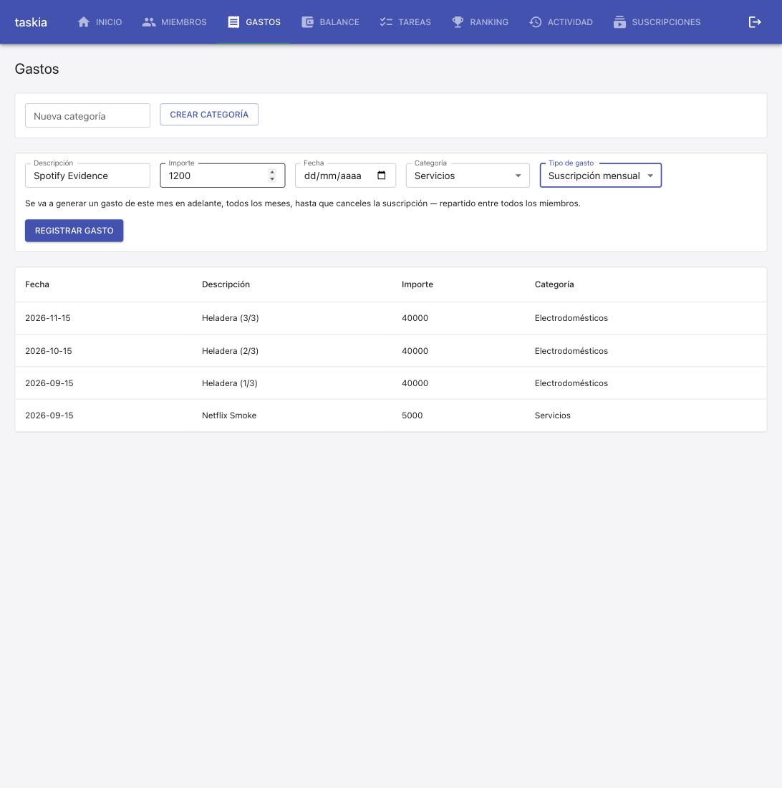
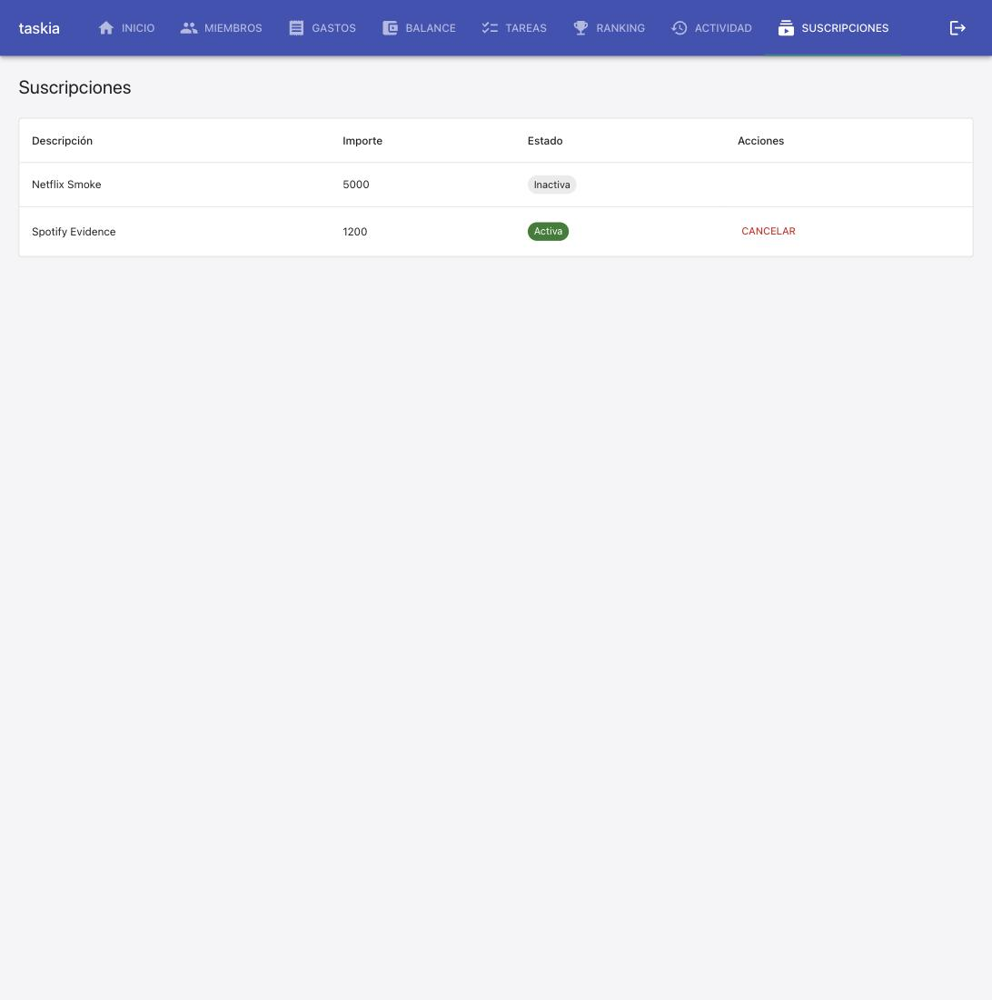
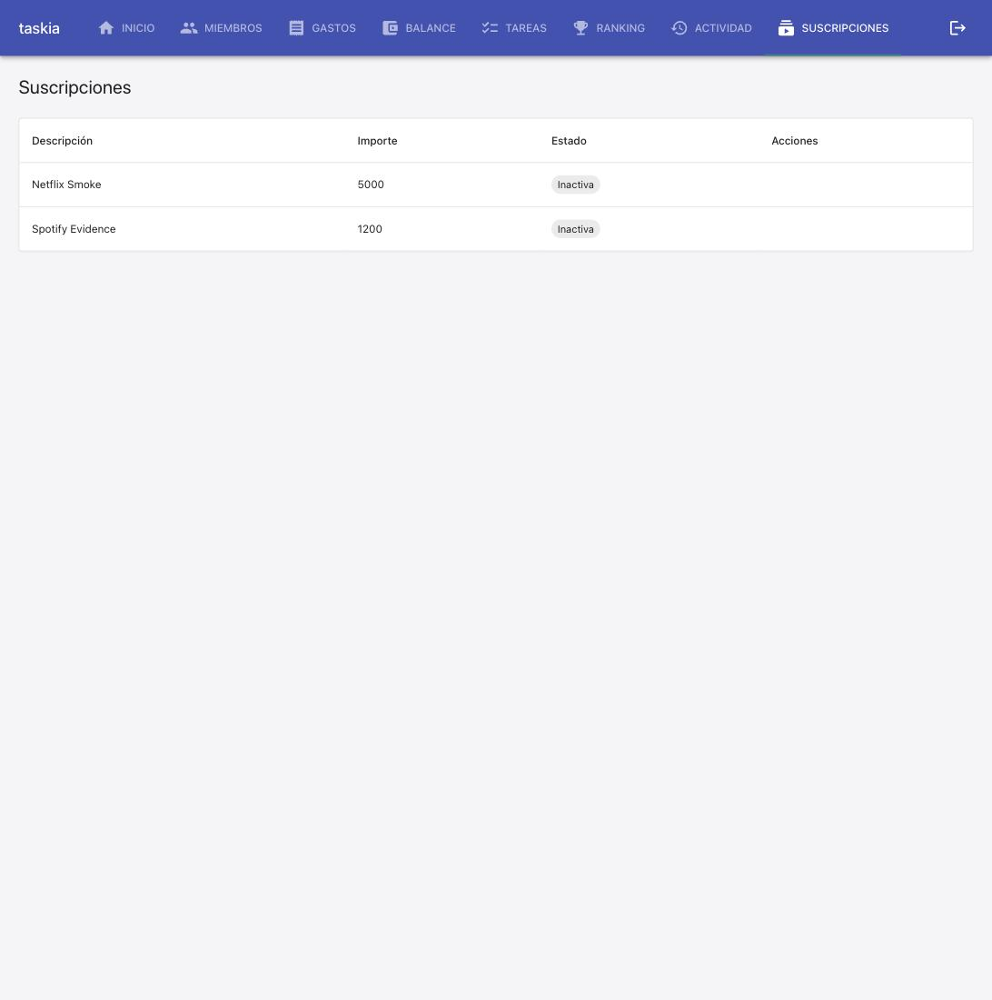
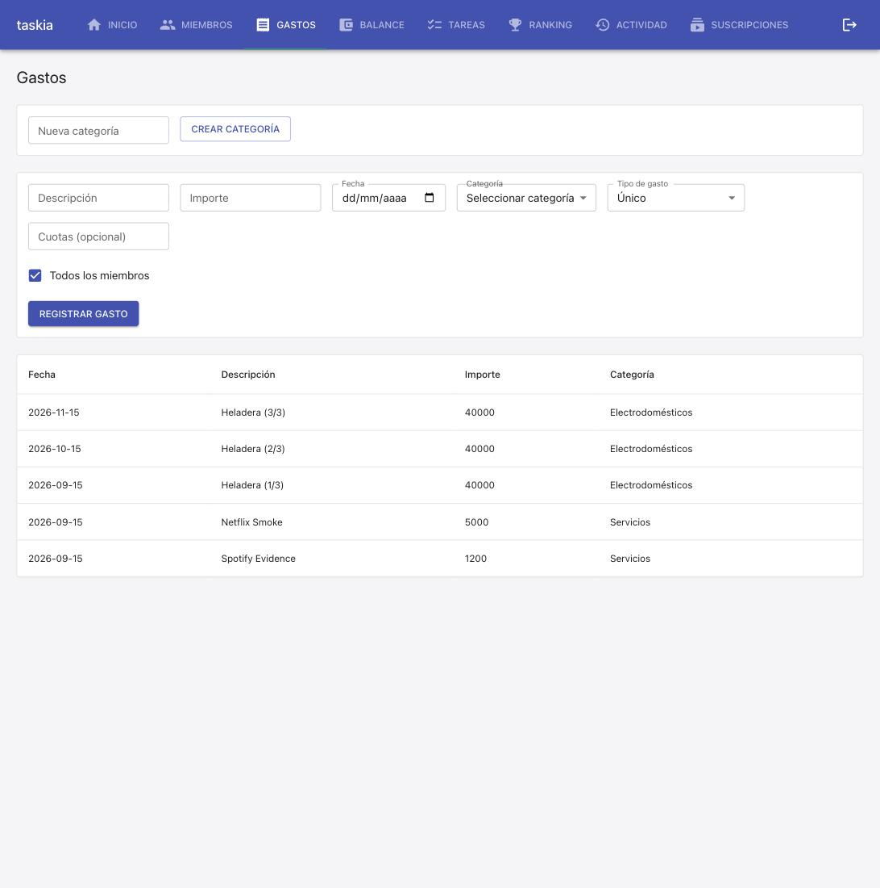

### Goal

Implementar la spec gastos-suscripcion-mensual completa: T1 (modelo Suscripcion + migración 0009), T2 (suscripcion_service + generar_gastos_pendientes enganchado en listar_gastos), T3 (rutas HTTP /casas/{id}/suscripciones), T4 (pantalla Suscripciones + selector Tipo de gasto en Gastos.tsx). Branch feat/gastos-suscripcion-mensual ya existente, PR #22 ya abierto como draft — build directo sobre esa rama, sin crear una nueva ni re-mergear main.

### Judgment

- **J001** — `Gasto.suscripcion_id` is a plain `Column(GUID(), nullable=True)`, WITHOUT a SQLAlchemy-level `ForeignKey("suscripciones.id")` (same pattern as the existing `cuota_grupo_id`). Discovered via a real failure against Postgres (`postgres_migrations.test.py`): `0002_gastos.py`'s `create_all(tables=[Gasto.__table__])` runs before `Suscripcion` is ever imported/registered in `Base.metadata` (migration 0009 runs last), so a SQLAlchemy `ForeignKey` there raises `NoReferencedTableError` at metadata-resolution time — independent of which DB engine and which migration subset a given test imports. The real DB-level FK constraint is still added, via raw SQL in `0009_suscripciones.py`'s Postgres-only `ALTER TABLE ... REFERENCES suscripciones(id)` branch, which runs after `suscripciones` genuinely exists.
- **J002** — That same `ALTER TABLE` must declare `suscripcion_id` as `CHAR(36)`, not native Postgres `UUID`. Discovered live: restarting the dockerized backend against the real dev Postgres crashed at startup with `psycopg2.errors.DatatypeMismatch` (`gastos_suscripcion_id_fkey` — `uuid` vs `character`), because `GUID()` (src/db/types.py) materializes as `CHAR(36)` on Postgres for SQLite portability, not native `uuid` — confirmed by `0005_usuarios.py`'s existing `usuario_id CHAR(36) REFERENCES usuarios(id)` precedent. Fixed and re-verified against the running docker-compose environment (backend restarted cleanly, schema inspected via psql, full pytest suite green inside the container against real Postgres).
- **J003** — Extended `GastoOut` (src/api/routes/gastos.py) with an optional `suscripcion_id` field, and 9 pre-existing test fixtures (gasto_cuotas/gasto_service/balance_mensual/dashboard_service/dashboard_routes/gastos_routes/postgres_migrations) with the `0009_suscripciones` migration — neither was explicitly listed in run-plan.json's files_touched, but both are required consequences of REQ-002's hook in `listar_gastos` (any test exercising that path now needs the `suscripciones` table to exist, same precedent as `0004_historial_actividad` being added to fixtures when `registrar_gasto` gained its activity hook).

### Verification

All 4 tasks (T1-T4) implemented and green.

- **Build**: `tsc --noEmit && vite build` — pass, no type errors. `npm run lint` clean.
- **Tests**: pytest 179 passed / 1 skipped (Docker-unavailable-via-plain-`DATABASE_URL` skip in this shell; 180 passed / 0 skipped when run inside the docker-compose `backend` container against real Postgres). vitest 79 passed (up from the pre-dispatch baseline of 166 pytest / 74 vitest: +14 pytest, +5 vitest for this spec).
- **Test cases**: TC-001 to TC-005 (`[INTEGRATION]`) in `tests/integration/services/suscripcion.test.py` and `tests/integration/api/suscripciones_routes.test.py`; TC-006 (`[UNIT]`) in `tests/unit/frontend/Suscripciones.test.tsx`; TC-007 (`[UNIT]`) in `tests/unit/frontend/Gastos.test.tsx`. All resolve to real tests, all green.
- **Migration**: `0009_suscripciones` verified idempotent against real Postgres (docker-launched ephemeral container) — run twice via `run_migrations`, table + FK + nullable column confirmed via `sqlalchemy.inspect`.
- **Live evidence (Branch A — documented and working, per stack.yaml's dev_runbook)**: dockerized dev environment was already running (`docker compose ps`). Restarted `backend`/`frontend` to pick up the new migration and code — this surfaced J001/J002 (real Postgres-only failures the SQLite test suite could not catch), both fixed and re-verified live against the running Postgres before capturing evidence below. Full manual smoke via claude-in-chrome against `http://localhost:5173`, driven twice (once informally to find J001/J002, once formally to capture this evidence with a second subscription, "Spotify Evidence", since the first, "Netflix Smoke", was already cancelled by the earlier pass):
  1.  — formulario Gastos con "Tipo de gasto" = "Suscripción mensual" elegido para "Spotify Evidence" ($1200, Servicios); Cuotas y selección de participantes correctamente ocultos.
  2.  — tras crear, "Spotify Evidence" ($1200, Servicios, 2026-09-15) aparece de inmediato en el historial de Gastos, junto al "Netflix Smoke" de la corrida anterior.
  3.  — pantalla Suscripciones muestra "Spotify Evidence" con estado "Activa" y botón Cancelar.
  4.  — tras cancelar "Spotify Evidence", ambas suscripciones muestran "Inactiva", sin botón Cancelar.
  5.  — "Netflix Smoke" y "Spotify Evidence", generados antes de cancelar cada suscripción, siguen presentes sin cambios en el historial de Gastos.
- **Judgment log**: 3 entries (J001, J002, J003) — see Judgment section above.
- **Security**: no new dependencies, no secrets, no auth surface changes (reuses existing `resolver_actor_en_casa`/`_validar_actor_admin`).
- **Design principles**: `suscripcion_service` delegates gasto-creation/participant-split to `gasto_service.registrar_gasto` — never reimplements it (SRP, per spec's own design rationale).

### Curation

2 new gotchas ([DBG-02], [DBG-03]) added to `.nybo/memory/domains/db.md` from J001/J002 — a SQLAlchemy-level `ForeignKey()` to a table created by a later migration breaks `run_migrations` ordering (use a plain column instead, add the real FK via raw SQL in the later migration), and that raw SQL must type the column `CHAR(36)` to match `GUID()`'s actual Postgres representation, never native `UUID`. No new conventions, no foundation gaps, no stale references, no open decisions.
