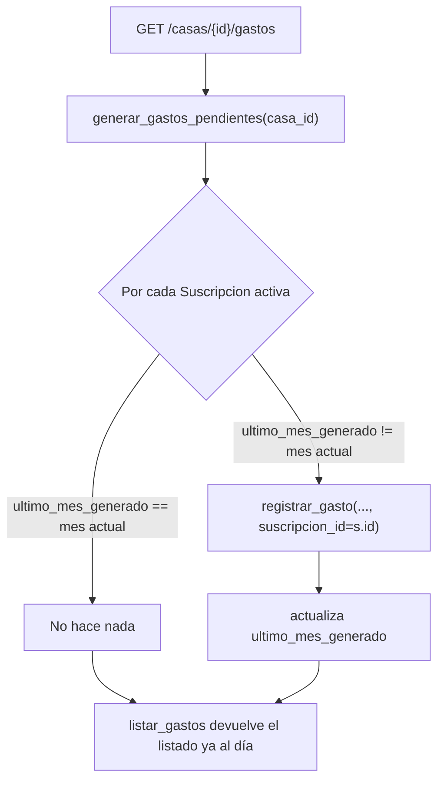

# Solution Overview — Suscripciones mensuales de gastos

## File Index
- [../spec.md](../spec.md)
- [10-verify.md](10-verify.md)
- [99-progress.md](99-progress.md)

### Task Index

| Task | File | Description | Dependencies |
|---|---|---|---|
| T1 | [01-plan-01-modelo-suscripcion.md](01-plan-01-modelo-suscripcion.md) | Modelo `Suscripcion` + FK en `Gasto`; migración | — |
| T2 | [01-plan-02-servicio-suscripciones.md](01-plan-02-servicio-suscripciones.md) | Crear/listar/cancelar + generación perezosa al listar gastos | T1 |
| T3 | [01-plan-03-rutas-suscripciones.md](01-plan-03-rutas-suscripciones.md) | Rutas HTTP nuevas | T2 |
| T4 | [01-plan-04-pantalla-suscripciones.md](01-plan-04-pantalla-suscripciones.md) | Pantalla "Suscripciones" + entrada de nav | T3 |

## Problema y solución
`Suscripcion` es una entidad nueva y liviana: casa, descripción,
importe, categoría, quién paga, si está activa, y qué mes fue el último
generado (`ultimo_mes_generado`, formato `YYYY-MM`). Reutiliza
`gasto_service.registrar_gasto` (extendido con un `suscripcion_id`
opcional, puramente para etiquetar el `Gasto` resultante) en vez de
duplicar la lógica de reparto entre participantes — la generación
mensual es, en esencia, "llamar a `registrar_gasto` de nuevo, con los
mismos datos, una vez por mes". El disparador de esa generación es
`listar_gastos`: antes de devolver el listado, revisa las suscripciones
activas de la casa y genera lo que falte del mes actual — cubre tanto
la pantalla Gastos como el Inicio (`armar_dashboard` ya llama a
`listar_gastos` internamente), sin necesitar un segundo punto de
enganche. **Visitar solo la pantalla Balance no dispara la generación**
— es una limitación conocida y aceptada del diseño (ver spec, REQ-002).

## Arquitectura
Nuevo servicio `suscripcion_service.py` (SRP: crear/listar/cancelar
suscripciones cambia por razones distintas a cómo cambia el registro de
un gasto puntual) y nuevo router `suscripciones.py` (mismo patrón que
`casas.py`/`gastos.py`/`tareas.py`: un archivo por recurso, todos bajo
el prefijo `/casas`). `gasto_service.registrar_gasto` gana un parámetro
más; `listar_gastos` gana una llamada a `generar_gastos_pendientes` al
principio.

## Data Model
- `Suscripcion` (tabla `suscripciones`): `id`, `casa_id`, `descripcion`,
  `importe`, `categoria_id`, `pagado_por`, `activa: bool = True`,
  `ultimo_mes_generado: Optional[str]` (`YYYY-MM`), `creado_en: datetime`.
- `Gasto.suscripcion_id: Optional[GUID]` — FK nullable a `Suscripcion`,
  `NULL` para un gasto normal o en cuotas.
- Migración `0009_suscripciones.py` — nueva tabla + columna aditiva en
  `gastos`, mismo patrón que las migraciones anteriores.

## Tradeoffs
- **Generación perezosa al listar vs. un scheduler real**: se eligió la
  perezosa porque el proyecto no tiene infraestructura de scheduler hoy
  (ni en `docker-compose.yml` ni en el despliegue real de AWS) y
  agregarla es una decisión de infraestructura nueva fuera del alcance
  de este pedido. Costo aceptado: si nadie visita una casa en todo un
  mes, ese mes no genera su gasto hasta la próxima visita — no se
  "recupera" retroactivamente (REQ-002).
- **Reutilizar `registrar_gasto` en vez de duplicar el reparto entre
  participantes** — evita una segunda fuente de verdad para cómo se
  divide un gasto; el único costo es un parámetro más en una función ya
  extendida por `gastos-en-cuotas` (`cuotas`) — ambos parámetros son
  independientes entre sí (un gasto generado por una suscripción nunca
  tiene `cuotas`, y viceversa).

## API/Data Contracts
- `POST /casas/{casa_id}/suscripciones` — crea, `{descripcion, importe,
  categoria_id}`. Responde 201 con la `Suscripcion` creada.
- `GET /casas/{casa_id}/suscripciones` — lista todas (activas e
  inactivas).
- `PATCH /casas/{casa_id}/suscripciones/{id}` — `{activa: false}` para
  cancelar (mismo patrón que `MiembroActivoUpdate`; `activa: true` no
  soportado, 400, igual que "reactivar un miembro" no lo está).
