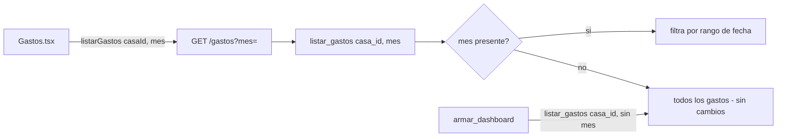

# Solution Overview — Vista mensual del listado de Gastos

## File Index
- [../spec.md](../spec.md)
- [10-verify.md](10-verify.md)
- [99-progress.md](99-progress.md)

### Task Index

| Task | File | Description | Dependencies |
|---|---|---|---|
| T1 | [01-plan-01-listar-gastos-por-mes.md](01-plan-01-listar-gastos-por-mes.md) | `listar_gastos` acepta `mes` opcional | — |
| T2 | [01-plan-02-api-mes.md](01-plan-02-api-mes.md) | `GET .../gastos?mes=` | T1 |
| T3 | [01-plan-03-frontend-mes.md](01-plan-03-frontend-mes.md) | Selector de mes en Gastos.tsx | T2 |

## Problema y solución
`listar_gastos(casa_id, mes: Optional[str] = None)` — cuando `mes` está
presente, filtra por `Gasto.fecha.between(desde, hasta)` (mismo rango
que ya calcula `balance_service._rango_mes`, reimplementado acá como
helper propio de `gasto_service.py` para no acoplar los dos servicios
por una función de 5 líneas — mismo criterio de "un servicio por
responsabilidad" ya establecido). Sin `mes`, el comportamiento es
exactamente el actual: todos los gastos, sin filtrar — necesario porque
`dashboard_service.armar_dashboard` sigue llamando `listar_gastos(casa_id)`
sin `mes` y espera los últimos 10 gastos de TODA la casa, no del mes
actual (REQ-004).

## Arquitectura
Sin componentes nuevos — extiende `gasto_service.listar_gastos` (T1),
la ruta `GET /casas/{id}/gastos` (T2) y `Gastos.tsx` (T3). No toca
`dashboard_service.py` (sigue llamando sin `mes`, comportamiento
idéntico).

## Data Model
Sin cambios — filtra sobre `Gasto.fecha`, columna ya existente.

## Tradeoffs
- **`mes=None` significa "todos", no "mes actual"** — a diferencia de
  `calcular_balance(casa_id, mes=None)` (que sí asume el mes actual):
  acá el default debe preservar el comportamiento 100% actual de
  `listar_gastos` para no romper el dashboard de Inicio, que depende de
  ver el historial completo para sus "últimos 10 gastos". Documentado
  explícitamente para evitar confundir ambos contratos.
- **Helper de rango de mes duplicado, no compartido con
  `balance_service`**: 5 líneas, mismo criterio que otras pequeñas
  utilidades ya duplicadas entre servicios en este proyecto — evita
  acoplar dos servicios por una función trivial.

## API/Data Contracts
- `GET /casas/{casa_id}/gastos?mes=YYYY-MM` — query param opcional,
  formato `YYYY-MM`; `mes` inválido responde 400 (mismo criterio que
  `GET .../balance?mes=`).
- `listarGastos(casaId: string, mes?: string)` (frontend).
