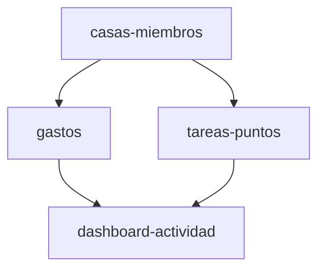

# Plan — Gestión Doméstica

feature_kind: multi_spec

## Feature Branch
`feat/gestion-domestica`

## Sub-Spec DAG

| Spec | Branch | Depends on |
|---|---|---|
| casas-miembros | feat/gestion-domestica--casas-miembros | — |
| gastos | feat/gestion-domestica--gastos | casas-miembros |
| tareas-puntos | feat/gestion-domestica--tareas-puntos | casas-miembros |
| dashboard-actividad | feat/gestion-domestica--dashboard-actividad | gastos, tareas-puntos |

## Split Rationale

**casas-miembros** — pasa las tres pruebas: es un entregable independiente (crear una casa y administrar miembros ya aporta valor por sí solo), es revisable de forma independiente (no depende de leer las otras specs para entenderse), y separa una preocupación real: es la base (foundation) sobre la que se construyen gastos y tareas (consumer).

**gastos** — entregable independiente (el registro y balance de gastos es útil por sí mismo una vez existe una casa con miembros); revisable sin leer tareas-puntos; separa una preocupación real (dominio financiero) de la de tareas/gamificación.

**tareas-puntos** — mismo razonamiento que gastos mirado desde el otro dominio: entregable independiente (gestión de tareas y puntos aporta valor sin que exista aún el módulo de gastos), revisable por separado, y separa la preocupación de gestión de tareas/incentivos de la financiera.

**dashboard-actividad** — entregable independiente (una vista consolidada y un historial general aportan valor una vez existen gastos y tareas); revisable aparte (es una capa de presentación/agregación, no de dominio); separa la preocupación de agregación/visualización de las de dominio (gastos, tareas) que consume.

## Alcance excluido
Sección "21. Funcionalidades futuras posibles" del documento fuente queda explícitamente fuera de alcance de esta feature (premios, penalizaciones, notificaciones, presupuestos, fotos/comprobantes, listas de compras, votaciones, etc.).
