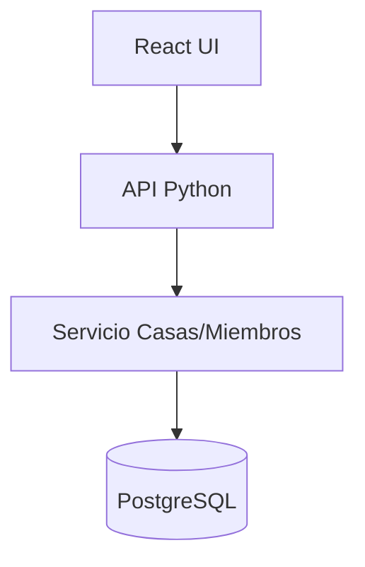
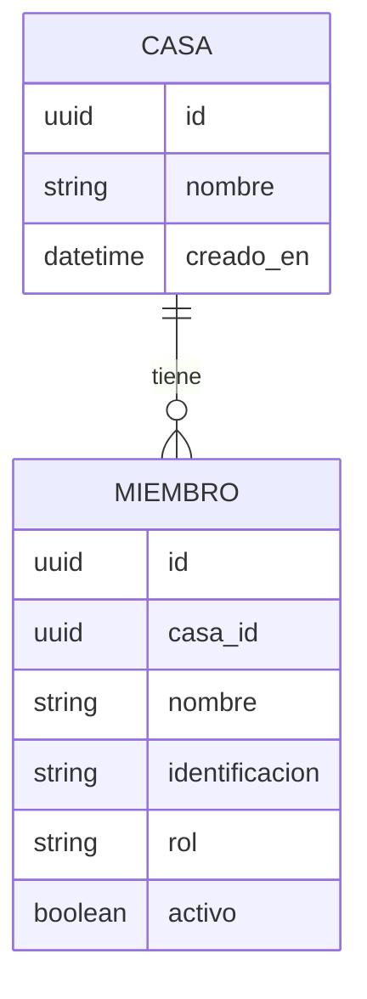

# Casas y Miembros — Solution Overview

## File Index
- [spec.md](../spec.md)
- [10-verify.md](10-verify.md)
- [99-progress.md](99-progress.md)

### Task Index
| Task | File | Description | Dependencies |
|---|---|---|---|
| T1 | 01-plan-01-data-layer.md | Esquema de datos Casa y Miembro | — |
| T2 | 01-plan-02-service-layer.md | Servicios: crear casa, agregar/eliminar miembro, permisos por rol | T1 |
| T3 | 01-plan-03-api-routes.md | Endpoints REST de casas y miembros | T2 |
| T4 | 01-plan-04-ui.md | UI de creación de casa y gestión de miembros | T3 |

## Problem & Solution
- Sin un concepto de "Casa" y "Miembro" con roles, ninguna otra funcionalidad (gastos, tareas, puntos) tiene sobre qué operar.
- Se modela Casa 1—N Miembro, con un enum de rol (`admin` | `member`) y un flag `activo` para preservar historial al dar de baja.
- Los permisos se resuelven en la capa de servicio (guard por rol), no en la UI, para que la API quede protegida aunque cambie el cliente.

## Architecture

## Data Model

## UX/UI
- Pantalla "Crear casa": formulario con nombre.
- Pantalla "Miembros": listado de miembros activos/inactivos, alta de miembro (nombre + identificación), acción desactivar/eliminar (solo visible para Administrador).

## Tradeoffs
- Se usa desactivación lógica (`activo=false`) en vez de borrado físico para preservar el historial (REQ-003) — coherente con el patrón de auditoría que gastos y tareas también necesitarán.
- La identificación de miembro es única por casa, no global, para permitir que una misma persona use distintos alias en distintas casas (REQ-006).

## API/Data Contracts
| Método | Ruta | Body/Query | Respuesta |
|---|---|---|---|
| POST | /casas | `{nombre}` | `Casa` (incluye miembro creador como admin) |
| POST | /casas/{casaId}/miembros | `{nombre, identificacion}` | `Miembro` |
| PATCH | /casas/{casaId}/miembros/{miembroId} | `{activo: boolean}` | `Miembro` |
| GET | /casas/{casaId}/miembros | — | `Miembro[]` |

## Service Integrations
Ninguna integración externa — persistencia directa en PostgreSQL.
