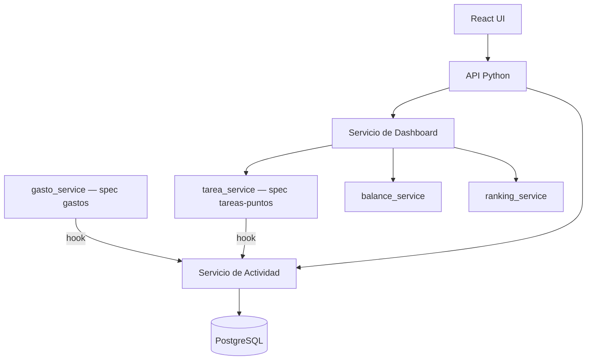
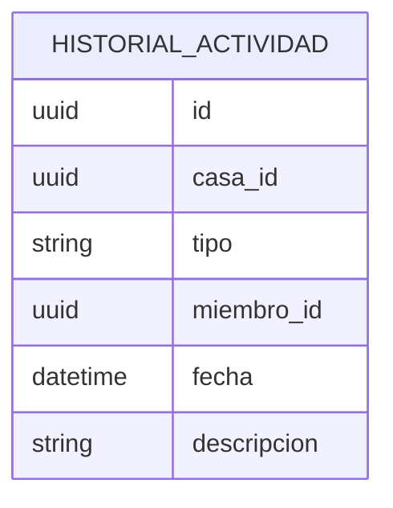

# Vista General y Actividad — Solution Overview

## File Index
- [spec.md](../spec.md)
- [10-verify.md](10-verify.md)
- [99-progress.md](99-progress.md)

### Task Index
| Task | File | Description | Dependencies |
|---|---|---|---|
| T1 | 01-plan-01-data-layer.md | Esquema HistorialActividad | — |
| T2 | 01-plan-02-service-layer.md | Hooks de logging + agregación del dashboard | T1 |
| T3 | 01-plan-03-api-routes.md | Endpoints de dashboard y actividad | T2 |
| T4 | 01-plan-04-ui.md | UI de pantalla principal e historial de actividad | T3 |

## Problem & Solution
- Gastos y tareas ya existen como módulos independientes; falta una capa de agregación y de trazabilidad transversal.
- `HistorialActividad` es un event log append-only, escrito por hooks disparados desde `gasto_service.registrar_gasto` y `tarea_service.crear_tarea`/`completar_tarea` (specs `gastos` y `tareas-puntos`).
- El dashboard no persiste datos propios: agrega en tiempo real desde `balance_service`, `tarea_service` y `ranking_service`.

## Architecture

## Data Model

## UX/UI
- Pantalla "Inicio de la casa": secciones Miembros, Gastos recientes, Balance, Tareas pendientes, Tareas completadas recientes, Ranking.
- Pantalla "Historial de actividad": lista cronológica descendente con descripciones legibles (ej. "Pablo registró un gasto de $25.000").

## Tradeoffs
- Se optó por hooks explícitos desde los servicios de gastos/tareas (llamada directa a `registrar_actividad`) en vez de un bus de eventos, dado el tamaño y alcance doméstico del proyecto — evita infraestructura adicional (colas, event bus) no justificada aún.
- El dashboard no cachea resultados; se recalcula en cada request, aceptable al volumen esperado.

## API/Data Contracts
| Método | Ruta | Body/Query | Respuesta |
|---|---|---|---|
| GET | /casas/{casaId}/inicio | — | `{miembros, gastosRecientes, balance, tareasPendientes, tareasCompletadasRecientes, ranking}` |
| GET | /casas/{casaId}/actividad | — | `HistorialActividad[]` ordenado descendente |

## Service Integrations
Ninguna integración externa. Consume internamente los servicios de las specs `gastos` y `tareas-puntos`.
