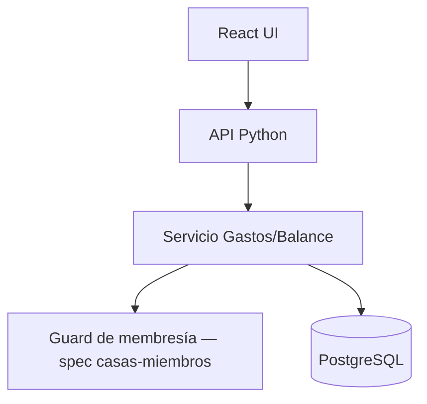
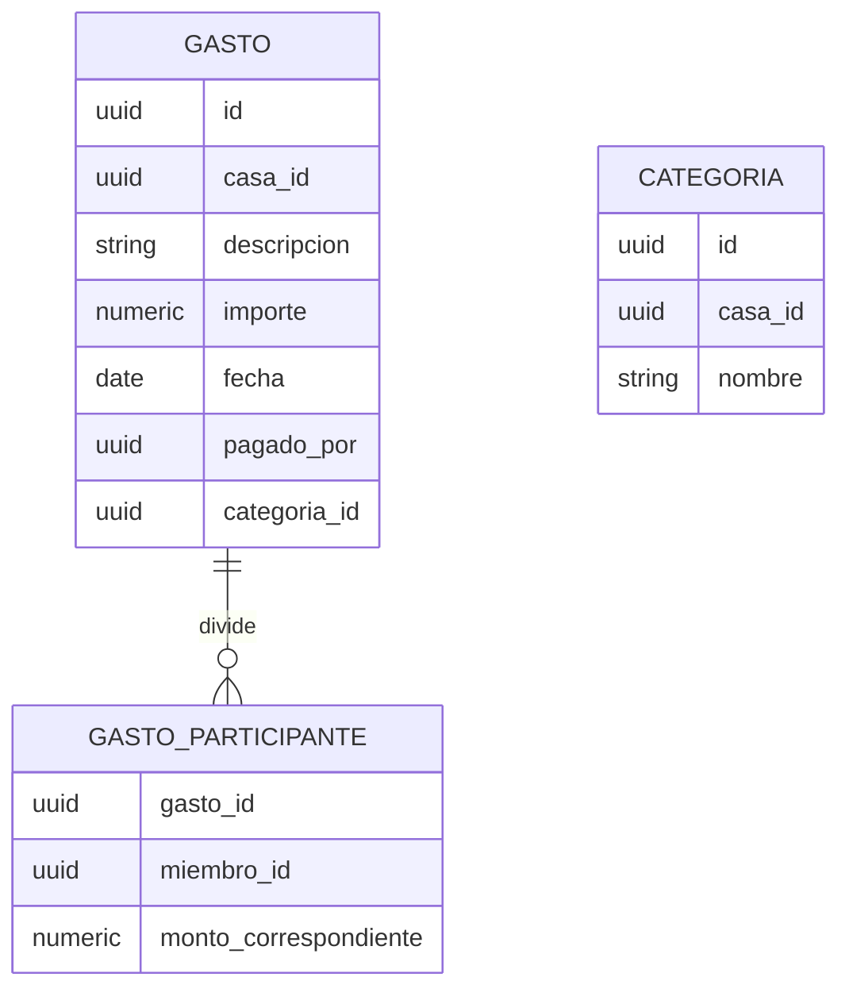

# Gestión de Gastos — Solution Overview

## File Index
- [spec.md](../spec.md)
- [10-verify.md](10-verify.md)
- [99-progress.md](99-progress.md)

### Task Index
| Task | File | Description | Dependencies |
|---|---|---|---|
| T1 | 01-plan-01-data-layer.md | Esquema Gasto, Categoria, GastoParticipante | — |
| T2 | 01-plan-02-service-layer.md | Registro, división y cálculo de balance | T1 |
| T3 | 01-plan-03-api-routes.md | Endpoints REST de gastos y balance | T2 |
| T4 | 01-plan-04-ui.md | UI de registro de gasto, balance e historial | T3 |

## Problem & Solution
- Los miembros de una casa necesitan repartirse gastos compartidos sin llevar cuentas manuales.
- Se modela Gasto (1) con N GastoParticipante (uno por miembro que participa), y Categoria como catálogo administrable por casa.
- El balance se calcula on-demand a partir de la suma de gastos pagados vs. la suma de partes correspondientes por miembro — no se almacena un balance derivado, evitando inconsistencias.
- Requiere que el actor sea miembro activo de la casa (guard `requiere_membresia_activa` de la spec `casas-miembros`).

## Architecture

## Data Model

## UX/UI
- Formulario "Nuevo gasto": descripción, importe, fecha, categoría (select), participantes (todos por defecto, o selección manual).
- Pantalla "Balance": tabla miembro/pagó/le correspondía/balance, con sugerencia de transferencias.
- Pantalla "Historial de gastos": lista ordenada por fecha, incluye gastos de miembros desactivados.

## Tradeoffs
- El balance se calcula on-demand en vez de mantenerse como campo derivado, priorizando consistencia sobre performance — aceptable dado el volumen esperado (uso doméstico, no a escala).
- Las transferencias sugeridas usan un algoritmo greedy simple (mayor deudor con mayor acreedor); no se optimiza el número mínimo de movimientos — el documento fuente no exige esa optimización.

## API/Data Contracts
| Método | Ruta | Body/Query | Respuesta |
|---|---|---|---|
| POST | /casas/{casaId}/categorias | `{nombre}` | `Categoria` |
| POST | /casas/{casaId}/gastos | `{descripcion, importe, fecha, categoriaId, participantes?}` | `Gasto` |
| GET | /casas/{casaId}/gastos | — | `Gasto[]` (historial) |
| GET | /casas/{casaId}/balance | — | `{miembroId, pago, correspondia, balance}[]` + transferencias sugeridas |

## Service Integrations
Ninguna integración externa. Depende internamente del guard de membresía/permisos de la spec `casas-miembros`.
