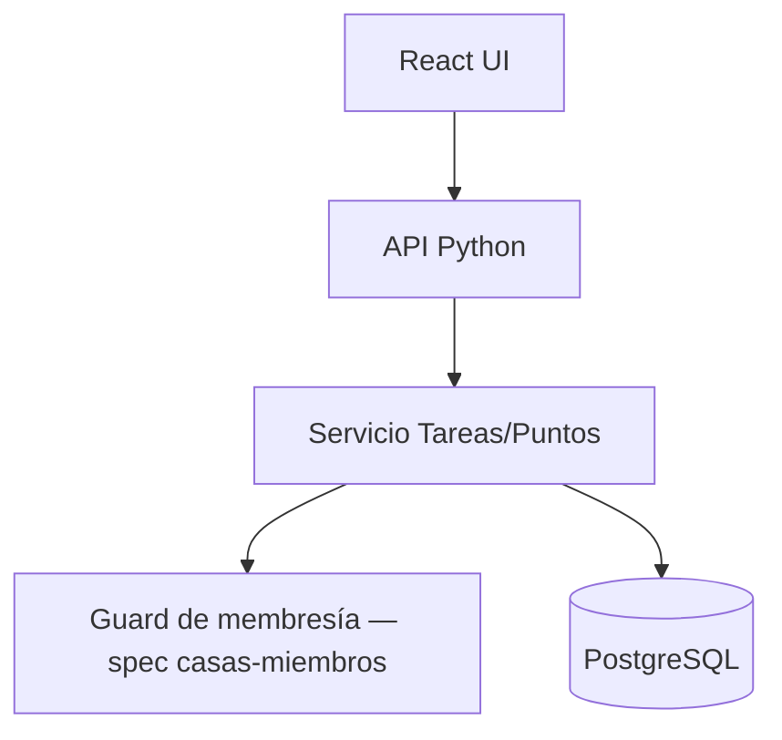
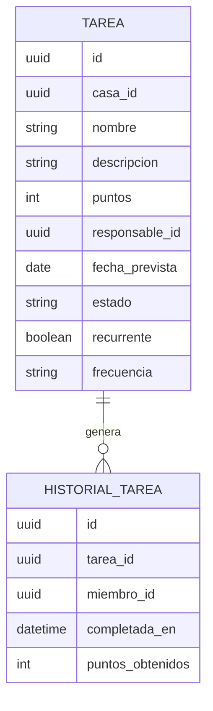

# Gestión de Tareas y Puntos — Solution Overview

## File Index
- [spec.md](../spec.md)
- [10-verify.md](10-verify.md)
- [99-progress.md](99-progress.md)

### Task Index
| Task | File | Description | Dependencies |
|---|---|---|---|
| T1 | 01-plan-01-data-layer.md | Esquema Tarea, HistorialTarea, recurrencia | — |
| T2 | 01-plan-02-service-layer.md | Crear/asignar/completar tarea, puntos, ranking, recurrencia | T1 |
| T3 | 01-plan-03-api-routes.md | Endpoints REST de tareas y ranking | T2 |
| T4 | 01-plan-04-ui.md | UI de tareas, ranking e historial | T3 |

## Problem & Solution
- Las tareas domésticas necesitan un ciclo de vida (Pendiente → En curso → Completada) y un incentivo (puntos) que motive la participación.
- Se modela Tarea con estado, puntos, responsable opcional y flag de recurrencia; HistorialTarea registra cada finalización real (tarea, miembro, fecha, puntos) de forma inmutable, que es la fuente del ranking.
- El ranking se deriva agregando `HistorialTarea` por miembro — no se guarda un contador de puntos separado, evitando desincronización.

## Architecture

## Data Model

## UX/UI
- Pantalla "Tareas": listado por estado (Pendiente/En curso/Completada), formulario de creación, acción "Marcar completada".
- Pantalla "Ranking": tabla miembro/puntos ordenada descendente.
- Pantalla "Historial de tareas": fecha/miembro/tarea/puntos.

## Tradeoffs
- Los puntos totales se derivan de `HistorialTarea` en vez de mantenerse como contador en Miembro, priorizando consistencia e historial auditable sobre performance de lectura (aceptable a escala doméstica).
- Una tarea recurrente completada genera una nueva instancia (fila) en vez de reabrir la misma fila, para que `HistorialTarea` mantenga una relación 1:1 clara entre finalización y tarea concreta.

## API/Data Contracts
| Método | Ruta | Body/Query | Respuesta |
|---|---|---|---|
| POST | /casas/{casaId}/tareas | `{nombre, descripcion?, puntos, responsableId?, fechaPrevista?, recurrente?, frecuencia?}` | `Tarea` |
| PATCH | /casas/{casaId}/tareas/{tareaId} | `{estado}` | `Tarea` (+ crea HistorialTarea si estado=Completada) |
| GET | /casas/{casaId}/tareas | `?estado=` | `Tarea[]` |
| GET | /casas/{casaId}/ranking | — | `{miembroId, puntos}[]` ordenado desc |
| GET | /casas/{casaId}/tareas/historial | — | `HistorialTarea[]` |

## Service Integrations
Ninguna integración externa. Depende internamente del guard de membresía/permisos de la spec `casas-miembros`.
