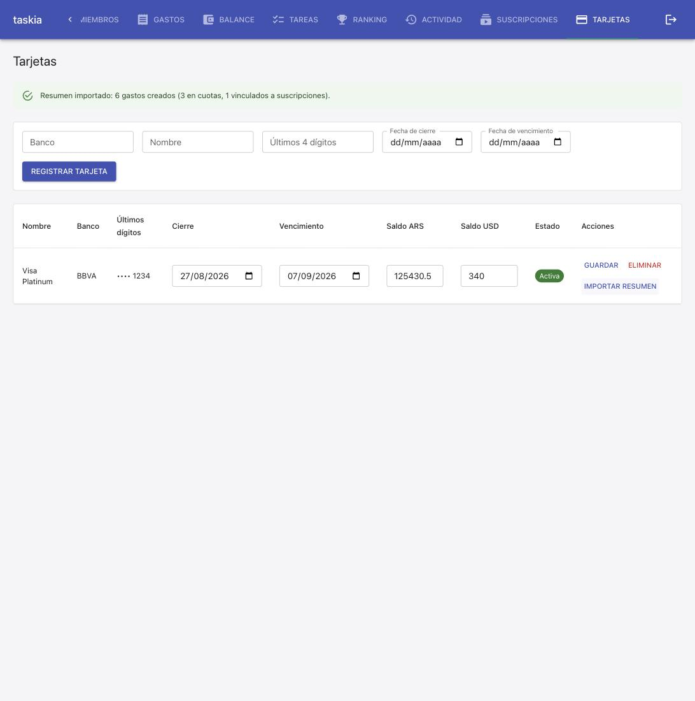
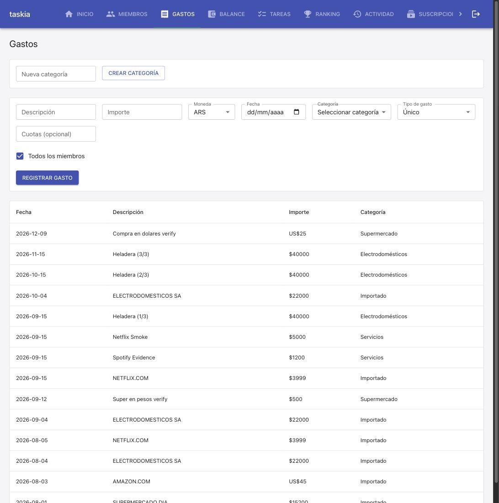

### Goal

Implementar la spec `importar-resumen-tarjeta` completa: T1 parser puro
`pdf_resumen_parser` + `Gasto.tarjeta_id` + migración 0012, T2
`resumen_importer_service` (orquestación, ruteo a gasto normal/cuotas
restantes/suscripción detectada), T3 endpoint de subida de PDF, T4 botón
"Importar resumen" en la pantalla Tarjetas. Pre-requisito cumplido antes
de T1: `main` (con `gastos-multi-moneda` y `tarjetas-credito` ya
shippeadas) mergeado sin conflictos a la rama, suite completa
reverificada en verde (223 backend + 91 frontend, build/lint limpios),
merge pusheado.

### Judgment

- **J001** `Gasto.tarjeta_id` se implementó SIN `ForeignKey()` a nivel de
  modelo (mismo criterio que `suscripcion_id`/`cuota_grupo_id`), con la
  FK real agregada vía SQL crudo (`ALTER TABLE ... REFERENCES
  tarjetas_credito(id)`) en `0012_gasto_tarjeta_id.py` — el plan dejaba
  esto "a verificar al implementar". Confirmado necesario: `0002_gastos.py`
  crea la tabla `gastos` vía `create_all` ANTES de que `0011_tarjetas_
  credito.py` registre `TarjetaCredito` en `Base.metadata` durante la
  secuencia de `run_migrations` — un `ForeignKey()` a nivel de modelo
  hubiera lanzado `NoReferencedTableError` en cualquier base nueva.
- **J002** Descubierto durante la verificación de idempotencia contra
  Postgres real: en una base creada desde cero, `gastos.tarjeta_id` (igual
  que `suscripcion_id` ya hoy) termina SIN la FK real a nivel de Postgres,
  porque `0002_gastos.py`'s `create_all` ya materializa la tabla completa
  con TODAS las columnas del modelo `Gasto` vigente (incluida `tarjeta_id`)
  desde el arranque — el `ALTER TABLE ADD COLUMN IF NOT EXISTS ...
  REFERENCES` de `0012` nunca llega a ejecutarse contra una base nueva
  (la columna ya existe). La `REFERENCES` de `0012` sigue siendo correcta
  para el path real de producción (una base existente donde `gastos` ya
  existía sin `tarjeta_id` antes de este deploy). No es una regresión
  introducida por esta spec — es la misma limitación preexistente que ya
  tiene `suscripcion_id` (`0009`), documentada ahora explícitamente en el
  test de migraciones. Ver Observations/suggestions.yaml para el hallazgo
  completo.
- **J003** Parser (`pdf_resumen_parser.py`) usa `pdfplumber.extract_text
  (layout=True)` (no el modo default, que colapsa el espaciado entre
  columnas a un solo espacio) para preservar la separación real entre las
  columnas "pesos"/"dólares" de la tabla Consumos. Para decidir a qué
  columna pertenece un importe encontrado en una línea (dado que una de
  las dos columnas suele estar vacía y no deja rastro en el texto), se usa
  la línea "TOTAL CONSUMOS" —siempre trae ambos totales poblados— como
  ancla de posición de columna, clasificando cada importe de cada línea de
  consumo por cercanía a esas dos posiciones. Decisión de implementación
  dentro de la libertad explícita que daba `01-plan-01-parser-pdf.md`
  ("decisión de implementación libre siempre que TC-002/003/004/008/009
  queden cubiertos").
- **J004** `resumen_importer_service.importar_resumen` parsea el PDF
  ANTES de validar que `tarjeta_id` existe/pertenece a la casa (el plan
  listaba el orden inverso) — se fusionó la validación de existencia de
  la tarjeta con la llamada a `tarjeta_service.actualizar_tarjeta` (que
  ya la hace por su cuenta, lanzando `NotFoundError`), evitando una
  lectura separada solo para esa validación. Sin impacto en ningún TC
  (ninguno ejercita la combinación "tarjeta inexistente + PDF también mal
  formado" para distinguir qué error debería ganar). Deviation dentro de
  `spec-deviation`, settleable en L2.
- **J005** `ResumenImportado.gastos_creados` es el TOTAL de filas `Gasto`
  persistidas por la importación (incluye las de `cuotas_creadas` y las
  vinculadas a `suscripciones_vinculadas` — no una cuarta categoría
  aparte), interpretando literalmente el mensaje de T4 ("N gastos
  creados (X en cuotas, Y vinculados a suscripciones)") como "N total,
  desglosado en X e Y". `00-overview.md`/T2 no lo dejaban 100% explícito;
  T3/T4 no tienen tests que dependan de la interpretación contraria.
- **J006** T3 requirió agregar `python-multipart` a `requirements.txt`
  (necesaria para que FastAPI parsee `multipart/form-data`/`UploadFile`)
  — no estaba en `spec.md`'s `exceptions` (que solo confirmó `pdfplumber`
  con el usuario). `new-dependency` nunca es settleable en ningún trust
  level: registrada como decisión abierta no bloqueante `D001` en
  `evidence/decisions.yaml` en vez de asumirla silenciosamente — el build
  continuó (es un requisito técnico ineludible de lo que T3 ya
  especificaba), pero queda pendiente de confirmación explícita del
  humano antes de shippear.

### Observations

- El proyecto sigue sin tooling de coverage instalado (`stack.yaml`
  `quality_tools.coverage.tool: null`) a pesar de que `nybo.config.yaml`
  declara `testing.coverage_threshold: 80` — mismo gap preexistente ya
  observado en `tarjetas-credito`, no introducido por esta spec. Remedio:
  `/nybo-brownfield-bootstrap --quality`, fuera del alcance de este build.
- Confirmado en vivo, contra la base de datos real del entorno de
  desarrollo (persistida, no efímera): `gastos.tarjeta_id` SÍ recibió su
  FK real (`gastos_tarjeta_id_fkey -> tarjetas_credito`), a diferencia de
  la base de test efímera (ver J002) — porque esa base ya tenía la tabla
  `gastos` creada ANTES de que este build agregara la columna, exactamente
  el escenario real de producción que el `ALTER TABLE ... REFERENCES` de
  `0012` está pensado para cubrir.
- La generación perezosa mensual de suscripciones (`generar_gastos_
  pendientes`, spec `gastos-suscripcion-mensual`) interactúa
  correctamente con `registrar_suscripcion_detectada` sin cambios: al
  visitar Gastos un mes calendario después de la fecha del resumen
  importado, generó exactamente un gasto adicional para el mes en curso
  (sin duplicar el de agosto) — confirmado en vivo, ver Verification.

### Verification

### Verificación (cycle 1)

**Build**
- `npm run build` (`tsc --noEmit && vite build`) — sin errores. 650 módulos, bundle 481.72 kB (gzip 147.21 kB).
- `npm run lint` (`eslint src/frontend`) — sin errores.

**Tests**
- Backend: `.venv/bin/python3 -m pytest tests/` — **243 passed, 1 skipped** (el skip es `test_dsn_externa_nunca_se_toca_directamente`, requiere `DATABASE_URL` apuntando a Postgres directo).
- Frontend: `npm run test -- --run` (vitest) — **93 passed** (18 archivos).
- Migración `0012_gasto_tarjeta_id` — idempotencia verificada contra Postgres real (contenedor `postgres:16-alpine` efímero vía docker): `tests/integration/db/postgres_migrations.test.py` corre `run_migrations` 3 veces seguidas sin excepción, confirma `gastos.tarjeta_id` nullable y documenta por qué esa base efímera no exhibe la FK real (ver Observations) — **2 passed, 1 skipped**.

**Test cases (spec.md, TC-001 a TC-010)** — las 10 son `[INTEGRATION]`/`[UNIT]`, ninguna `[E2E]`/`[MANUAL]`; las 10 resuelven a un test automatizado real:
| TC | Cubierta por |
|---|---|
| TC-001 | `tests/integration/services/resumen_importer.test.py::test_tc001_...`, `tests/integration/api/importar_resumen_routes.test.py::test_post_resumen_con_pdf_de_ejemplo_...` |
| TC-002 | `resumen_importer.test.py::test_tc002_...` |
| TC-003 | `resumen_importer.test.py::test_tc003_...` |
| TC-004 | `resumen_importer.test.py::test_tc004_...` |
| TC-005 | `resumen_importer.test.py::test_tc005_...` |
| TC-006 | `resumen_importer.test.py::test_tc006_...` |
| TC-007 | `resumen_importer.test.py::test_tc007_...` |
| TC-008 | `pdf_resumen_parser.test.py::test_tc008_...` (parser), `resumen_importer.test.py::test_tc008_...` (integración) |
| TC-009 | `pdf_resumen_parser.test.py::test_tc009_...` (x2, parser), `importar_resumen_routes.test.py::test_tc009_...` (API, 422 + cero gastos) |
| TC-010 | `tests/unit/frontend/Tarjetas.test.tsx::"TC-010: importar un resumen sube el PDF de inmediato..."` |

Coverage tool: no configurado en este proyecto — gap preexistente, ver Observación arriba.

**Live evidence (smoke manual, REQ-001 a REQ-007/Outcome)**
Entorno ya arriba (`docker compose`, contenedores corriendo hacía 4h+ — probado antes de tocar nada, nunca reiniciado innecesariamente): se reconstruyó SOLO la imagen `backend` (`docker compose build backend` + `docker compose up -d --no-deps backend`) para instalar las dependencias nuevas (`pdfplumber`, `python-multipart`) — el bind mount de `./src` no cubre paquetes instalados en la imagen. El restart aplicó `0012_gasto_tarjeta_id` contra la base real persistida del entorno de dev, confirmado vía `psql \d gastos` (FK real `gastos_tarjeta_id_fkey -> tarjetas_credito`, ver Observations).

Ruta completa manejada con un browser real (Chrome vía extensión), un solo pase, de punta a punta, contra la "Casa Smoke Test" ya usada por builds anteriores:
1. Sesión ya activa (JWT persistido) → "Casa Smoke Test" → pantalla Tarjetas.
2. Alta de una tarjeta real vía el formulario: BBVA / Visa Platinum / •••• 1234 / cierre 27/07/2026 / vencimiento 07/08/2026.
3. Click en "Importar resumen" → seleccionar el PDF de muestra (BBVA Visa Platinum, generado con `reportlab`, mismo layout que las fixtures de test — sin datos personales reales) → **subida inmediata, sin ningún diálogo de confirmación** (REQ-007 en vivo).
4. Resultado mostrado de inmediato en un `Alert` verde: **"Resumen importado: 6 gastos creados (3 en cuotas, 1 vinculados a suscripciones)."** — coincide exactamente con lo esperado (1 ARS + 1 USD + 3 cuotas restantes + 1 suscripción = 6).
5. La fila de la tarjeta se refrescó sola: Cierre **27/08/2026**, Vencimiento **07/09/2026**, Saldo ARS **125430.5**, Saldo USD **340** — coincide con el encabezado del PDF (REQ-001 en vivo).
6. Navegación a "Gastos": confirmados en vivo contra la base real —
   `ELECTRODOMESTICOS SA` × 3 ($22000 c/u, 2026-08-04/09-04/10-04, categoría "Importado", sin sufijo "(N/M)" en la descripción — a diferencia de las cuotas preexistentes de otro build que sí lo llevan, confirmando que `registrar_gasto_cuotas_restantes` es un mecanismo propio, TC-004 en vivo);
   `NETFLIX.COM` $3999 en 2026-08-05, categoría "Importado" (suscripción nueva, TC-005 en vivo);
   `AMAZON.COM` US$45 en 2026-08-03 (TC-003 en vivo);
   `SUPERMERCADO DIA` $15200 en 2026-08-01 (TC-002 en vivo);
   ninguna línea "COMISION PLATINUM"/"IMPUESTO DE SELLOS" (TC-008 en vivo).
   Bonus no buscado pero confirmatorio: apareció además un `NETFLIX.COM` $3999 fechado 2026-09-15 ("hoy") — la generación perezosa mensual preexistente (`generar_gastos_pendientes`, spec `gastos-suscripcion-mensual`) generó sola el gasto del mes en curso para la Suscripcion recién creada, sin duplicar el de agosto, confirmando en vivo que `ultimo_mes_generado` quedó bien seteado (ver Observations).
7. Limpieza: tarjeta eliminada (soft-delete) vía "Eliminar", dejando el entorno compartido de dev como estaba (los gastos/suscripción generados quedan, mismo criterio que el resto de gastos de smoke de builds anteriores ya presentes en esa casa).

Screenshots:

**Resultado**: OUTCOME observado — verde en todos los niveles (unit, integration, migración contra Postgres real —efímera y persistida—, UI en vivo con datos reales).

### Curation

Se extrajeron 4 convenciones/patrones a memoria de proyecto:
- **[DBG-04]** (`db.md`) — el gap de FK-nunca-adjuntada en una base
  creada desde cero por `run_migrations` en un solo pase, incluso
  siguiendo correctamente DBG-02/DBG-03 (`create_all` de una migración
  temprana ya materializa la columna completa del modelo vigente,
  volviendo no-op el `ALTER ADD COLUMN` de la migración que agrega la
  FK real). Confidence: high (confirmado en vivo contra 2 bases reales
  — efímera y persistida — con resultados opuestos, no una sola
  observación).
- **[SERVP-03]** (`services.md`) — series "solo lo restante" vs. serie
  "arranca en 1": sibling function, no un flag en la existente.
  Confidence: medium (primera vez que este patrón se necesitó en el
  proyecto).
- **[SERVP-04]** (`services.md`) — variante sin efecto colateral cuando
  un caller nuevo no quiere el "hoy" implícito de la función existente.
  Confidence: medium (primera vez).
- **[APIP-01]** (`api.md`) — primer endpoint de subida de archivos del
  proyecto (`UploadFile`, `async def`, `python-multipart`, 422 vs 400
  para "contenedor reconocido, contenido no reconocido"). Confidence:
  medium (un solo endpoint hasta ahora).

`evidence/suggestions.yaml` (S001-S003): S001 pide confirmación humana
explícita de `python-multipart` antes de `/nybo-ship` (mismo criterio
que D001 en `decisions.yaml`); S002 sugiere probar el parser contra un
PDF real (no solo fixtures sintéticas) antes de confiar en él a diario;
S003 repite el gap preexistente de coverage tooling (ya señalado por
`gastos-multi-moneda`/`tarjetas-credito`).
