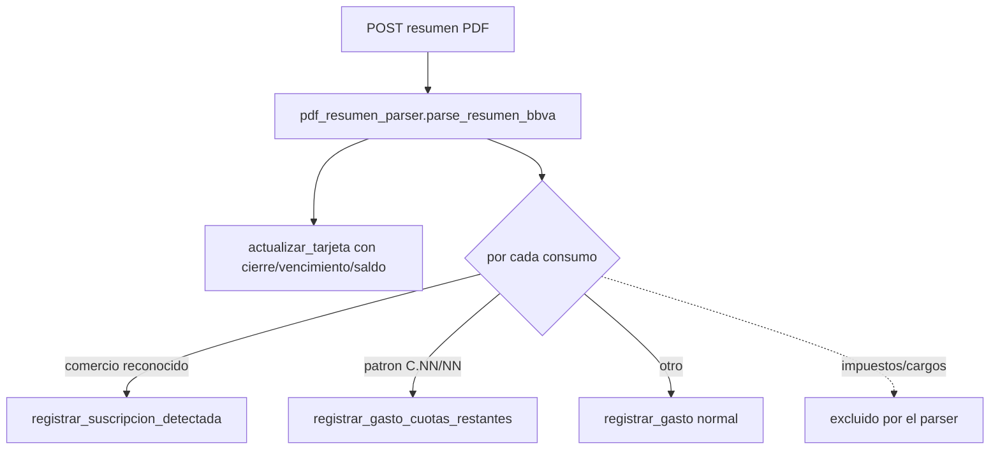

# Solution Overview — Importar resumen de tarjeta en PDF

## File Index
- [../spec.md](../spec.md)
- [10-verify.md](10-verify.md)
- [99-progress.md](99-progress.md)

### Task Index

| Task | File | Description | Dependencies |
|---|---|---|---|
| T1 | [01-plan-01-parser-pdf.md](01-plan-01-parser-pdf.md) | `pdf_resumen_parser` (puro); `Gasto.tarjeta_id`; dependencia `pdfplumber` | — |
| T2 | [01-plan-02-importer-service.md](01-plan-02-importer-service.md) | `resumen_importer_service`; helpers en `suscripcion_service`/`gasto_service` | T1 |
| T3 | [01-plan-03-api-importar.md](01-plan-03-api-importar.md) | Endpoint de subida de PDF | T2 |
| T4 | [01-plan-04-frontend-importar.md](01-plan-04-frontend-importar.md) | Botón "Importar resumen" en Tarjetas | T3 |

## Problema y solución
`pdf_resumen_parser.py` es una función pura (sin DB): recibe los bytes
del PDF y devuelve un `ResumenParseado` (cierre/vencimiento/saldo +
lista de consumos). `resumen_importer_service.py` es el único que toca
la base — por cada consumo decide a qué mecanismo enrutarlo (gasto
normal / cuotas restantes / suscripción) y llama a los servicios ya
existentes, nunca reimplementa su lógica.

## Arquitectura
Dos componentes nuevos: `pdf_resumen_parser.py` (parsing puro,
testeable sin DB) y `resumen_importer_service.py` (orquestación). Se
extienden `suscripcion_service.py` (nueva función
`registrar_suscripcion_detectada`) y `gasto_service.py` (nueva función
`registrar_gasto_cuotas_restantes`, y `tarjeta_id` opcional agregado a
`registrar_gasto`) — ninguno de los dos mecanismos existentes
(`crear_suscripcion`/`_crear_gastos_en_cuotas`) se modifica ni se
reutiliza directamente, porque ambos asumen "arrancar de cero ahora"
(ver Tradeoffs).

## Data Model
- `Gasto.tarjeta_id: Optional[GUID]` — `NULL` para un gasto no
  originado en una importación; identifica de qué tarjeta vino un
  consumo importado. Sin `ForeignKey()` a nivel de modelo, mismo
  criterio que `suscripcion_id` (ver docstring de `Gasto`) solo si el
  orden de migraciones lo exige — a verificar al implementar T1 (si
  `tarjetas_credito` ya existe en el momento de la migración de este
  campo, sí puede llevar `ForeignKey()` normal).
- Migración `0012_gasto_tarjeta_id.py` — aditiva.
- `ResumenParseado`/`ConsumoParseado` (dataclasses, `pdf_resumen_parser.py`, sin persistencia propia).

## Tradeoffs
- **`registrar_suscripcion_detectada` no reutiliza `crear_suscripcion`**:
  `crear_suscripcion` genera de inmediato un gasto fechado "hoy" además
  de crear la Suscripcion — eso duplicaría el consumo real del resumen
  (que ya trae su propia fecha e importe). La nueva función crea la
  Suscripcion (o reutiliza una activa existente con la misma
  descripción) y registra el gasto con la fecha/importe/moneda reales
  del resumen, dejando `ultimo_mes_generado` en el mes de esa fecha para
  que la generación perezosa mensual no lo duplique después.
- **`registrar_gasto_cuotas_restantes` no reutiliza `_crear_gastos_en_cuotas`**:
  esa función siempre arranca una serie nueva de 1/N dividiendo un
  importe total; acá el PDF ya da el importe de cada cuota individual y
  el punto de partida es "N de M" (cuota en curso) — se crean solo las
  cuotas de la actual (inclusive) a la total, una por mes consecutivo
  desde la fecha del resumen, reutilizando `_sumar_meses`.
- **Categoría de un gasto importado**: no viene en el PDF. Se usa
  find-or-create de una categoría "Importado" por casa (mismo patrón de
  find-or-create que ya usa la vinculación de suscripciones por
  descripción).
- **`pagado_por` de un gasto importado**: el dueño de la tarjeta
  (`TarjetaCredito.miembro_id`), no necesariamente quien sube el PDF.
- **Suscripción nueva detectada con actor no-Administrador**: no se
  bloquea la importación completa por un solo permiso — esa línea cae a
  gasto suelto (REQ-004) y el resto de la importación continúa.
- **Nueva dependencia de backend**: `pdfplumber` (confirmado con el
  usuario) — se agrega a `requirements.txt`.

## API/Data Contracts
- `POST /casas/{casa_id}/tarjetas/{tarjeta_id}/resumen` — `multipart/form-data`, campo `archivo` (PDF). Responde `ResumenImportadoOut {gastos_creados: int, cuotas_creadas: int, suscripciones_vinculadas: int, tarjeta: TarjetaOut}`.
- Error de formato no reconocido → 422 con `detail` descriptivo (REQ-006).
- `importarResumen(casaId, tarjetaId, archivo: File)` (frontend).
