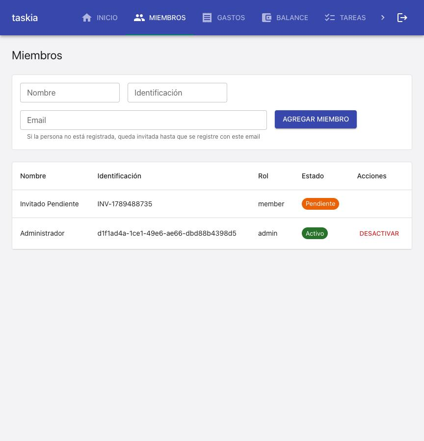
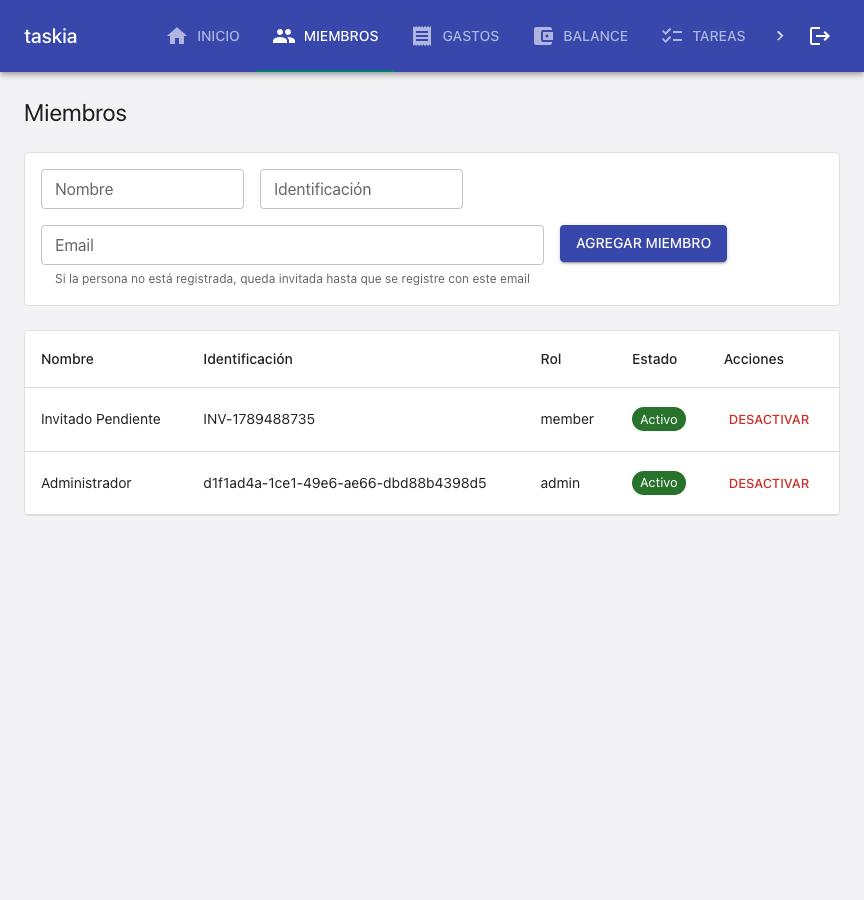

### Goal

Implementar la spec invitar-miembro-pendiente completa: T1 (columna email_invitacion + migración 0007), T2 (agregar_miembro crea membresía pendiente cuando el email no tiene Usuario, y rechaza una segunda invitación pendiente duplicada), T3 (vincular_membresias_pendientes, llamada desde auth_service.registrar_usuario dentro de la misma transacción) y T4 (Miembros.tsx muestra Pendiente y oculta Desactivar para esas filas, helper text actualizado). Objetivo: que un Administrador pueda invitar a alguien por email sin cuenta todavía, y que esa persona quede vinculada automáticamente al registrarse.

### Judgment

**J001** Dos tests preexistentes codificaban el comportamiento viejo (email sin Usuario -> `NotFoundError`/404): `tests/integration/services/miembro_service.test.py::test_agregar_miembro_con_email_de_usuario_inexistente_es_rechazado`, `tests/integration/api/casas_routes.test.py::test_agregar_miembro_con_email_de_usuario_inexistente_devuelve_404` y `tests/integration/api/miembro_historial_actividad.test.py::test_agregar_miembro_rechazado_no_agrega_actividad`. Los tres se reescribieron para reflejar el nuevo comportamiento deseado por la spec (201 con `usuario_id: null`, y SÍ se registra actividad ya que el alta ahora se confirma) en vez de dejarlos en rojo o borrarlos — es un cambio de contrato intencional de REQ-001, documentado explícitamente en el docstring de cada test actualizado. Clase de decisión: `spec-deviation` (ajuste de tests de regresión para reflejar un contrato que la propia spec cambia a propósito) — settleable en L2 (semi-autonomous).

**J002** `auth_service.registrar_usuario` necesitó un segundo `session.refresh(usuario)` después del segundo `commit()` (el que persiste `vincular_membresias_pendientes`) — sin él, `session.commit()` expira los atributos de `usuario` y el objeto queda inutilizable tras `session.close()` en el `finally` (`DetachedInstanceError`). Ajuste mecánico, mismo patrón que el primer refresh ya existente; no cambia ningún contrato observable.

### Observations

Migración 0007 siguió el patrón de `0006_miembro_desactivado_enum_value.py` (chequeo de dialect + no-op fuera de Postgres) en vez del patrón de `0005` (inspector de columnas) — ambos son convenciones válidas en este proyecto para columnas/valores aditivos; se eligió el de 0006 porque `ALTER TABLE ... ADD COLUMN IF NOT EXISTS` es nativamente idempotente en Postgres 9.6+, sin necesitar inspeccionar el esquema primero.

### Verification

**Build**
- `npm run build` (`tsc --noEmit && vite build`): PASS, sin errores de tipos.
- Backend no tiene paso de build separado (Python interpretado); `nybo results` no reporta un build backend porque no existe uno propio en este stack.

**Tests**
- Backend: `.venv/bin/python -m pytest tests/` (excluyendo `tests/integration/db`, que requiere Docker — ver Live evidence): **144 passed**.
  - Incluye las 8 pruebas nuevas/reescritas de esta spec: TC-001, TC-002 (control), TC-003, TC-004, TC-005 (control), TC-006, y las 3 pruebas de regresión actualizadas (`casas_routes.test.py`, `miembro_historial_actividad.test.py`, `miembro_service.test.py`) que codificaban el contrato viejo (404) y ahora codifican el nuevo (201 pendiente).
- Frontend: `npm run test -- --run`: **69 passed** (15 archivos), incluye TC-007 y TC-008 en `Miembros.test.tsx`.
- `npm run lint`: sin hallazgos.

**Coverage**
`unavailable — not configured`: `.nybo/foundation/stack.yaml`'s `quality_tools.coverage.tool` es `null` — no hay herramienta de cobertura instalada en este proyecto (backend ni frontend). No es un gap introducido por esta spec; se recomienda `/nybo-brownfield-bootstrap --quality` como próximo paso (ver checkpoint).

**Test cases & progress**
Los 8 test cases de la spec (TC-001 a TC-008) están todos automatizados y en verde:
- TC-001, TC-002, TC-006: `tests/integration/api/miembro_invitacion_pendiente.test.py` (nuevo).
- TC-003, TC-004: `tests/integration/api/miembro_invitacion_pendiente.test.py` (nuevo).
- TC-005 (control, `[UNIT]`): `tests/unit/services/auth_service.test.py::test_registrar_usuario_sin_membresias_pendientes_no_cambia_de_comportamiento` (nuevo).
- TC-007, TC-008: `tests/unit/frontend/Miembros.test.tsx` (ampliado).
Ningún caso quedó `[E2E]`/`[MANUAL]` en esta spec — los 8 son `[INTEGRATION]`/`[UNIT]` automatizables, y los 8 resuelven a un test real.

**Manual test cases**
Ninguno — no hay test cases `[E2E]`/`[MANUAL]` en esta spec.

**Live evidence**
Entorno dockerizado (`docker compose`, ya arriba — `db`/`backend`/`frontend`) reusado tal cual (probe-then-attach: healthcheck ya en verde, sin reinstalar/migrar/sembrar). El backend recargó con el código de esta rama (bind mount + `--reload`) y corrió `run_migrations` en el arranque, incluida `0007_miembro_email_invitacion`.

Ruta completa recorrida a mano, replicando el reporte de bug original (captura de la pantalla Miembros):
1. Se registró un Administrador real y creó una Casa vía API (`POST /auth/registro`, `POST /casas`).
2. Se invitó, como Admin, a un email que nunca se había registrado (`POST /casas/{id}/miembros`) → `201`, `usuario_id: null`.
3. Se abrió la app real en el browser, se inició sesión como ese Administrador, y se navegó a la pantalla Miembros:

4. Se registró ese mismo email como Usuario real (`POST /auth/registro`) y se refrescó la pantalla:

Confirma, en la app real (no solo en tests): (a) el bug original ("No existe un Usuario registrado con el email...") ya no ocurre — la invitación se crea sin crash; (b) el estado "Pendiente" se distingue visualmente de Activo/Inactivo y no ofrece Desactivar; (c) al registrarse con el mismo email, la membresía pasa a Activo automáticamente, sin ninguna acción manual adicional.

`tests/integration/db/postgres_migrations.test.py` (Postgres real, vía Docker efímero o `TEST_DATABASE_URL`) no se corrió en esta pasada — cubre las migraciones existentes contra Postgres real de forma genérica y no fue tocado por esta spec; el smoke manual de arriba ya ejercitó la migración 0007 contra el Postgres real de `docker-compose`, incluyendo el `run_migrations` repetido en cada reload del backend (idempotencia confirmada por los múltiples reloads sin error durante el desarrollo).

**Judgment log**
Ver sección `### Judgment` arriba (J001, J002) — ambos revisados y consistentes con REQ-001/REQ-002; ninguno bloquea el resultado.

**Security**
Sin cambios de superficie de seguridad: no se tocó autenticación/autorización más allá de reusar los guards existentes (`_validar_actor_admin`, `resolver_actor_en_casa`). `email_invitacion` no es un dato sensible nuevo (es el mismo email que ya se acepta en el payload de alta).

**Design principles**
Cambios quirúrgicos dentro de funciones existentes, sin introducir componentes nuevos innecesarios (ver Design Rationale de cada task file) — consistente con "Clarity, Consistency, OOP" del proyecto.

**Wiki alignment**
Sin domain docs (`.nybo/memory/domains/*.md`) que necesiten actualización — el patrón de migraciones y el guard de sesión compartida ya están documentados en el código (docstrings) siguiendo la convención existente del proyecto.
