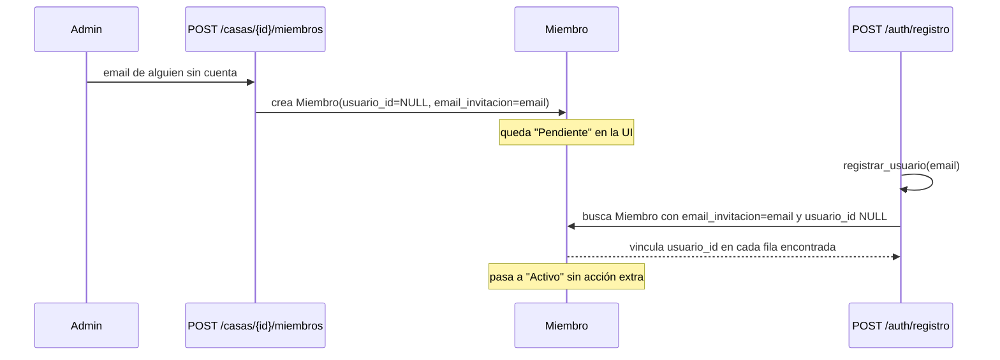

# Solution Overview — Invitar a un miembro que todavía no tiene cuenta

## File Index
- [../spec.md](../spec.md)
- [10-verify.md](10-verify.md)
- [99-progress.md](99-progress.md)

### Task Index

| Task | File | Description | Dependencies |
|---|---|---|---|
| T1 | [01-plan-01-membresia-pendiente.md](01-plan-01-membresia-pendiente.md) | `Miembro` guarda el email invitado; migración | — |
| T2 | [01-plan-02-agregar-miembro-pendiente.md](01-plan-02-agregar-miembro-pendiente.md) | `agregar_miembro` crea una membresía pendiente en vez de rechazar | T1 |
| T3 | [01-plan-03-vincular-al-registrarse.md](01-plan-03-vincular-al-registrarse.md) | `registrar_usuario` vincula automáticamente las pendientes | T1 |
| T4 | [01-plan-04-frontend-estado-pendiente.md](01-plan-04-frontend-estado-pendiente.md) | Miembros.tsx muestra "Pendiente" | T2 |

## Problema y solución
`agregar_miembro` exige hoy que el email ya corresponda a un Usuario
registrado. La solución invierte esa dependencia: `Miembro.usuario_id`
ya es nullable (existía para datos previos a `usuarios-auth`) — se
reutiliza ese `NULL` para representar "pendiente", agregando una columna
nueva `email_invitacion` que guarda el email con el que se invitó, para
poder encontrarlo cuando esa persona se registre. `registrar_usuario`
(otro servicio, dominio `auth`) llama a una función nueva de
`miembro_service` que busca y vincula esas filas — una dependencia
nueva y deliberada entre dos servicios que hoy no se conocen entre sí
(ver Tradeoffs).

## Arquitectura
Sin componentes nuevos — se extiende `Miembro` (T1) y se agregan dos
funciones de servicio nuevas en `miembro_service.py` (T2 alta pendiente,
y una función de vinculación que `auth_service.py` importa y llama
desde T3). La UI (T4) es un cambio de presentación puro sobre un dato
que `MiembroOut` ya expone (`usuario_id`, agregado por
`resolver-rol-usuario-en-casa`).

## Data Model
- `Miembro.email_invitacion: Optional[str]` — nuevo. Se completa al
  crear una membresía pendiente; se conserva después de vincularse (no
  se borra) como registro de auditoría de quién invitó a quién.
- Migración `0007_miembro_email_invitacion.py` (`ALTER TABLE miembros
  ADD COLUMN email_invitacion VARCHAR`) — aditiva, sin afectar filas
  existentes (quedan con `NULL`, que ya significa "sin invitación
  registrada", equivalente a como se comportaban hoy).

## Tradeoffs
- **`registrar_usuario` (auth_service) llama a una función de
  `miembro_service`** — nueva dependencia cruzada entre dos servicios
  que hoy están deliberadamente aislados ("un servicio por
  responsabilidad"). Se acepta porque la alternativa (hacer que
  `miembro_service` sondee constantemente si hay Usuarios nuevos, o
  mover la lógica de registro a `miembro_service`) es peor: la
  vinculación es un efecto secundario *del registro*, tiene sentido que
  el propio flujo de registro lo dispare explícitamente, una vez, en el
  momento correcto.
- **Vincular TODAS las pendientes con ese email, no solo una** — es la
  lectura natural de "un Usuario puede estar en varias Casas" que ya
  rige el resto del dominio.

## API/Data Contracts
- `POST /casas/{casa_id}/miembros`: ya no responde 404 cuando el email
  no corresponde a un Usuario registrado — responde 201 igual, con
  `usuario_id: null` en el `Miembro` creado. Sigue respondiendo 400 si
  ya existe una membresía (pendiente o activa) para ese email en esa
  casa (REQ-003).
- `MiembroOut`: sin cambio de forma (ya expone `usuario_id`, que ahora
  puede ser `null` en más casos que antes — antes solo en datos
  sembrados manualmente).
