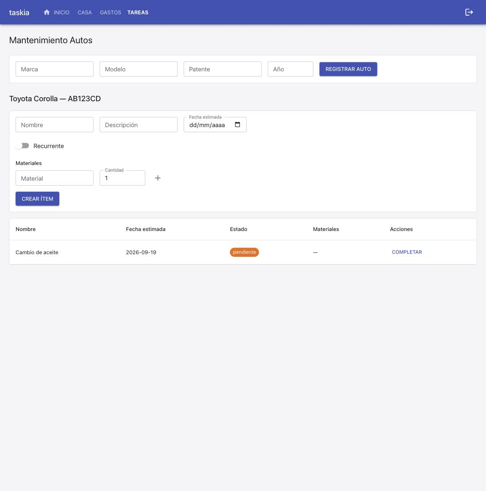
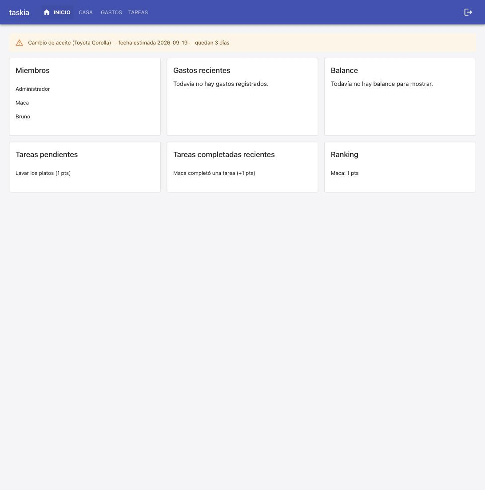
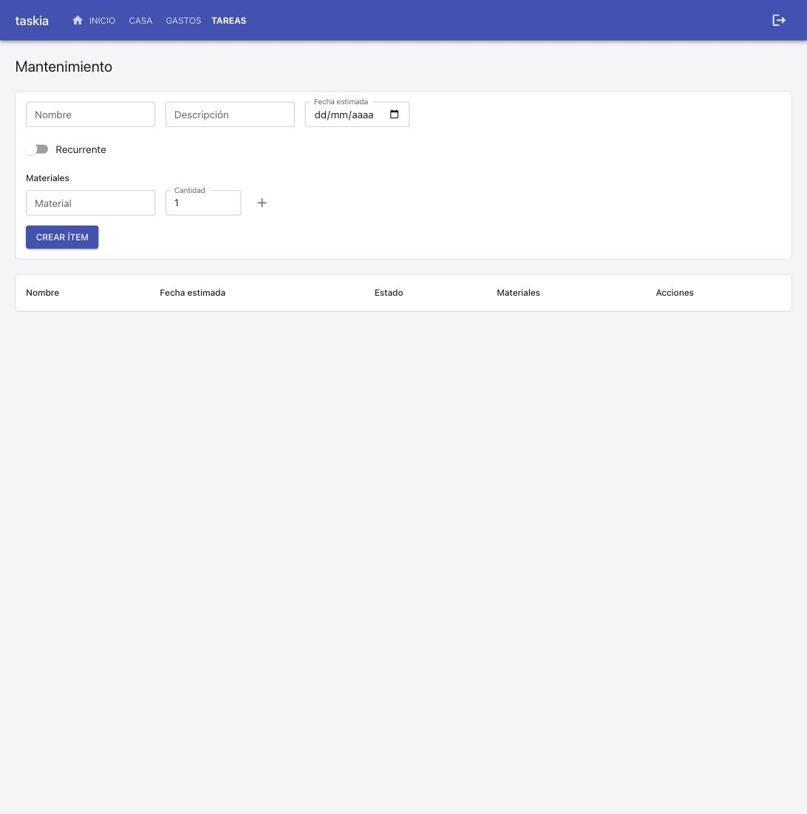

### Goal

Extender mantenimiento-casa (ya mergeada) con una nueva entidad Auto y auto_id opcional en ItemMantenimiento: registrar autos de la casa y cargarles ítems de mantenimiento (mismo mecanismo ya construido), en una pantalla propia 'Mantenimiento Autos', separada de 'Mantenimiento' (casa) — TC-001 a TC-007.

### Judgment

- **J001** T1: `ItemMantenimiento.auto_id` se declaró como `Column(GUID(), nullable=True)` PLANO, sin `ForeignKey('autos.id')` a nivel de modelo — desviación deliberada de la redacción literal de 00-overview.md/01-plan-01 (que pedía un FK real a nivel de modelo). Motivo: `items_mantenimiento` fue creada por la migración 0017 (ya shippeada, mantenimiento-casa), que corre ANTES que 0018 (la que crea `autos`); un ForeignKey real en el modelo habría hecho fallar 0017.upgrade() en cualquier base creada desde cero con 'relation "autos" does not exist', porque create_all resuelve el FK contra el modelo VIGENTE (que ya incluye auto_id). Mismo patrón ya documentado y verificado en el proyecto ([DBG-02]/[DBG-03]/[DBG-04], .nybo/memory/domains/db.md) para suscripcion_id/tarjeta_id. El FK real se agrega vía SQL crudo (ALTER TABLE ... REFERENCES) en 0018, después de crear autos en esa misma migración — mismo gap ya aceptado en una base fresh (DBG-04): ahí la ALTER es no-op y el FK físico solo se adjunta en el path real de producción (una base que ya tenía items_mantenimiento sin auto_id antes de este deploy). Extendí también tests/integration/db/postgres_migrations.test.py con las mismas aserciones de columnas/FK que ya sigue esa suite para cada migración anterior.
- **J002** Pre-cycle baseline: antes de tocar código, mergeé `main` (ya con mantenimiento-casa mergeada, PR #35) dentro de `feat/mantenimiento-autos` — merge limpio, sin conflictos (esta rama solo traía archivos de spec-tree únicos bajo .nybo/plans/mantenimiento-autos/). Corrí la suite completa ANTES de implementar: backend 329/329 verde; frontend falló con 'bad option: --no-experimental-webstorage' al correr `docker compose exec frontend npm run test` — atribuido: reproduje el mismo fallo en `main` sin tocar nada (checkout limpio), confirmando que es un problema de entorno preexistente (la imagen Docker del frontend usa `node:20-slim`, pero `vite.config.ts` pasa un execArgv de vitest — `--no-experimental-webstorage` — que Node 20 no reconoce; ese flag fue agregado para Node >=22 en la spec `usuarios-auth`) — no reproducible en el código de esta spec, y no relacionado con ningún cambio de esta rama. Excluido una vez: usé `npm run test -- --run` en el host (Node 25) como ruta de verificación de frontend durante todo este build en su lugar — 120/120 verde en esa ruta antes de tocar código.

### Verification

**Build**: `npm run build` (tsc --noEmit + vite build) — clean, no errors. Backend (`main.py`) starts and runs migrations idempotently, confirmed via a real backend restart against the persisted dev DB.

**Tests**:
- Backend: `docker compose exec backend python3 -m pytest tests/` — **349 passed** (baseline 329 + 20 new: 7 in `auto_service.test.py`, 7 in `mantenimiento_auto.test.py`, 6 in `autos_routes.test.py`).
- Frontend: `npm run test -- --run` (host, Node 25 — see Judgment J002 re: the pre-existing Docker/Node-20 vitest execArgv mismatch) — **123 passed** (baseline 120 + 3 new: 2 in `MantenimientoAutos.test.tsx`, 1 regression case added to `Mantenimiento.test.tsx`).
- Lint: `npm run lint` — clean.

**Coverage**: no coverage tool configured in this project (`stack.yaml`'s `quality_tools.coverage.tool: null`) — not evaluated, consistent with every prior cycle in this repo.

**Test cases (spec.md)**:
- `[TC-001]` Alta de auto con datos válidos — covered by `auto_service.test.py::test_tc001_alta_de_auto_con_datos_validos_persiste_y_aparece_en_el_listado` + `autos_routes.test.py::test_tc001_post_crea_auto_y_aparece_en_el_listado`, and confirmed live (see below). PASS
- `[TC-002]` Item con auto_id queda asociado — `mantenimiento_auto.test.py::test_tc002_item_con_auto_id_valido_queda_asociado_a_ese_auto` + `autos_routes.test.py::test_tc002_post_item_con_auto_id_queda_asociado`, confirmed live. PASS
- `[TC-003]` Listado filtra por auto correctamente (sin auto_id = solo casa; con auto_id = solo ese auto) — `mantenimiento_auto.test.py::test_tc003_listar_sin_filtro_devuelve_solo_los_de_la_casa` / `test_tc003_listar_filtrando_por_auto_devuelve_solo_los_de_ese_auto` + HTTP-level equivalents, confirmed live. PASS
- `[TC-004]` Alerta incluye ítems de auto — `mantenimiento_auto.test.py::test_tc004_alerta_incluye_items_de_auto_con_auto_id_y_auto_nombre`, confirmed live (banner text: "Cambio de aceite (Toyota Corolla) — fecha estimada 2026-09-19 — quedan 3 días"). PASS
- `[TC-005]` Auto de otra casa rechazado (404) — `mantenimiento_auto.test.py::test_tc005_auto_de_otra_casa_es_rechazado_con_not_found` + `autos_routes.test.py::test_tc005_auto_de_otra_casa_responde_404`, confirmed live (curl: `404`). PASS
- `[TC-006]` Pantalla agrupa auto + sus ítems — `MantenimientoAutos.test.tsx`, confirmed live (screenshot below). PASS
- `[TC-007]` Mantenimiento de la casa sin regresión — new regression test in `Mantenimiento.test.tsx` (asserts the fetch URL never carries `?autoId=`) + confirmed live (screenshot below: empty listing, no car items leaking in). PASS

**Live evidence** (dev environment already up via `make up`; backend restarted once to apply migration `0018` against the persisted dev DB — no reset/reseed):

Drove the full flow live end to end, via the real API (`curl`) and a real browser against `http://localhost:5173`:
1. Registered a user, created a casa, registered an `Auto` (Toyota Corolla, AB123CD, 2020) via `POST /casas/{id}/autos`.
2. Created a car maintenance item (`auto_id` set, due in 3 days) and a house item (no `auto_id`).
3. `GET .../mantenimiento` (no `autoId`) returned only the house item; `GET .../mantenimiento?autoId=...` returned only the car item.
4. `POST .../mantenimiento` with another casa's `auto_id` -> `404`.
5. In the browser: registered the same car and item through the "Mantenimiento Autos" screen — item appeared grouped under "Toyota Corolla — AB123CD".
6. Inicio banner showed: "Cambio de aceite (Toyota Corolla) — fecha estimada 2026-09-19 — quedan 3 días" — exactly the Outcome text specified in spec.md.
7. "Mantenimiento" (house) screen, reloaded after all of the above, showed an empty listing — zero leakage of car items, zero code touched in `Mantenimiento.tsx`.

**Judgment log**: see J001 (auto_id FK strategy, DBG-02/03/04 precedent) and J002 (pre-existing frontend Docker/Node-version test-runner mismatch, excluded once, reproduced identically against unmodified `main`).

**Security**: no new auth surface — reuses `resolver_actor_en_casa`/`requiere_membresia_activa` exactly as every other resource in this project. No secrets, no new external dependency.

**Design principles**: `Auto`/`auto_service`/`autos.py` mirror the existing `TarjetaCredito`/`tarjeta_service`/`tarjetas.py` pattern (one-resource-per-module, service owns validation, route is a thin HTTP adapter). `mantenimiento_service` extended, never duplicated, per the spec's explicit reuse requirement.

**Wiki alignment**: none of this project's ADRs/architecture docs required updates; `db.md`'s `[DBG-02]`/`[DBG-03]`/`[DBG-04]` conventions were followed, not contradicted.
