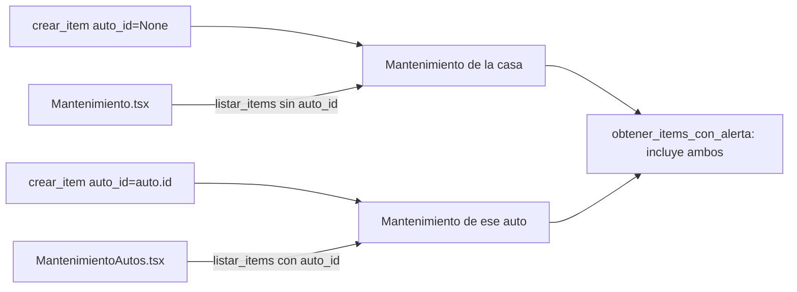

# Solution Overview — Mantenimiento de autos

## File Index
- [../spec.md](../spec.md)
- [10-verify.md](10-verify.md)
- [99-progress.md](99-progress.md)

### Task Index

| Task | File | Description | Dependencies |
|---|---|---|---|
| T1 | [01-plan-01-modelo-auto.md](01-plan-01-modelo-auto.md) | `Auto`; `ItemMantenimiento.auto_id`; migración | — |
| T2 | [01-plan-02-auto-service.md](01-plan-02-auto-service.md) | `auto_service`; `mantenimiento_service` filtra por auto | T1 |
| T3 | [01-plan-03-api-autos.md](01-plan-03-api-autos.md) | Rutas de autos; mantenimiento acepta `auto_id` | T2 |
| T4 | [01-plan-04-frontend-autos.md](01-plan-04-frontend-autos.md) | Pantalla "Mantenimiento Autos"; nav | T3 |

## Problema y solución
`Auto` es una entidad propia (mismo criterio que `TarjetaCredito`) —
solo datos básicos del vehículo. `ItemMantenimiento` (ya existente, spec
`mantenimiento-casa`) gana una columna `auto_id` opcional: `NULL` es
mantenimiento de la casa (comportamiento actual, sin cambios); poblado
vincula el ítem a un auto puntual. `mantenimiento_service.py` se
extiende (no se duplica) — `crear_item`/`listar_items` aceptan un
`auto_id` opcional, `obtener_items_con_alerta` no distingue origen (ya
devuelve todos los ítems próximos a vencer, sean de la casa o de un
auto — la spec `mantenimiento-casa` ya lo dejó preparado para esto al
no filtrar por `auto_id`).

## Arquitectura
Componente nuevo: `auto_service.py` + `Auto` (mismo patrón simple que
`tarjeta_service.py`, sin alertas propias — la alerta ya la cubre
`mantenimiento_service`). Router nuevo `src/api/routes/autos.py`.
`mantenimiento_service.py`/`src/api/routes/mantenimiento.py` se
extienden con un parámetro adicional, nunca se reescriben. Pantalla
nueva `MantenimientoAutos.tsx`, agregada al grupo desktop "Tareas"
(junto a Tareas/Mantenimiento) en `AppNav.tsx`.

## Data Model
`Auto` (`src/db/models/auto.py`, tabla `autos`):
- `id`, `casa_id` (FK `casas.id`).
- `marca: str`, `modelo: str`, `patente: Optional[str]`, `anio: Optional[int]`.
- `creado_en: datetime`.

`ItemMantenimiento` (extensión): agrega `auto_id: Optional[GUID]` (FK
real a `autos.id` — `autos` ya existe en el orden de migraciones al
momento de agregar esta columna, sin el problema de
`NoReferencedTableError` documentado para otras columnas de este
proyecto).

Migración `0018_mantenimiento_autos.py` — crea `autos` y agrega
`items_mantenimiento.auto_id` en el mismo archivo (mismo criterio ya
usado cuando dos cambios de esquema están estrechamente acoplados y se
shippean siempre juntos).

## Tradeoffs
- **Sin kilometraje ni intervalos en km**: decisión explícita del
  usuario — la periodicidad de un ítem de auto es por fecha, igual que
  el resto de la app; no se agrega un campo de odómetro al `Auto`.
- **`obtener_items_con_alerta` sin distinguir casa/auto en su propia
  lista**: un solo banner combinado en Inicio (decisión explícita del
  usuario, REQ-004) — el texto de cada alerta sí menciona el auto
  cuando corresponde (`ItemMantenimientoAlertaOut` incluye
  `auto_id`/`auto_nombre` opcionales para que el frontend arme el
  mensaje correcto).
- **Auto de la casa, no de un miembro**: decisión explícita del
  usuario — mismo criterio ya usado para `TarjetaCredito` (aunque un
  miembro sea quien más lo usa, no hay "dueño" a nivel de datos).

## API/Data Contracts
- `POST/GET /casas/{id}/autos` — CRUD simple (sin edición ni borrado en
  esta spec — alta y listado alcanzan para el caso de uso).
- `POST /casas/{id}/mantenimiento` (ya existente): `ItemMantenimientoCreate`
  agrega `auto_id: Optional[UUID] = None`.
- `GET /casas/{id}/mantenimiento?autoId=` (ya existente): agrega el
  query param opcional `autoId` — sin él, devuelve solo `auto_id=NULL`
  (comportamiento actual de `mantenimiento-casa`, sin cambios).
- `ItemMantenimientoOut`/`ItemMantenimientoAlertaOut`: agregan
  `auto_id: Optional[UUID]`, `auto_nombre: Optional[str]` (aditivo).
