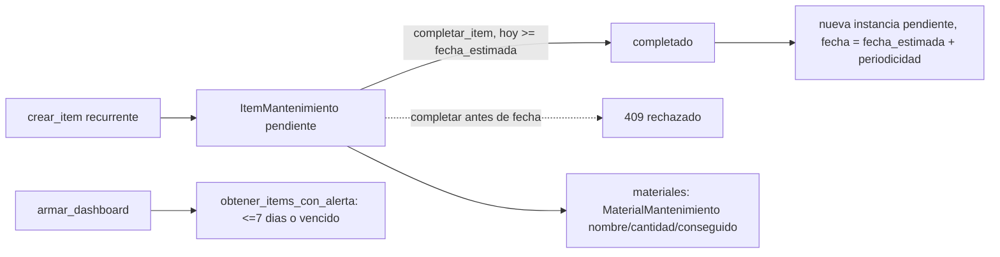

# Solution Overview — Mantenimiento de la casa

## File Index
- [../spec.md](../spec.md)
- [10-verify.md](10-verify.md)
- [99-progress.md](99-progress.md)

### Task Index

| Task | File | Description | Dependencies |
|---|---|---|---|
| T1 | [01-plan-01-modelo-mantenimiento.md](01-plan-01-modelo-mantenimiento.md) | `ItemMantenimiento` + `MaterialMantenimiento`; migración | — |
| T2 | [01-plan-02-mantenimiento-service.md](01-plan-02-mantenimiento-service.md) | `mantenimiento_service` (alta/materiales/completar/alerta) | T1 |
| T3 | [01-plan-03-api-mantenimiento.md](01-plan-03-api-mantenimiento.md) | Rutas; dashboard expone la alerta | T2 |
| T4 | [01-plan-04-frontend-mantenimiento.md](01-plan-04-frontend-mantenimiento.md) | Pantalla "Mantenimiento"; banner en Inicio; nav agrupada con Tareas | T3 |

## Problema y solución
`ItemMantenimiento` es una entidad propia (mismo criterio que
`TarjetaCredito`/`Suscripcion`/`Prestamo`) — nunca extiende `Tarea`
(gamificación con puntos/ranking es un concepto distinto). Reutiliza el
patrón ya usado y corregido en `tarea_service.py`: recurrente exige
periodicidad + fecha estimada, y una instancia recién generada no se
puede completar antes de su propia fecha — mismo gate, código propio
(criterio ya establecido de un-servicio-por-responsabilidad, sin
compartir funciones entre servicios salvo casos ya documentados como
`MONEDAS_VALIDAS`). `obtener_items_con_alerta` replica el patrón de
`tarjeta_service.obtener_tarjetas_con_alerta` (`UMBRAL_ALERTA_DIAS = 7`).

## Arquitectura
Componentes nuevos: `mantenimiento_service.py` + `ItemMantenimiento`/
`MaterialMantenimiento`. Router propio `src/api/routes/mantenimiento.py`
(mismo criterio que separó `tarjetas.py`/`prestamos.py`). `dashboard_
service.py` se extiende con una sección más (`mantenimiento_con_
alerta`), mismo patrón que `tarjetas_con_alerta`. `AppNav.tsx`: "Tareas"
pasa de entrada suelta a grupo desktop `{ label: "Tareas", pantallas:
["tareas", "mantenimiento"] }` (mismo mecanismo `GRUPOS_DESKTOP` de
`nav-agrupada`) — la barra inferior mobile sigue plana, sin cambios.

## Data Model
`ItemMantenimiento` (`src/db/models/mantenimiento.py`, tabla
`items_mantenimiento`):
- `id`, `casa_id` (FK `casas.id`).
- `nombre: str`, `descripcion: Optional[str]`.
- `fecha_estimada: Optional[date]`.
- `recurrente: bool, default False`, `periodicidad: Optional[str]`
  (`"semanal"|"mensual"|"trimestral"|"semestral"|"anual"` — constante
  `PERIODICIDADES_VALIDAS`/`_DIAS_POR_PERIODICIDAD` propia del servicio,
  no compartida con `tarea_service._DIAS_POR_FRECUENCIA`).
- `estado: str, default "pendiente"` (`"pendiente"|"completado"`).
- `creado_en: datetime`.

`MaterialMantenimiento` (tabla `materiales_mantenimiento`):
- `id`, `item_mantenimiento_id` (FK `items_mantenimiento.id`).
- `nombre: str`, `cantidad: int, default 1`, `conseguido: bool, default False`.

Migración `0017_mantenimiento.py` — dos tablas nuevas, FKs reales a
nivel de modelo (`casas`/`items_mantenimiento` ya existen en el orden
de migraciones al momento de crear `materiales_mantenimiento`).

## Tradeoffs
- **Entidad propia, no una extensión de `Tarea`**: sin puntos ni
  ranking; un ítem de mantenimiento no compite por el ranking de la
  casa. Compartir la tabla hubiera forzado columnas nulas cruzadas
  (`puntos` sin sentido acá, `periodicidad`/`materiales` sin sentido en
  Tareas).
- **`_DIAS_POR_PERIODICIDAD` propio, no reutiliza `tarea_service`**:
  mismo criterio de duplicación deliberada ya usado en el proyecto
  (`_rango_mes`, `_dividir_importe`) — evita acoplar dos servicios por
  una función/constante pequeña.
- **Sin notificaciones reales (push/email)**: decisión explícita del
  usuario — la app no tiene esa infraestructura; la alerta es
  puramente visual, calculada en cada carga de Inicio (sin scheduler).
- **Materiales sin costo estimado**: decisión explícita del usuario —
  solo nombre + cantidad + conseguido, sin tracking de precio.

## API/Data Contracts
- `POST/GET/PATCH /casas/{id}/mantenimiento` — CRUD de ítems, mismo
  patrón que `tarjetas.py`/`prestamos.py`.
- `POST /casas/{id}/mantenimiento/{item_id}/materiales`,
  `PATCH /casas/{id}/mantenimiento/{item_id}/materiales/{material_id}`
  — alta y toggle de `conseguido`.
- `DashboardResponse.mantenimiento_con_alerta: List[ItemMantenimientoAlertaOut]`
  (aditivo, mismo criterio que `tarjetas_con_alerta`).
