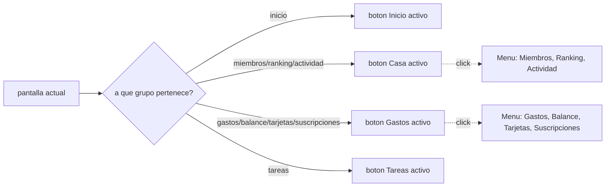

# Solution Overview — Menú superior agrupado por categoría

## File Index
- [../spec.md](../spec.md)
- [10-verify.md](10-verify.md)
- [99-progress.md](99-progress.md)

### Task Index

| Task | File | Description | Dependencies |
|---|---|---|---|
| T1 | [01-plan-01-menu-agrupado.md](01-plan-01-menu-agrupado.md) | Estructura de grupos + menú desktop desplegable; mobile sin cambios | — |

Una sola tarea: todo el cambio vive en `AppNav.tsx` (dato + UI), no hay
capa de servicio/API/modelo involucrada — separarlo en más tareas
fragmentaría artificialmente un cambio de un solo archivo.

## Problema y solución
`SECCIONES` (el array plano de 9 pantallas) se mantiene tal cual —
sigue siendo lo único que usa `BottomNavigation` (mobile, REQ-004). Se
agrega `GRUPOS_DESKTOP`, una estructura nueva que agrupa esas mismas
pantallas para el menú superior:

```ts
type GrupoDesktop =
  | { tipo: "suelta"; pantalla: Pantalla }
  | { tipo: "grupo"; label: string; pantallas: Pantalla[] };
```

`AppNav`'s desktop branch reemplaza `<Tabs>` por una fila de botones:
un `<Tab>`/`<Button>` simple por cada entrada `"suelta"`, y un botón con
`<Menu>` (MUI) anclado por cada entrada `"grupo"` — el botón del grupo
se marca visualmente activo si `pantalla` (la prop actual) está incluida
en `pantallas`.



## Arquitectura
Sin componentes nuevos fuera de `AppNav.tsx` — usa `Menu`/`MenuItem` de
MUI (ya es una dependencia del proyecto). `App.tsx` no cambia: sigue
recibiendo el mismo `onChange(pantalla)` sin importar si vino de un
grupo o de una pantalla suelta.

## Data Model
Sin cambios de datos — es una reestructuración puramente de UI sobre
las mismas 9 pantallas ya existentes.

## Tradeoffs
- **Mobile sin cambios, solo desktop se agrupa** — decisión explícita
  del usuario (la captura que motivó esta spec es del menú superior);
  una barra inferior con submenús desplegables no es un patrón mobile
  habitual y queda fuera de esta spec.
- **Rompe (y actualiza) el TC-002 existente de `ui-modernization`**: ese
  test asume un `tablist` con las 9 pantallas como `tab` directos en
  desktop — deja de ser cierto una vez agrupado. Se actualiza para
  reflejar el nuevo contrato desktop (4 elementos de primer nivel,
  Gastos/Casa despliegan menú) en vez de dejarlo roto o eliminarlo sin
  reemplazo — el TC-001 (mobile) de esa misma spec permanece intacto,
  sin ningún cambio.
- **El botón de un grupo no navega directo al hacer clic** (solo abre
  el menú) — evita la ambigüedad de "¿a cuál de las 4 pantallas del
  grupo Gastos navega un clic directo en 'Gastos'?".

## API/Data Contracts
Ninguno — sin backend involucrado.
