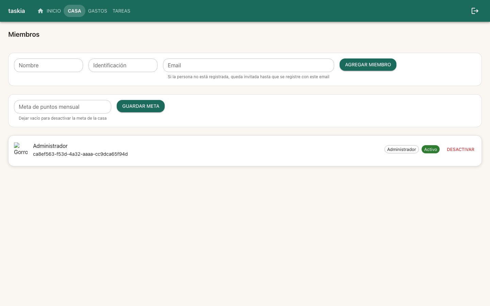
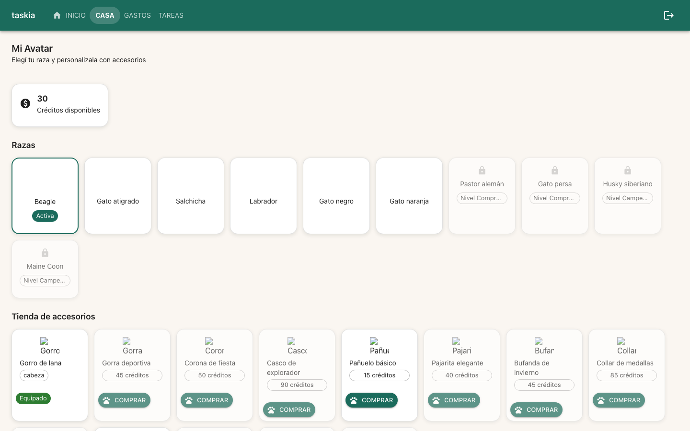
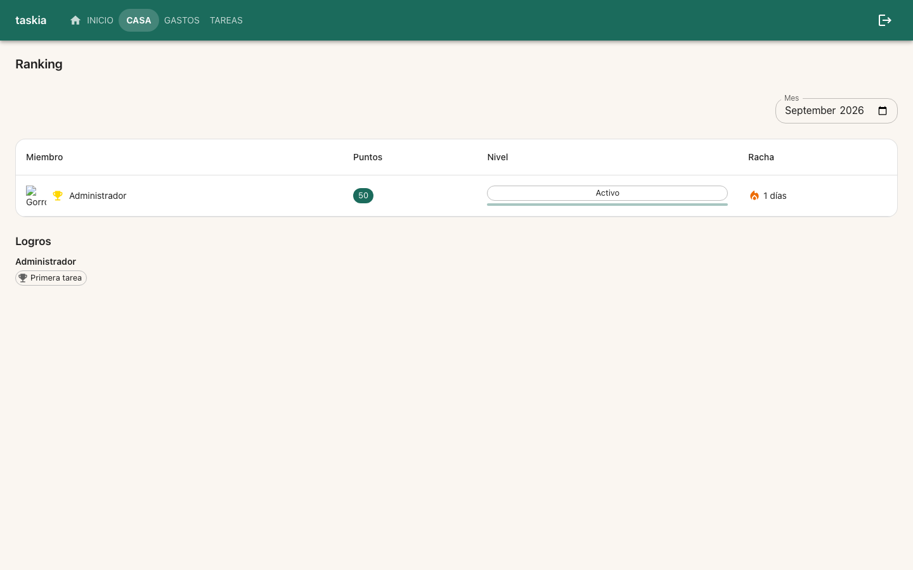

### Goal

Implementar T1 (avatar+accesorios en Miembros/Ranking) y T2 (pantalla Mi Avatar + navegación) de la spec perfil-avatar-ui, integrando visualmente lo construido por avatares-economia y tienda-accesorios.

### Judgment

- **J005** tienda_service.listar_catalogo_accesorios no excluye accesorios ya comprados del catálogo (ver su propio docstring) — MiAvatar.tsx dedupe por id contra el inventario (idsComprados) para no mostrar 'Comprar' y 'Equipar' para el mismo accesorio a la vez.
- **J006** El smoke test de outcome (Section 4) se corrió contra un stack docker-compose AISLADO de este worktree (proyecto perfilavatarui-verify, puertos 8010/5183 vía un override con !override en ports — nunca contra el stack compartido gastos-test-backend-1/frontend-1 ya corriendo hace 5h, que sirve OTRO checkout y no reflejaría este diff). Se derribó completamente al terminar (docker-compose down -v), sin dejar containers/volúmenes huérfanos ni el archivo de override (no versionado).
- **J007** Las 3 capturas de pantalla (Miembros/Mi Avatar/Ranking) muestran el ícono roto en vez de la animación Lottie/el overlay del accesorio — las URLs de los assets sembrados por avatares-economia/tienda-accesorios son placeholders de ejemplo (lf20_..._placeholder.json) que lottiefiles.com nunca sirvió (403) y que el sandbox además bloquea (ERR_BLOCKED_BY_ORB) — gap de DATOS DE SEED preexistente a esta spec, no un defecto de perfil-avatar-ui: la estructura (el Avatar con inicial reemplazado por el contenedor Lottie + el  de overlay, con su alt text) es exactamente la esperada. No bloquea este cycle; queda como observación.

### Observations

- **O001** Patrón repetido en esta feature (3/3 specs): un servicio ya construye la función pero la spec que lo necesita como CONSUMIDOR (no la que lo construyó) es la que descubre que falta el endpoint que la expone — `tienda_service.listar_equipados` (T1 de esta spec) y `avatar_service.listar_catalogo` (T2). Candidato a convención de dominio: cuando el run-plan.json de una spec deja una función de servicio ya construida pero sin ruta ([S00x] en suggestions.yaml), la spec consumidora la expone ella misma como parte de su propio prerrequisito real, documentado en Judgment — nunca esperando a un build separado solo para el endpoint.
- **O002** El catálogo de seed de `avatares-economia`/`tienda-accesorios` usa URLs Lottie/overlay con el sufijo literal `_placeholder.json` que lottiefiles.com nunca sirvió (403) — cualquier verify/QA visual futuro sobre estas 2 specs (o `perfil-avatar-ui`) va a ver el mismo ícono roto. Candidato: reemplazar el seed por assets reales curados de LottieFiles (Simple License, uso comercial libre) ya mencionados en el plan.md de la feature, o documentar el gap en suggestions.yaml de una de esas 2 specs.

### Verification

**Build**: `npm run build` (`tsc --noEmit && vite build`) — verde, 804 módulos, sin errores. `.venv/bin/python3 -m pytest tests/` no aplica a build (Python no compila), ver Tests.

**Lint**: `npm run lint` (`eslint src/frontend`) — verde, sin findings.

**Tests**:
- Backend: `442 passed, 1 skipped` (baseline pre-spec: 437 passed, 1 skipped — +5 nuevos: 2 tests de `GET .../avatares-catalogo`, 3 de `GET .../accesorios/equipados` a nivel servicio+API).
- Frontend: `193 passed` (baseline pre-spec: 183 passed — +10 nuevos: 2 en Miembros.test.tsx [TC-001/TC-002], 2 en Ranking.test.tsx [TC-002/TC-003], 4 en MiAvatar.test.tsx [TC-004/TC-005/TC-006 + 1 caso de error], 2 en AppShell.test.tsx [TC-007]).

**Coverage**: `unavailable — not configured` (`stack.yaml`'s `quality_tools.coverage.tool: null`) — remedio: `/nybo-brownfield-bootstrap --quality`, surfaceado en el checkpoint, no bloquea este cycle.

**Test cases & progress**: 7/7 test cases de `spec.md` resueltas por un test real y automatable — TC-001 a TC-007, todas `[UNIT]`/`[INTEGRATION]`, ninguna `[E2E]`/`[MANUAL]` diferida. `progress.md` actualizado: T1/T2 y las 7 TC tildadas `[x]`.

**Manual test cases**: ninguna — spec sin test cases `[MANUAL]`.

**Live evidence** (Section 4, Branch A — probado, no solo documentado):
1. Flujo completo vía API real contra un stack docker-compose AISLADO de este worktree (Judgment J006): registro → login → crear casa → crear tarea (50 pts) → completar tarea → `GET creditos` refleja 50 → `GET avatares-catalogo` devuelve el catálogo COMPLETO (10 razas, incluyendo Comprometido/Campeón bloqueadas) mientras `avatares-disponibles` solo devuelve las 6 desbloqueadas por el nivel "Activo" ya alcanzado → `PUT avatar` selecciona Beagle → `GET accesorios/catalogo` → `POST .../comprar` (Gorro de lana, 20 créditos) → saldo baja a 30 → `PUT .../equipar` → `GET accesorios/equipados` (endpoint nuevo de T1/J001) devuelve el accesorio con su `asset_overlay_url` completo.
2. 3 capturas de pantalla vía `/nybo-ui-evidence` contra ese mismo stack, con el usuario/casa ya sembrados por el paso 1:
   - 
   - 
   - 
3. Único hallazgo: las URLs de asset Lottie/overlay sembradas por `avatares-economia`/`tienda-accesorios` son placeholders de ejemplo, nunca resueltos por lottiefiles.com — la animación/ícono no se ve, pero la estructura (avatar reemplazado, overlay presente con su alt text) es la esperada (Judgment J007, no bloqueante).

**Judgment log**: revisado — 7 entradas (J001–J007) en la sección Judgment de este mismo archivo, todas dentro de autoridad `spec-deviation` (trust `semi-autonomous`), ninguna requirió diferir a `decisions.yaml`.

**Security**: sin cambios de superficie de auth — las 2 rutas nuevas (`avatares-catalogo`, `accesorios/equipados`) son GET de solo lectura, mismo criterio de apertura ya establecido (cualquier miembro activo de la casa, nada privado por miembro) que el resto de `avatares.py`/`tienda.py`.

**Design principles**: Clarity/Consistency/OOP (`CLAUDE.md`) — `AvatarConAccesorios` centraliza la lógica condicional avatar/respaldo una sola vez para Miembros+Ranking (Constraints de la spec); `tiendaClient.ts` sigue el mismo patrón que `avatarClient.ts`/`casasClient.ts`.

**Wiki alignment**: sin hallazgos — `AGENTS.md`/`CLAUDE.md` no requieren actualización por esta spec.
