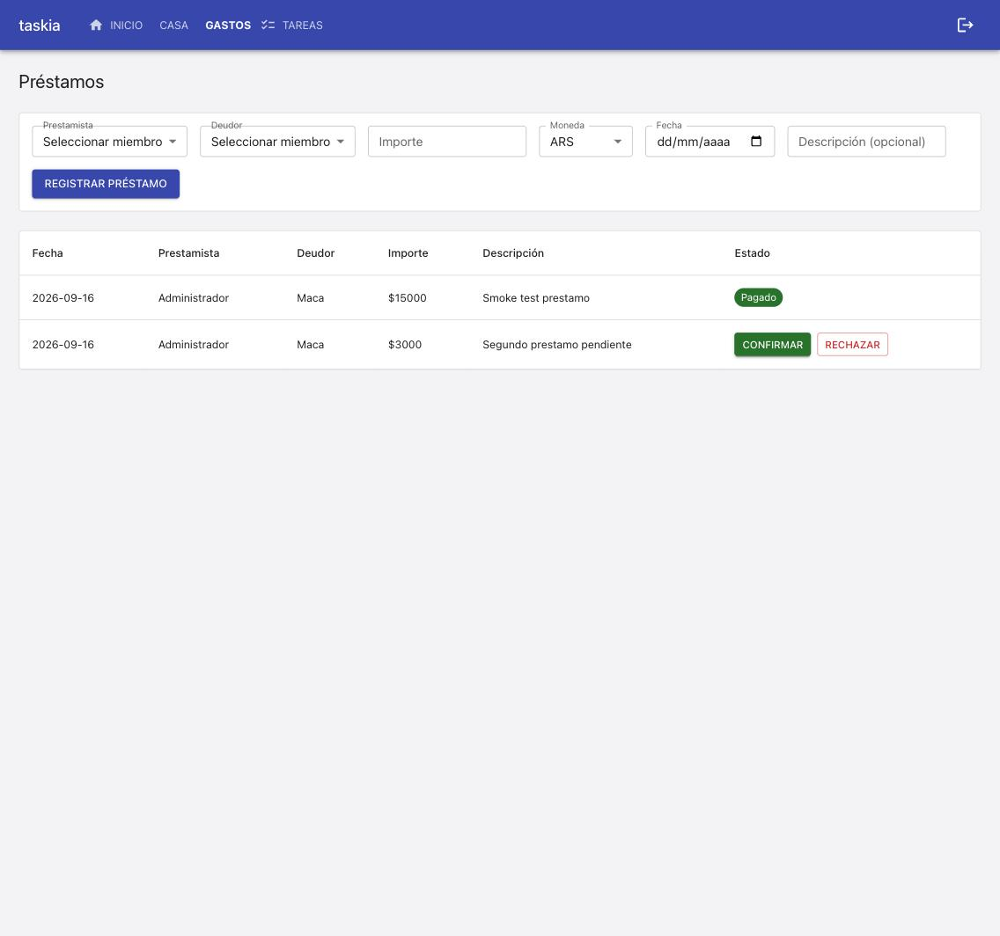
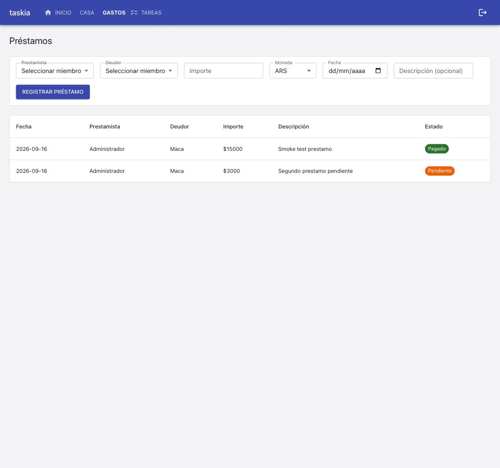

### Goal

Confirmación mutua de un préstamo: T1 (columnas confirmado_prestamista/confirmado_deudor + property estado_confirmacion + migración 0016), T2 (auto-confirmación en crear_prestamo, nueva confirmar_prestamo, guard en actualizar_estado_prestamo), T3 (API: PrestamoOut aditivo, PATCH .../confirmacion), T4 (Prestamos.tsx: Confirmar/Rechazar solo para la parte pendiente). TC-001 a TC-009.

### Judgment

- **J001** El guard nuevo en `actualizar_estado_prestamo` (exige `estado_confirmacion == "confirmado"`) rompe 4 tests preexistentes (`prestamo_service.test.py` x3, `prestamos_routes.test.py` x1) que cambiaban estado sin confirmar antes — correcto según REQ-006/TC-007, no regresión. Se actualizaron esos tests para confirmar primero, en vez de relajar el guard. Dentro de la autoridad del builder (spec-deviation).
- **J002** Migración `0016_prestamo_confirmacion.py` — verificado contra `_MIGRACIONES` que `0015` era la última existente; sin colisión de numeración esta vez (a diferencia de `0014`/`0015`, [DBP-02]).

### Observations

- [SERVP candidate] Un guard nuevo sobre una acción EXISTENTE exige revisar los tests preexistentes de esa acción, no solo escribir los nuevos — 4 tests de 2 archivos ejercitaban el camino ahora bloqueado. Mismo espíritu que [SERVP-06] pero para un cambio de GUARD, no de tipo.
- [FRONP candidate] "¿Me toca esta acción a mí?" con dos roles nombrados: chequear el estado agregado primero (`pendiente_confirmacion`), recién ahí comparar `miembroIdActual` contra el id del rol Y que ese campo siga `null` — mismo criterio que `puedeCompletar` de `Tareas.tsx`, extendido a dos roles.

### Verification

### Build
- `npm run build` (tsc --noEmit && vite build): OK.

### Tests
- Backend: `python3 -m pytest tests/` -> 296 passed, 1 skipped (skip preexistente no relacionado: `test_dsn_externa_nunca_se_toca_directamente`, requiere `DATABASE_URL` a Postgres externo).
- Frontend: `npx vitest run` -> 113 passed (19 archivos), incluye 8 en `Prestamos.test.tsx`.
- Lint: `npm run lint` -> sin errores.

### Coverage
- Sin herramienta configurada (`stack.yaml` `quality_tools.coverage.tool: null`); cada TC automatable resuelve a un test real (gate duro efectivo).

### Test cases & progress
- `[TC-001..003]` PASS -- `tests/integration/services/prestamo_confirmacion.test.py` (prestamista/deudor/tercero registra)
- `[TC-004]` PASS -- ídem (`PermissionDeniedError`) + `prestamos_confirmacion_routes.test.py` (403)
- `[TC-005]` PASS -- ídem (confirmado) + routes (HTTP)
- `[TC-006]` PASS -- ídem (rechazado permanente) + routes (400 en reintento)
- `[TC-007]` PASS -- ídem (guard estado) + routes (400)
- `[TC-008]` PASS -- `Prestamos.test.tsx` "chip Pendiente de confirmación para quien no le toca"
- `[TC-009]` PASS -- ídem "botones solo para la parte pendiente" (x2: deudor ve, prestamista ya confirmado no ve)

Las 4 tareas (T1-T4) quedan `[x]`.

### Manual test cases
- Ninguna `[MANUAL]` -- las 9 son `[INTEGRATION]`/`[UNIT]`, automatizadas arriba.

### Live evidence
- **Migración vs Postgres real (docker)**: `postgres_migrations.test.py::test_las_4_migraciones_corren_limpias_contra_postgres_real` PASS -- confirma columnas nuevas nullable sin default, `run_migrations` x3 idempotente, `estado_confirmacion == "pendiente_confirmacion"` por default.
- **Smoke contra docker-compose real** (stack ya arriba, backend con reload en vivo confirmado en logs): POST sin confirmar -> `pendiente_confirmacion` (TC-001); PATCH estado antes de confirmar -> 400 (TC-007); tercero (Bruno) intenta confirmar -> 403 (TC-004); deudora (Maca) confirma -> `confirmado`, y el PATCH de estado que antes daba 400 ahora responde 200 (TC-005).
- **UI real** (JWT de Maca inyectado en `localStorage.taskia_jwt`): un préstamo confirmado se ve con el chip clickeable "Pagado"; uno pendiente de su confirmación muestra los botones CONFIRMAR/RECHAZAR (TC-009):

  

  Tras click en CONFIRMAR, pasa al chip clickeable "Pendiente" (TC-005 en vivo):

  

### Judgment log
Ver sección `## Judgment` de este archivo (J001, J002).

### Security
Sin superficie nueva: el endpoint reutiliza `resolver_actor_en_casa` y agrega un chequeo MÁS estricto (ser prestamista/deudor de ESE préstamo) encima, nunca debilita un guard existente. Verificado en vivo: tercero recibe 403 (TC-004).

### Design principles
`estado_confirmacion` es property derivada, nunca persistida (evita desincronización). `confirmar_prestamo` es función dedicada (no sobrecarga `actualizar_estado_prestamo`); ruta propia por el mismo motivo. Ningún archivo supera 500 líneas.

### Wiki alignment
`frontend.md` ya documentaba `puedeCompletar` de `Tareas.tsx` — esta spec extiende el criterio a dos roles nombrados (`[FRONP candidate]`). `db.md` `[DBP-01]` (columna nullable sin default) se reconfirma.

### Curation

- Convention added: `.nybo/memory/domains/services.md` `[SERVP-07]` (guard nuevo sobre acción existente exige revisar sus tests preexistentes).
- Convention added: `.nybo/memory/domains/frontend.md` `[FRONP-02]` (orden de chequeo "me toca a mí" con dos roles nombrados).
- J001/J002 dentro de la autoridad del builder, ya documentados en `## Judgment` -- no requieren `decisions.yaml`.
- Sin architecture facts nuevos (extensión aditiva sobre componentes existentes).
- Sin foundation gaps nuevos (`dev_runbook`/`testing.md` ya cubrían el smoke, confirmado funcionando).
- Sin `decisions.yaml` entries -- ningún hallazgo crítico ni trade-off abierto.
