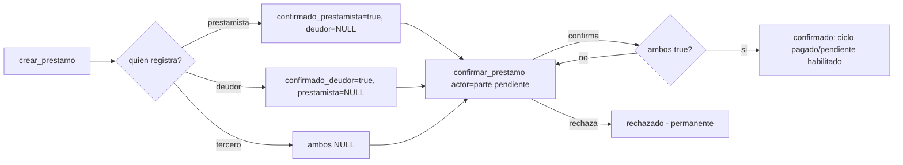

# Solution Overview — Confirmación mutua de un préstamo

## File Index
- [../spec.md](../spec.md)
- [10-verify.md](10-verify.md)
- [99-progress.md](99-progress.md)

### Task Index

| Task | File | Description | Dependencies |
|---|---|---|---|
| T1 | [01-plan-01-columnas-confirmacion.md](01-plan-01-columnas-confirmacion.md) | `Prestamo` guarda confirmación por rol; migración | — |
| T2 | [01-plan-02-confirmar-prestamo.md](01-plan-02-confirmar-prestamo.md) | Auto-confirmación al crear; `confirmar_prestamo`; guard en el cambio de estado | T1 |
| T3 | [01-plan-03-api-confirmacion.md](01-plan-03-api-confirmacion.md) | API expone confirmación; endpoint de confirmar/rechazar | T2 |
| T4 | [01-plan-04-frontend-confirmacion.md](01-plan-04-frontend-confirmacion.md) | `Prestamos.tsx` muestra el estado y las acciones de confirmación | T3 |

## Problema y solución
`Prestamo` gana `confirmado_prestamista`/`confirmado_deudor`
(`Boolean`, `nullable=True` — `NULL`=pendiente, `true`=confirmado,
`false`=rechazado). Una property Python `estado_confirmacion` (no
persistida, calculada) resume ambos campos en un solo valor de
presentación: `"rechazado"` si cualquiera es `false`; `"confirmado"` si
ambos son `true`; `"pendiente_confirmacion"` en cualquier otro caso.
`crear_prestamo` fija automáticamente el campo del rol de quien
registra (si es una de las dos partes) en `true`; el otro rol (o ambos,
si quien registra es un tercero) queda en `NULL`. `confirmar_prestamo`
(nueva función) es la única forma de pasar de `NULL` a `true`/`false`,
y exige que `actor` sea exactamente el prestamista o el deudor de ESE
préstamo. `actualizar_estado_prestamo` (ya existente) exige ahora
`estado_confirmacion == "confirmado"` antes de aceptar un cambio.

## Arquitectura
Sin componentes nuevos — extiende `Prestamo` (T1) y
`prestamo_service.py` (T2, nueva función + guard en la ya existente).
API (T3) y `Prestamos.tsx` (T4, necesita saber "quién soy" — mismo
patrón que `Tareas.tsx` recibe `miembroIdActual`).

## Data Model
- `Prestamo.confirmado_prestamista: Optional[bool]` — `NULL` default.
- `Prestamo.confirmado_deudor: Optional[bool]` — `NULL` default.
- `Prestamo.estado_confirmacion` — property Python, no persistida (no
  requiere columna ni migración propia).
- Migración `0016_prestamo_confirmacion.py` — aditiva, mismo patrón que
  las anteriores.

## Tradeoffs
- **Confirmación por rol con dos columnas nullable, no una tabla de
  confirmaciones aparte** — solo hay 2 roles posibles por préstamo
  (prestamista/deudor), una tabla de confirmaciones por miembro sería
  sobre-ingeniería para un caso siempre binario.
- **Rechazo permanente, sin revertir a confirmado**: decisión explícita
  del usuario — un préstamo rechazado no se "reactiva"; si el error fue
  del rechazo en sí, la solución es registrar el préstamo de nuevo, no
  reabrir uno rechazado.
- **`estado_confirmacion` no persistido**: se deriva siempre de los dos
  campos booleanos — evita que ambas representaciones (los booleanos y
  un string derivado guardado aparte) puedan desincronizarse.

## API/Data Contracts
- `PrestamoOut`: agrega `confirmado_prestamista: Optional[bool]`,
  `confirmado_deudor: Optional[bool]`, `estado_confirmacion: str`
  (aditivo, computado).
- `PATCH /casas/{casa_id}/prestamos/{prestamo_id}/confirmacion` — body
  `{confirma: bool}`, responde `PrestamoOut` actualizado. 403 si `actor`
  no es el prestamista ni el deudor; 400 si el préstamo ya fue resuelto
  (confirmado o rechazado).
- `actualizar_estado_prestamo` (endpoint ya existente): ahora responde
  400 si `estado_confirmacion != "confirmado"`.
- `prestamosClient.ts`: `Prestamo` agrega los mismos 3 campos;
  `confirmarPrestamo(casaId, prestamoId, confirma: boolean)` nueva.
