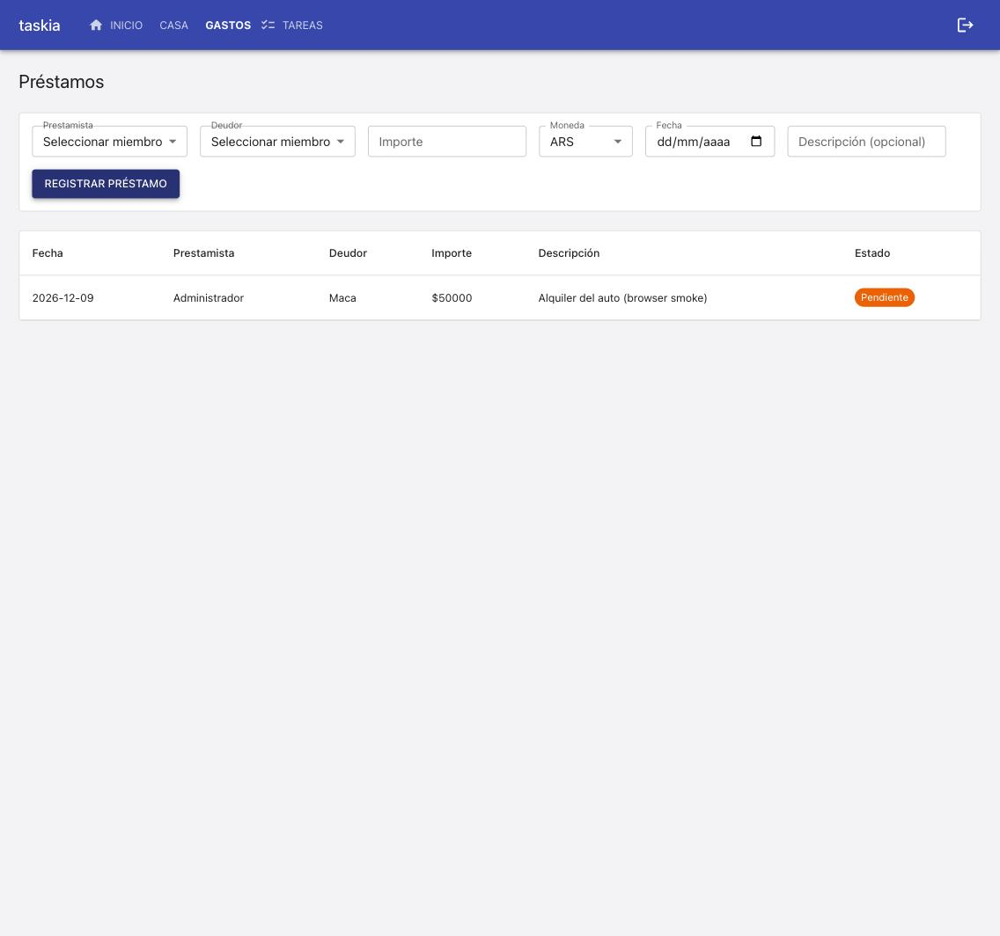
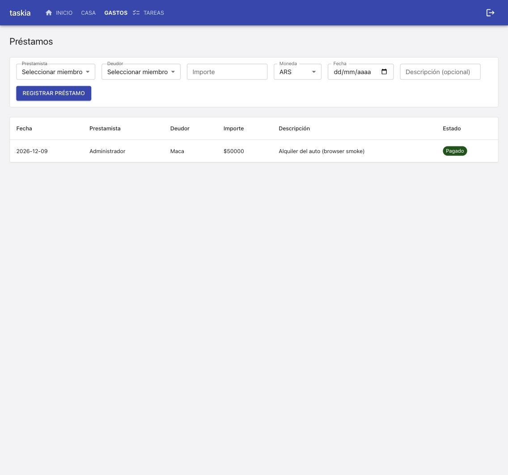

### Goal

Implementar la spec prestamos-entre-miembros completa (T1-T4): modelo/migracion Prestamo, prestamo_service (alta/listado/cambio de estado), rutas API /casas/{id}/prestamos, y pantalla frontend Prestamos + entrada de navegacion. TC-001 a TC-008.

### Judgment

- **J001** El plan asumía la migración `0015_prestamos.py` como próximo número libre; al implementar, el último libre real era `0014` (la última existente en esta rama es `0013_gasto_estado`). Se usó `0014_prestamos.py` en vez de `0015`, registrado en `_MIGRACIONES`. La spec hermana `gastos-sin-reparto` (independiente, en paralelo) puede introducir su propia migración con un número que colisione al mergear `main` más adelante — esperado y documentado en el propio docstring de la migración, a resolver en ese momento (deviation dentro de la autoridad de decisión spec-deviation, trust L2).

### Observations

- Reutilizado sin modificar: `gasto_service.MONEDAS_VALIDAS` (import directo, mismo criterio que `suscripcion_service.py`), `miembro_service.requiere_membresia_activa` como guard de actor, y el patrón CRUD delgado de `tarjetas.py` para el router. `ESTADOS_PRESTAMO_VALIDOS` es una constante propia del módulo, mismo patrón que `ESTADOS_VALIDOS` de `gasto_service.py` (default invertido: pendiente vs. pagado). Frontend: [FRON-01] (nombreDe con fallback nullish) y [FRONP-01] (Chip clickeable con label ambiguo respecto a otro texto en pantalla — acá contra las <option> de los Select de miembros, resuelto acotando la query a la tabla con `within`) confirmados una vez más en Prestamos.tsx/Prestamos.test.tsx. AppNav: "prestamos" se agregó al grupo desktop "Gastos" existente (GRUPOS_DESKTOP sigue en 4 elementos de primer nivel) sin crear grupo nuevo — la spec ya documentaba esta asunción de bajo impacto en 00-overview.md. balance_service.py no fue tocado (confirmado por TC-006 control).

### Verification

### Build
- `npm run build` (tsc --noEmit && vite build): OK, sin errores.

### Tests
- Backend: `python3 -m pytest tests/` -> 281 passed, 1 skipped (skip preexistente, no relacionado con esta spec: `test_dsn_externa_nunca_se_toca_directamente`, requiere `DATABASE_URL` apuntando a Postgres real fuera del contenedor).
- Frontend: `npm run test -- --run` -> 108 passed (19 archivos), incluye 3 tests nuevos en `Prestamos.test.tsx` (TC-007, TC-008, y un caso de error de negocio) y el ajuste de `AppShell.test.tsx` TC-003 para incluir "Préstamos" en el grupo desktop "Gastos".
- Lint: `npm run lint` -> sin errores.

### Coverage
- Sin herramienta de coverage configurada en `stack.yaml` (`quality_tools.coverage.tool: null`) -- no hay umbral automatizable que aplicar; cada TC-xxx automatable resuelve a un test real (ver abajo), que es el gate duro efectivamente disponible.

### Test cases & progress
- `[TC-001]` PASS -- `tests/integration/services/prestamo_service.test.py::test_tc001_alta_con_datos_validos_persiste_pendiente` + `tests/integration/api/prestamos_routes.test.py::test_tc001_post_crea_prestamo_pendiente_y_aparece_en_el_listado` + confirmado vía UI real (ver Live evidence).
- `[TC-002]` PASS -- `prestamo_service.test.py::test_tc002_prestamista_igual_a_deudor_es_rechazado` + `prestamos_routes.test.py::test_tc002_prestamista_igual_a_deudor_responde_400`.
- `[TC-003]` PASS -- `prestamo_service.test.py::test_tc003_moneda_invalida_es_rechazada` + `prestamos_routes.test.py::test_tc003_moneda_invalida_responde_400`.
- `[TC-004]` PASS -- `prestamo_service.test.py::test_tc004_cambio_de_estado_en_ambos_sentidos` + `prestamos_routes.test.py::test_tc004_patch_cambia_estado_en_ambos_sentidos` + confirmado vía UI real (chip Pendiente -> Pagado).
- `[TC-005]` PASS -- `prestamo_service.test.py::test_tc005_listado_ordenado_por_fecha_descendente` + `prestamos_routes.test.py::test_tc005_listado_ordenado_por_fecha_descendente`.
- `[TC-006]` PASS -- `prestamo_service.test.py::test_tc006_control_crear_y_actualizar_prestamo_no_cambia_el_balance` (control: `calcular_balance` idéntico antes/después de crear y de actualizar estado; `balance_service.py` no tocado) + confirmado vía API real (ver Live evidence).
- `[TC-007]` PASS -- `tests/unit/frontend/Prestamos.test.tsx` -- "TC-007: crear un préstamo desde el formulario lo agrega al listado".
- `[TC-008]` PASS -- `tests/unit/frontend/Prestamos.test.tsx` -- "TC-008: un clic en el chip de estado cambia de Pendiente a Pagado".

Las 4 tareas (T1-T4) del checklist quedan `[x]`.

Tests adicionales más allá del roster de TC-xxx (mismo criterio que otras specs de este proyecto: robustecer con casos no listados explícitamente): validación de estado inválido en `actualizar_estado_prestamo`, `NotFoundError` cuando prestamista/deudor no pertenecen a la casa, y confirmación de que el actor no necesita ser prestamista ni deudor (Tradeoff documentado en `00-overview.md`).

### Manual test cases
- Ninguna marcada `[MANUAL]` en spec.md -- las 8 son `[INTEGRATION]`/`[UNIT]`, automatizadas arriba.

### Live evidence
- **Migración contra Postgres real (Docker)**: `tests/integration/db/postgres_migrations.test.py::test_las_4_migraciones_corren_limpias_contra_postgres_real` corrida contra un Postgres 16 efímero vía Docker -- PASS (2 passed, 1 skipped esperado). Confirma que la tabla `prestamos` existe con todas sus columnas, FKs reales a `casas`/`miembros`, y que `run_migrations` corrido 3 veces seguidas (incluye la migración nueva `0014_prestamos`) es idempotente. Insertar un `Prestamo` sin `moneda`/`estado` explícitos vía el ORM confirma los defaults `'ARS'`/`'pendiente'` contra Postgres real.
- **Smoke a nivel API contra el stack real (`docker compose`, ya levantado -- Branch A, reusado sin reinicializar)**: registro de 2 Usuarios, alta de Casa con 2 Miembros, `POST .../prestamos` (201, `estado: "pendiente"`), `GET .../prestamos` (aparece en el listado), `GET .../balance` idéntico antes y después de crear el préstamo, `PATCH .../prestamos/{id}` a `"pagado"` (200), `GET .../balance` idéntico después del PATCH, `POST` con `prestamista_id == deudor_id` -> 400, `POST` con `moneda: "EUR"` -> 400. Confirma TC-001 a TC-006 en vivo, más allá de la suite automatizada.
- **Smoke a nivel UI contra un navegador real** (`http://localhost:5173`, casa "Casa UI Smoke" con 2 miembros reales): login real, navegación "Gastos" (grupo desktop) -> "Préstamos" (ícono `HandshakeIcon` visible en el menú, junto a Gastos/Balance/Tarjetas/Suscripciones). Formulario completo (Prestamista=Administrador, Deudor=Maca, Importe=50000, Moneda=ARS, Fecha, Descripción) -> "Registrar préstamo" -> aparece en el listado con chip naranja "Pendiente". Clic en el chip -> pasa a chip verde "Pagado" sin recargar la página. `GET .../balance` confirmado idéntico (0/0) antes y después de ambas acciones vía la misma sesión. Capturas:

    

    

### Judgment log
Ver sección `## Judgment` de este mismo archivo (J001).

### Security
Sin cambios de superficie de seguridad: los 3 endpoints nuevos reutilizan `resolver_actor_en_casa` (mismo guard de membresía activa que el resto de las rutas), sin check de rol admin -- mismo nivel de apertura documentado en REQ-003/Tradeoffs de `00-overview.md`. `PrestamoOut` no expone ningún dato sensible nuevo.

### Design principles
Clarity/Consistency/OOP respetados: `Prestamo` sigue exactamente el mismo patrón ya establecido por `TarjetaCredito`/`Suscripcion` (entidad propia, migración `create_all`, servicio con guard de membresía activa, router delgado). `ESTADOS_PRESTAMO_VALIDOS` replica el patrón de `ESTADOS_VALIDOS` de `gasto_service.py`. Ningún archivo nuevo supera 500 líneas (el más grande, `Prestamos.tsx`, ~250 líneas). `balance_service.py` no fue tocado (REQ-005, confirmado por TC-006 y por el smoke en vivo).

### Wiki alignment
`.nybo/memory/domains/frontend.md` ya documentaba [FRON-01] y [FRONP-01] -- ambos confirmados una vez más en `Prestamos.tsx`/`Prestamos.test.tsx` (ver `## Observations`). `.nybo/memory/domains/services.md`/`db.md`/`api.md` ya documentaban el patrón de entidad-propia-con-guard-de-membresía -- esta spec lo confirma sin desviaciones nuevas dignas de una convención adicional.

### Curation

- Sin convenciones nuevas: esta spec reutiliza patrones ya documentados y confirmados 2+ veces (entidad propia tipo `TarjetaCredito`, [FRON-01], [FRONP-01]) -- ninguno cruza el umbral de "primera vez" que justificaría una entrada nueva en `domains/*.md`.
- J001 (Judgment, cycle 1): decisión dentro de la autoridad del builder (spec-deviation, trust L2 semi-autonomous) -- numeración de migración corregida de `0015` (asumida en el plan) a `0014` (próximo número libre real). Ya documentada en `## Judgment`, no requiere entrada en `decisions.yaml`.
- Sin architecture facts nuevos (extensión aditiva sobre el patrón ya existente de entidad-propia-con-router-propio).
- Sin foundation gaps nuevos (`dev_runbook` ya documentaba correctamente cómo levantar y smoke-testear el stack; confirmado funcionando en esta misma corrida, incluida la migración automática al arrancar `backend`).
- Sin `decisions.yaml` entries -- ningún hallazgo crítico/breaking ni trade-off abierto.
