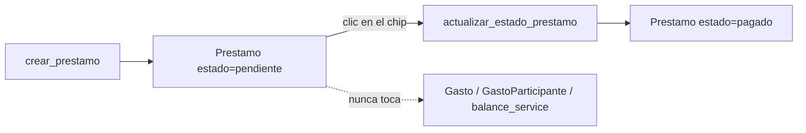

# Solution Overview — Préstamos entre miembros

## File Index
- [../spec.md](../spec.md)
- [10-verify.md](10-verify.md)
- [99-progress.md](99-progress.md)

### Task Index

| Task | File | Description | Dependencies |
|---|---|---|---|
| T1 | [01-plan-01-modelo-prestamo.md](01-plan-01-modelo-prestamo.md) | Modelo `Prestamo` + migración | — |
| T2 | [01-plan-02-prestamo-service.md](01-plan-02-prestamo-service.md) | `prestamo_service` (alta/listado/estado) | T1 |
| T3 | [01-plan-03-api-prestamos.md](01-plan-03-api-prestamos.md) | Rutas de préstamos | T2 |
| T4 | [01-plan-04-frontend-prestamos.md](01-plan-04-frontend-prestamos.md) | Pantalla "Préstamos"; entrada de navegación | T3 |

## Problema y solución
`Prestamo` es una entidad nueva e independiente (mismo criterio que
`TarjetaCredito`/`Suscripcion`: entidad propia con su propio ciclo de
vida) — no extiende `Gasto` ni depende de `GastoParticipante`/
`balance_service` en absoluto. Un préstamo es, en sí mismo, la relación
de deuda completa entre dos personas — no necesita ningún cálculo
derivado (no hay "sugerir transferencias": el préstamo ya ES la
transferencia registrada).

## Arquitectura
Componente nuevo: `prestamo_service.py` + `Prestamo`. Router propio
`src/api/routes/prestamos.py` (mismo criterio que separó
`tarjetas.py`/`suscripciones.py` del resto). Pantalla nueva
`Prestamos.tsx`, agregada a `AppNav.tsx` — tanto a `SECCIONES` (mobile,
lista plana) como al grupo desktop "Gastos" en `GRUPOS_DESKTOP`
(asunción: un préstamo es, como Balance/Tarjetas, una herramienta
financiera — no pertenece al grupo "Casa"; no se volvió a preguntar
esto al usuario por ser una decisión de bajo impacto y fácilmente
ajustable después).

## Data Model
`Prestamo` (`src/db/models/prestamo.py`, tabla `prestamos`):
- `id`, `casa_id` (FK `casas.id`).
- `prestamista_id` (FK `miembros.id`) — quien prestó el dinero.
- `deudor_id` (FK `miembros.id`) — quien debe devolverlo.
- `importe: Numeric(12,2)`, `moneda: str` (reutiliza
  `gasto_service.MONEDAS_VALIDAS`, importada directamente — mismo
  criterio que `suscripcion_service.py` ya usa para esa misma
  constante).
- `descripcion: Optional[str]`.
- `fecha: Date`.
- `estado: str` (`"pendiente"` default | `"pagado"` — constante propia
  `ESTADOS_PRESTAMO_VALIDOS`, mismo patrón que `ESTADOS_VALIDOS` de
  `gasto_service.py` pero con default invertido: un préstamo nace
  pendiente, un gasto nace pagado).
- `creado_en: DateTime`.
- Migración `0015_prestamos.py` — tabla nueva con FKs reales a nivel de
  modelo (`casas`/`miembros` ya existen en el orden de migraciones,
  mismo criterio que `0011_tarjetas_credito.py`).

## Tradeoffs
- **Sin pagos parciales** — decisión explícita del usuario: un préstamo
  es pagado/pendiente, binario, no un ledger de abonos.
- **Sin sugerencia de transferencias** — un préstamo ya es una
  transferencia explícita entre 2 personas; no hay nada que "sugerir".
- **`prestamista_id`/`deudor_id` no requieren que el actor sea uno de
  los dos** — cualquier miembro activo de la casa puede registrar un
  préstamo entre otros dos miembros (ej. un tercero que estuvo presente),
  mismo nivel de apertura que ya tiene `registrar_gasto`.

## API/Data Contracts
- `POST/GET /casas/{id}/prestamos`, `PATCH /casas/{id}/prestamos/{id}`
  — mismo patrón CRUD que `tarjetas.py`.
- `PrestamoOut {id, casa_id, prestamista_id, deudor_id, importe, moneda, descripcion, fecha, estado, creado_en}`.
- `prestamosClient.ts`: `crearPrestamo`, `listarPrestamos`, `actualizarEstadoPrestamo`.
