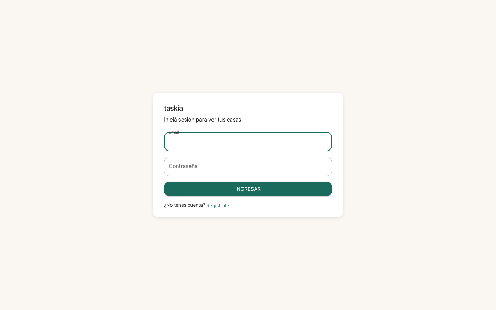
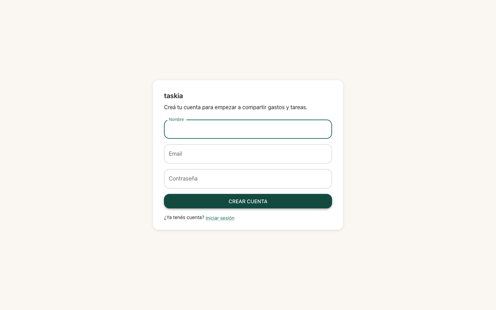
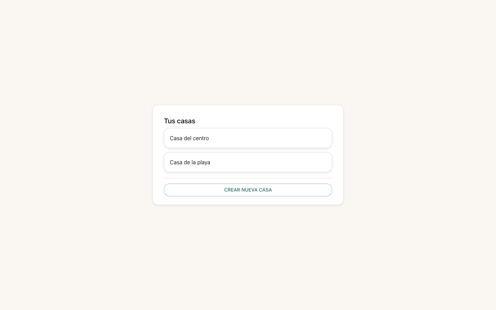
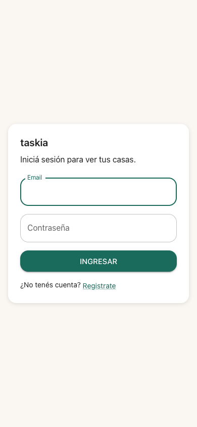

## Goal

Aplicar el tema "Cálido minimal" y el lenguaje de tarjeta (`Card`) de
`sistema-visual` a las 4 pantallas de auth/onboarding (Login, Registro,
Selector de casas, Crear casa) — 2 tasks (T1: Login+Registro; T2:
Selector de casas+Crear casa), cero regresión funcional (REQ-003).

### Judgment

- **J001** Las 4 pantallas usaban `Paper elevation={2}` dentro de un
  `Container` centrado por flex (patrón ya existente de
  `ui-modernization`), no `Card`. REQ-001 pide explícitamente una
  "tarjeta (`Card`)" — y el tema de `sistema-visual` define la sombra
  suave (`components.MuiCard.styleOverrides.root`) únicamente para
  `MuiCard`, no para `MuiPaper`. Se reemplazó `Paper`→`Card`+`CardContent`
  en las 4 pantallas para que además de cumplir la letra de REQ-001,
  hereden la sombra/esquinas del tema en vez de la elevación por defecto
  de MUI. Decision class: spec-deviation (interpretación literal de un
  requirement visual), settleable a nivel semi-autonomous.
- **J002** `SelectorCasas.tsx` renderizaba las casas como una `List`/
  `ListItemButton` de texto plano. TC-003 pide explícitamente "cada casa
  se muestra como una tarjeta seleccionable". Se reconstruyó como una
  `Card` (`variant="outlined"`) + `CardActionArea` por casa — preserva
  exactamente el texto (`casa.nombre`) y el callback `onCasaElegida`, sin
  tocar `casasClient.ts` (REQ-003). Nota: `variant="outlined"` muestra
  borde en vez de sombra (gotcha ya documentado en `frontend.md`
  FRON-02) — aceptable para un ítem seleccionable dentro de una lista,
  no requiere la sombra de elevación completa. Decision class:
  spec-deviation, settleable a nivel semi-autonomous.
- **J003** El primer intento de agrupar las tarjetas de casas usó
  `Stack` (`spacing`); se refactorizó a `Box` + `sx={{ display: "flex",
  flexDirection: "column", gap }}` siguiendo el gotcha ya documentado en
  `frontend.md` ("`Stack` rechaza props comunes bajo MUI v9.4.0 salvo
  pasar `component` explícito — se prefiere `Box`+`sx` flex en todo el
  proyecto"). Ningún otro archivo del proyecto usa `Stack` — se evitó
  ser el único outlier. Decision class: spec-deviation (conformidad de
  convención), settleable a nivel semi-autonomous.

### Observations

- Las 4 pantallas ya mostraban "taskia" como encabezado `h1` (heredado
  de `ui-modernization`/`usuarios-auth`) — TC-001 solo requería
  verificar que ese encabezado además quedara dentro de una `Card`, no
  agregar el encabezado desde cero.
- `App.tsx` nunca persiste `casaActual` entre reloads (solo el JWT
  persiste en `localStorage`) — cada carga de página vuelve a mostrar
  `SelectorCasas` si hay token pero no se re-eligió una casa en esa
  sesión. Relevante para reproducir el estado "selector con 2+ casas" en
  evidencia visual (ver Verification) y para cualquier spec futura que
  toque el flujo de sesión.

### Verification

- Build: `npm run build` (`tsc --noEmit && vite build`) — verde, sin
  errores de tipos.
- Lint: `npm run lint` (`eslint src/frontend --ext .ts,.tsx`) — verde, 0
  warnings/errors.
- Tests: `npm run test -- --run` — 166/166 passing (25 archivos): 163
  preexistentes sin regresión (ninguna query modificada) + 3 nuevos
  (TC-001 en `Login.test.tsx` y `Registro.test.tsx`, TC-003 en
  `SelectorCasas.test.tsx`).
- Coverage: no disponible — no hay proveedor de cobertura instalado
  (`@vitest/coverage-v8` ausente) y `stack.yaml`'s
  `quality_tools.coverage.tool` es `null` (mismo gap ya reportado por
  `sistema-visual`, D001/S002). Instalarlo es decision class
  `new-dependency` (siempre difiere a un humano) — `coverage_threshold:
  80` del `nybo.config.yaml` no pudo evaluarse este ciclo. Ver
  `decisions.yaml` D001.
- Test cases: TC-001 a TC-004 — las 4 automatizadas (`[UNIT]`/
  `[INTEGRATION]`) y en verde; no hay casos `[MANUAL]`/`[E2E]` en esta
  spec (la tabla de Verification de `spec.md` marca las 2 gate criteria
  como `[AUTO]` únicamente).
- Live evidence: se levantó un servidor `vite` aislado
  (`npx vite --port 5182`) sobre este worktree — el mismo
  probe-then-attach que usó `sistema-visual`: el stack de
  docker-compose ya estaba arriba (`gastos-test-backend-1`/
  `gastos-test-frontend-1`/`gastos-test-db-1`), pero el contenedor
  `frontend` monta el checkout PRINCIPAL (`feat/rediseno-ux-ui`, sin
  estos cambios), así que se apuntó un vite propio a este worktree, con
  proxy al backend real ya corriendo en `127.0.0.1:8000` — sin
  reinicializar nada. Flujo real vía Playwright (Chrome del sistema,
  canal `chrome`): registro → login → selector vacío → crear "Casa del
  centro" → 2da casa creada vía API con el JWT real de la sesión (única
  forma de llegar a "2 casas" sin un 2do punto de entrada en la UI, ver
  `suggestions.yaml` S002) → reload → selector con 2 casas. Confirmado
  visualmente en desktop y mobile: tarjeta centrada con "taskia" como
  encabezado en Login/Registro/Crear casa, paleta cálida consistente
  (verde/teal primario, fondo off-white), y el Selector de casas
  mostrando cada casa como tarjeta seleccionable con el mismo lenguaje
  visual.
  - 
  - 
  - 
  - 
- Regresión: `git diff --stat` contra la base
  (`feat/rediseno-ux-ui--sistema-visual`) confirma que solo cambiaron
  `src/frontend/pages/{Login,Registro,SelectorCasas,CrearCasa}.tsx` y
  sus 3 tests — ningún archivo bajo `src/services/`, `src/api/`, ni
  `src/db/` tocado, ni `authClient.ts`/`casasClient.ts` cambiaron de
  firma (cumple constraint REQ-003).

### Curation

Se extrajo 1 entrada nueva y 1 patrón nuevo a
`.nybo/memory/domains/frontend.md`: (1) [FRON-05] confirma que
`Paper` queda retirado como contenedor de pantalla en todo el proyecto
— las últimas 4 pantallas que aún lo usaban (Login/Registro/
SelectorCasas/CrearCasa) migraron a `Card`+`CardContent`, para heredar
la sombra suave que `theme.ts` define únicamente para `MuiCard`; (2)
[FRONP-05] el patrón "lista seleccionable bajo el tema Cálido minimal"
(`Card variant="outlined"` + `CardActionArea` por ítem, en vez de
`List`/`ListItemButton`) — reutilizable por `pantallas-financieras`/
`pantallas-casa` para cualquier listado que necesite ítems
seleccionables. `evidence/suggestions.yaml` y `evidence/decisions.yaml`
quedan con items abiertos (coverage tool — mismo gap que
`sistema-visual`; falta de un 2do punto de entrada para "crear otra
casa" desde el shell) para revisión humana — no bloquean este ciclo.
