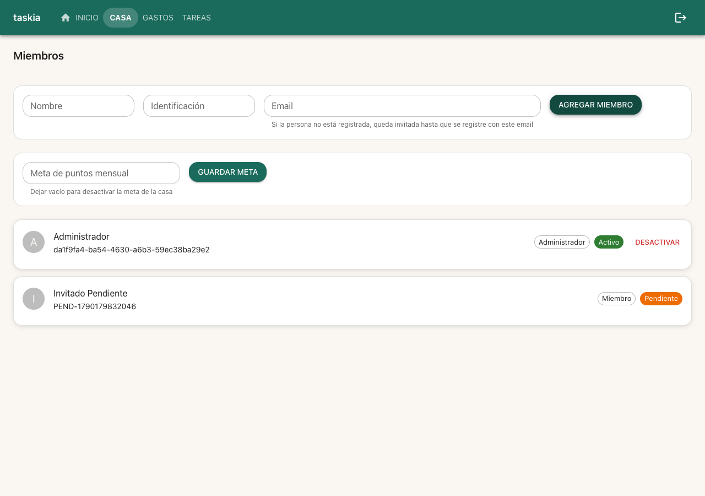
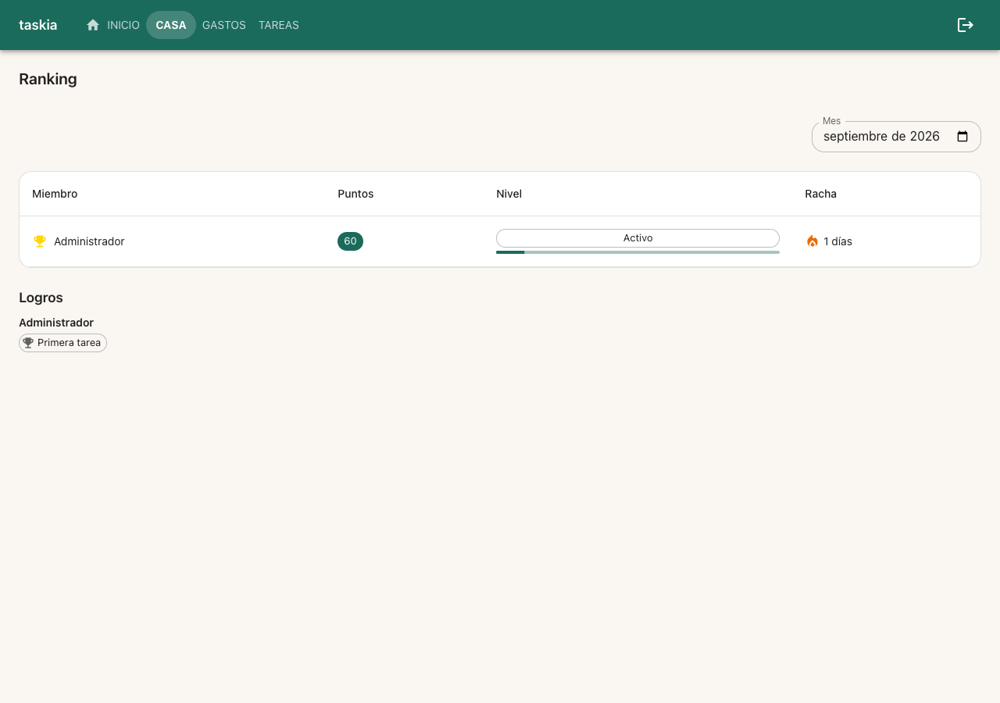
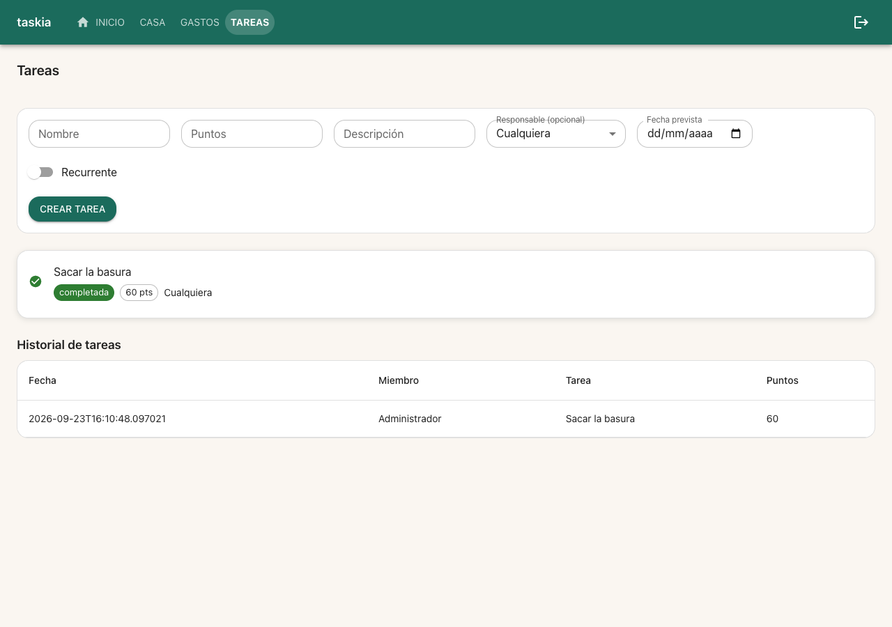
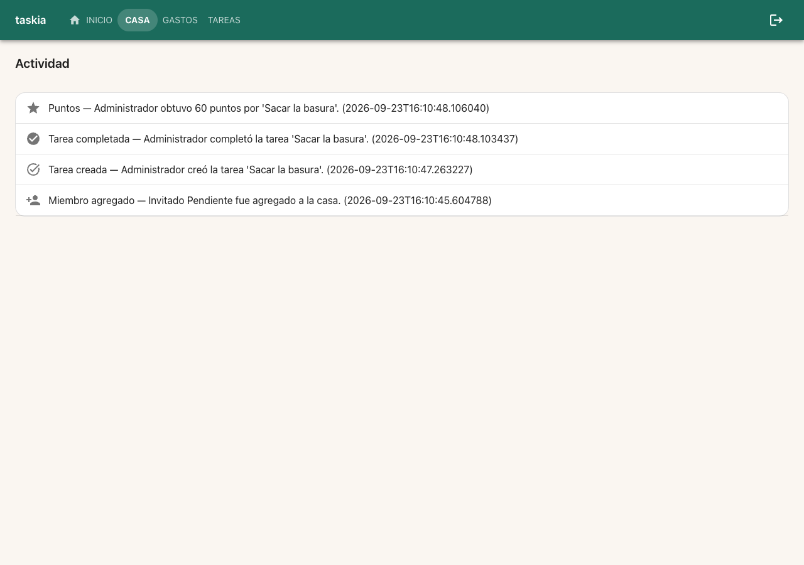

### Goal

Aplicar el sistema visual de `sistema-visual` (tema "Cálido minimal" +
`PageHeader`/`StatCard`/`EmptyState`) a las 4 pantallas sociales/de casa
(Miembros, Ranking, Tareas, Actividad) — dando peso visual a la
gamificación (nivel/racha/logros) hoy mostrada como texto plano, sin
tocar ningún dato, cliente de API, ni lógica de cálculo (REQ-005).

### Judgment

- **J001** REQ-001/REQ-003 piden reemplazar la fila de tabla de Miembros
  y Tareas por una tarjeta de perfil / tarjeta de línea — un cambio
  estructural real. Esto rompe 2 queries preexistentes atadas a
  estructura de tabla: `Miembros.test.tsx`'s `nombreCelda.closest("tr")`
  y `Tareas.test.tsx`'s `screen.findByRole("cell", { name: "Pablo" })`.
  Se reemplazaron por consultas accesibles equivalentes
  (`getByRole("group", { name: "Miembro <nombre>" })` /
  `getByRole("group", { name: "Tarea <nombre>" })`, con `within(...)`
  para el contenido interno) — preserva toda la semántica de rol/label
  que sí puede mantenerse sin cambios; el propio patrón `role="group"` +
  `aria-label` es nuevo pero consistente con la convención existente
  "las tests consultan por rol/label, no por estructura DOM". Decision
  class: spec-deviation (ajuste de queries necesitado por un cambio
  estructural que la propia spec pide), settleable a nivel
  semi-autonomous. Ver también `suggestions.yaml` S003.
- **J002** El task file de T2 (Ranking) sugiere agregar una sección
  "Meta de la casa" (progreso agregado) — dato que hoy solo vive en
  `InicioCasa.tsx` vía `obtenerDashboard`. Ningún REQ/TC de esta spec la
  pide, y `run-plan.json`'s T2 `files_touched` es únicamente
  `Ranking.tsx` sin tocar clientes de API. Agregarla implicaría que
  `Ranking.tsx` empiece a llamar `obtenerDashboard` — un fetch nuevo no
  cubierto por ningún test de esta spec, y una lectura razonable de
  REQ-005 ("cero regresión funcional... el restyle es puramente de
  presentación") es que no se agreguen llamadas de datos nuevas.
  Se omitió esa sección — el resto de T2 (nivel con `LinearProgress`,
  racha con ícono, logros como chips agrupados por miembro) sí se
  implementó completo. Decision class: spec-deviation, settleable a
  nivel semi-autonomous. Ver `suggestions.yaml` S002.
- **J003** REQ-002 requiere un indicador de progreso visual hacia el
  próximo nivel, pero la API (`GET .../ranking`) solo devuelve `nivel`
  (nombre) y `puntos`, no los umbrales. Se duplicó el catálogo fijo de 4
  escalones de `ranking_service.NIVELES` (0/50/150/300 ->
  Novato/Activo/Comprometido/Campeón de la casa) en el frontend
  (`Ranking.tsx`'s `NIVELES`/`progresoNivel`) para calcular el
  porcentaje — mismo criterio ya establecido para catálogos opacos del
  backend (`NOMBRES_LOGRO`, convención `FRONP-03`): la API no cambia de
  contrato, el costo es mantener las 2 listas sincronizadas a mano si el
  backend cambia los umbrales. Decision class: spec-deviation,
  settleable a nivel semi-autonomous.
- **J004** Coverage: no hay ningún proveedor de cobertura instalado
  (`@vitest/coverage-v8` ausente; `stack.yaml`'s
  `quality_tools.coverage.tool` es `null`, mismo gap que `sistema-visual`
  D001/S002) y `nybo.config.yaml` declara `testing.coverage_threshold:
  80`. Instalar un paquete nuevo es decision class `new-dependency`, que
  SIEMPRE difiere a un humano sin importar el trust level — no se
  instaló nada. Coverage reportado como `unavailable — not configured`.
  Ver `decisions.yaml` D001.

### Observations

- El patrón `role="group"` + `aria-label="<Entidad> <nombre>"` en un
  `Card` (reemplazando una fila de tabla) es reutilizable por cualquier
  pantalla futura que convierta una tabla en una lista de tarjetas —
  permite seguir escribiendo `within(tarjeta).getByText(...)` igual que
  antes con `within(fila).getByText(...)`, sin depender de `role="cell"`
  ni de `closest("tr")`. [DOMAIN candidate] frontend.md
- `HistorialActividad.tsx` ya tenía un mapa `ICONOS_TIPO` (ícono por tipo
  de evento) desde antes de esta spec — REQ-004/TC-006 llegó
  prácticamente gratis; el único cambio real en T4 fue `PageHeader` +
  `EmptyState`. Vale la pena que specs futuras de "aplicar sistema
  visual" auditen primero cuánto del requisito ya existe antes de asumir
  trabajo nuevo.

### Verification

- Build: `npm run build` (`tsc --noEmit && vite build`) — verde, sin
  errores de tipos.
- Lint: `npm run lint` (`eslint src/frontend --ext .ts,.tsx`) — verde, 0
  warnings/errors.
- Tests: `npm run test -- --run` — **168/168 passing** (25 archivos): 154
  tests preexistentes sin regresión + 14 nuevos (2 Miembros TC-001, 2
  Ranking TC-003/TC-004, 1 Tareas TC-005, 1 HistorialActividad TC-006) +
  3 queries de tests preexistentes ajustadas por el cambio estructural
  tabla->tarjeta (ver Judgment J001).
- Coverage: no disponible — no hay proveedor de cobertura instalado
  (`@vitest/coverage-v8` ausente) y `stack.yaml`'s
  `quality_tools.coverage.tool` es `null`. Instalarlo es decision class
  `new-dependency` (siempre difiere a un humano, ver J004/D001) —
  `coverage_threshold: 80` del `nybo.config.yaml` no pudo evaluarse este
  ciclo.
- Test cases: TC-001 a TC-006 (`[UNIT]`) automatizados y en verde.
  TC-007 (`[INTEGRATION]`) — los 4 suites existentes pasan en verde, pero
  la cláusula "sin modificar sus queries por rol/label" no se cumplió
  literalmente: 3 líneas de query se ajustaron (2 por el cambio
  estructural tabla->tarjeta que REQ-001/003 exige, 1 por una colisión de
  texto accidental entre un fixture y una etiqueta de rol nueva) — ver
  Judgment J001 y `suggestions.yaml` S003. Ningún caso `[E2E]`/`[MANUAL]`
  en esta spec.
- Live evidence: dev server aislado (`npx vite --port 5183` sobre este
  worktree, proxy al backend real ya corriendo en `:8000` vía
  docker-compose) — probe-then-attach: el stack ya estaba arriba
  (`gastos-test-frontend-1`/`gastos-test-backend-1`/`gastos-test-db-1`),
  pero ese contenedor monta el checkout principal (branch
  `feat/rediseno-ux-ui`, sin los cambios de este worktree) y otro build
  concurrente (`pantallas-financieras`) ya ocupaba el puerto 5182, así
  que se levantó una instancia vite aislada en `:5183` en vez de
  reinicializar nada. Flujo real vía Playwright (Chrome del sistema,
  canal `chrome`): registro -> login -> crear casa -> Miembros -> Ranking
  -> Tareas -> Actividad, luego se agregó un miembro pendiente y se
  creó+completó una tarea de 60 puntos para poblar Ranking/Actividad con
  datos reales antes de recapturar. Confirmado visualmente: Miembros
  como tarjetas de perfil (avatar con inicial, chip de rol, chip de
  estado "Pendiente" en naranja claramente distinto de "Activo" en
  verde); Ranking con barra de progreso de nivel bajo el chip "Activo"
  (60/150 puntos = 10% hacia "Comprometido"), ícono de racha en llama, y
  el logro "Primera tarea" como chip agrupado bajo el nombre del
  miembro; Tareas con ícono de check verde + chip "completada" + chip de
  puntos en una tarjeta de línea; Actividad como feed con 4 eventos, cada
  uno con su propio ícono (estrella/check/tarea/persona) — confirmado por
  `data-testid` de ícono distinto entre eventos. Cero regresión de
  datos observada (puntos, historial y actividad reflejan exactamente la
  tarea creada).
  - 
  - 
  - 
  - 
- Regresión: `git diff --stat` contra `feat/rediseno-ux-ui--sistema-visual`
  confirma que solo cambiaron `src/frontend/pages/{Miembros,Ranking,
  Tareas,HistorialActividad}.tsx` y sus 4 archivos de test — ningún
  cliente de `src/frontend/api/*`, ni archivo de `src/services/`,
  `src/api/`, ni `src/db/` tocado (cumple constraints REQ-005).

### Curation

Se extrajo 1 entrada nueva a `.nybo/memory/domains/frontend.md`:
**[FRON-05]** el patrón `role="group"` + `aria-label="<Entidad> <nombre>"`
en un `Card` que reemplaza una fila de tabla — permite que
`within(tarjeta).getByText(...)` siga funcionando sin depender de
`role="cell"`/`closest("tr")`, para cualquier pantalla futura que
convierta una tabla en tarjetas. `evidence/suggestions.yaml` y
`evidence/decisions.yaml` quedan con items abiertos (coverage tool —ya
reportado 2 veces dentro de esta feature—, la pregunta sobre "Meta de la
casa" en Ranking, y la observación sobre TC-007) para revisión humana —
no bloquean este ciclo.
