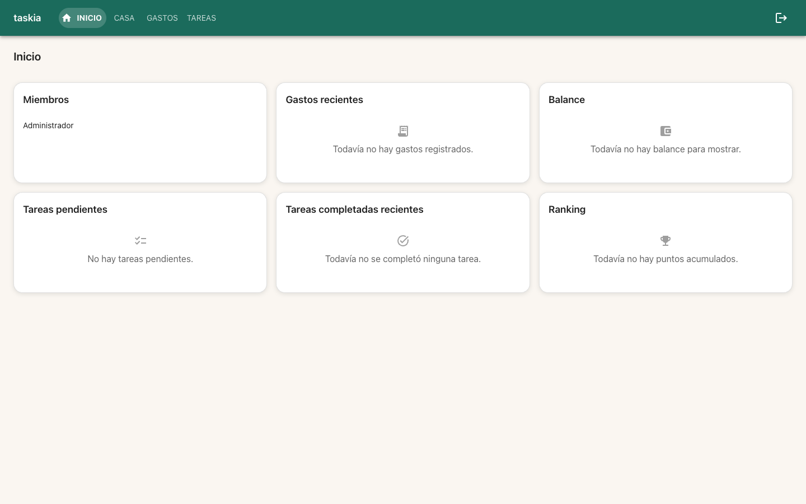
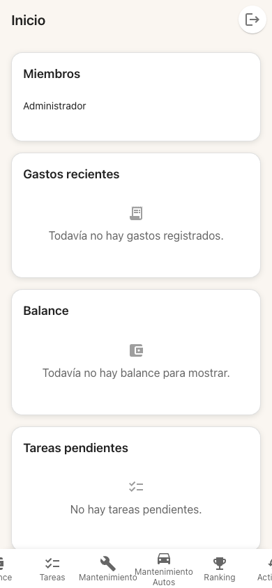
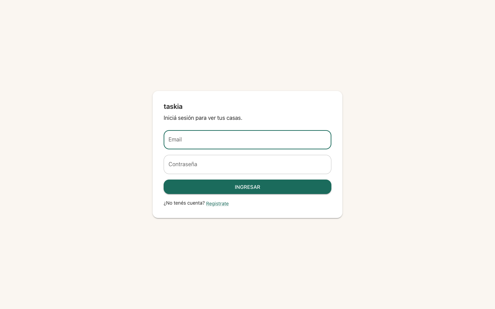

### Judgment

- **J001** T1's run-plan.json asignaba `tests/unit/frontend/MuiRestyle.test.tsx` como archivo nuevo, pero ese archivo ya existía (spec `ui-modernization`, TC-003 — verifica que las 8 pantallas usan componentes MUI). Se agregó un `describe` adicional al final con TC-001/TC-002 (paleta/shape/Card) en vez de sobreescribirlo, preservando las 8 pruebas existentes intactas. Decision class: spec-deviation (interpretación de un nombre de archivo compartido entre specs), settleable a nivel semi-autonomous.
- **J002** El task file de T4 sugiere aplicar StatCard también a la card "Meta de la casa", pero esa sección combina un valor (X/Y puntos) con una LinearProgress — contenido compuesto que excede el contrato simple de StatCardProps (icon/label/value) definido en T2 y consumido por las 3 specs siguientes (pantallas-financieras/pantallas-casa/auth-onboarding). Se decidió NO extender StatCardProps con un slot children para este único caso, dejando "Meta de la casa" como su propio Card con LinearProgress sin cambio de comportamiento — prioriza mantener la interfaz exportada de StatCard mínima y estable para las specs dependientes por sobre una reutilización total. Decision class: spec-deviation, settleable a nivel semi-autonomous.
- **J003** REQ-001 pide que "los números monetarios usen font-variant-numeric: tabular-nums". Se implementó como un export compartido `monetaryValueSx` en `theme.ts` (en vez de una prop nueva o un componente separado), aplicado en `StatCard.value` — reutilizable por cualquier pantalla de las 3 specs siguientes que muestre un importe, sin repetir el estilo inline. Decision class: spec-deviation, settleable a nivel semi-autonomous.
- **J004** Coverage: no hay ningún proveedor de cobertura instalado (`@vitest/coverage-v8` ausente; `.nybo/foundation/stack.yaml`'s `quality_tools.coverage.tool` es `null`) y `nybo.config.yaml` declara `testing.coverage_threshold: 80`. Instalar un paquete nuevo es decision class `new-dependency`, que SIEMPRE difiere a un humano sin importar el trust level (L2 semi-autonomous incluido) — no se instaló nada. Se reporta coverage como `unavailable — not configured` en vez de forzar la instalación; ver `decisions.yaml` D001 y el checkpoint (recomendación: `/nybo-brownfield-bootstrap --quality`).

### Observations

- El patrón de EmptyState (ícono + mensaje exacto preservado) permitió reemplazar 5 mensajes 'sin datos' de texto plano en InicioCasa.tsx sin romper ninguna query de test existente — clave para futuras specs: EmptyState.message debe recibir el string EXACTO que el test ya busca (getByText), no un derivado. [DOMAIN candidate] frontend.md
- StatCard/EmptyState/PageHeader no importan ningún cliente de src/frontend/api/* (verificado por revisión de imports) — cumple el constraint de REQ-002 que las hace reutilizables por pantallas-financieras/pantallas-casa/auth-onboarding sin acoplarlas a un dominio.

### Verification

- Build: `npm run build` (tsc --noEmit + vite build) — verde, sin errores de tipos.
- Lint: `npm run lint` — verde, 0 warnings/errors.
- Tests: `npm run test -- --run` — 163/163 passing (25 archivos): 150 tests preexistentes sin regresión + 13 nuevos (2 MuiRestyle TC-001/002, 3 PageHeader TC-003, 2 EmptyState TC-004, 2 StatCard TC-005, 2 AppShell TC-006/007, 2 InicioCasa TC-009 + encabezado).
- Coverage: no disponible — no hay proveedor de cobertura instalado (`@vitest/coverage-v8` ausente) y `stack.yaml`'s `quality_tools.coverage.tool` es `null`. Instalarlo es decision class `new-dependency` (siempre difiere a un humano, ver J004/D001) — coverage_threshold: 80 del nybo.config.yaml no pudo evaluarse este ciclo.
- Test cases: TC-001 a TC-009 automatizados (`[UNIT]`/`[INTEGRATION]`) y en verde. El único caso `[HUMAN]` (smoke visual en emulador Android, T4) queda diferido al checkpoint — BUILD no ejecuta casos HUMAN/E2E.
- Live evidence: dev server aislado (`npx vite --port 5180` sobre este worktree, proxy al backend real ya corriendo en :8000 vía docker-compose) — probe-then-attach: el stack ya estaba arriba (`gastos-test-frontend-1`/`gastos-test-backend-1`/`gastos-test-db-1`), pero ese contenedor monta el checkout PRINCIPAL (branch `feat/rediseno-ux-ui`, sin los cambios de este worktree), así que se levantó una instancia vite aislada apuntando a este worktree en vez de reinicializar nada. Flujo real vía Playwright (Chrome del sistema, canal `chrome`): registro -> login -> crear casa -> Inicio. Confirmado visualmente: fondo off-white cálido (no gris MUI), AppBar con el primario verde/teal nuevo (no índigo/teal), ítem 'INICIO' activo con relleno/pill destacado, encabezado 'Inicio' vía PageHeader, 5 EmptyState (ícono+mensaje) en las secciones sin datos (Gastos recientes/Balance/Tareas pendientes/Tareas completadas/Ranking), Cards con esquinas redondeadas y sombra suave. Confirmado también en mobile (390x844): BottomNavigation con el nuevo tema y los mismos EmptyState.
  - 
  - 
  - 
- Regresión: `git diff --stat` contra `feat/rediseno-ux-ui` confirma que solo cambiaron `src/frontend/theme.ts`, `src/frontend/AppNav.tsx`, `src/frontend/pages/InicioCasa.tsx`, `src/frontend/components/{PageHeader,StatCard,EmptyState}.tsx` (nuevos) y sus tests — ningún cliente de API ni archivo de backend/services/db tocado (cumple constraints REQ-002/REQ-004).

### Curation

Se extrajeron 4 entradas nuevas a `.nybo/memory/domains/frontend.md`: (1) [FRON-02] la paleta/tokens concretos del tema "Cálido minimal" (colores, shape, el gotcha de `variant="outlined"` siempre resetea `boxShadow` a `none` pese a `styleOverrides.root`, y el export `monetaryValueSx`); (2) [FRON-03] los 3 componentes compartidos (`PageHeader`/`StatCard`/`EmptyState`) — su ubicación, su regla de "cero imports de api/*", y el gotcha de preservar el string EXACTO en `EmptyState.message` para no romper queries `getByText` existentes; (3) [FRON-04] el tratamiento visual del ítem de navegación activo (pill de color primario, mobile y desktop) — resuelve la sugerencia S001 que `nav-agrupada` había dejado abierta; (4) [FRONP-04] el patrón "no extender un componente compartido con un slot para un solo caso compuesto" (aplicado a la decisión de NO meter 'Meta de la casa' dentro de StatCard, ver Judgment J002). `evidence/suggestions.yaml` y `evidence/decisions.yaml` quedan con items abiertos (coverage tool, mobile nav overflow, StatCard de progreso) para revisión humana — no bloquean este ciclo.
