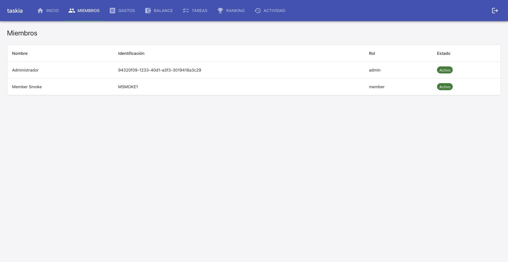
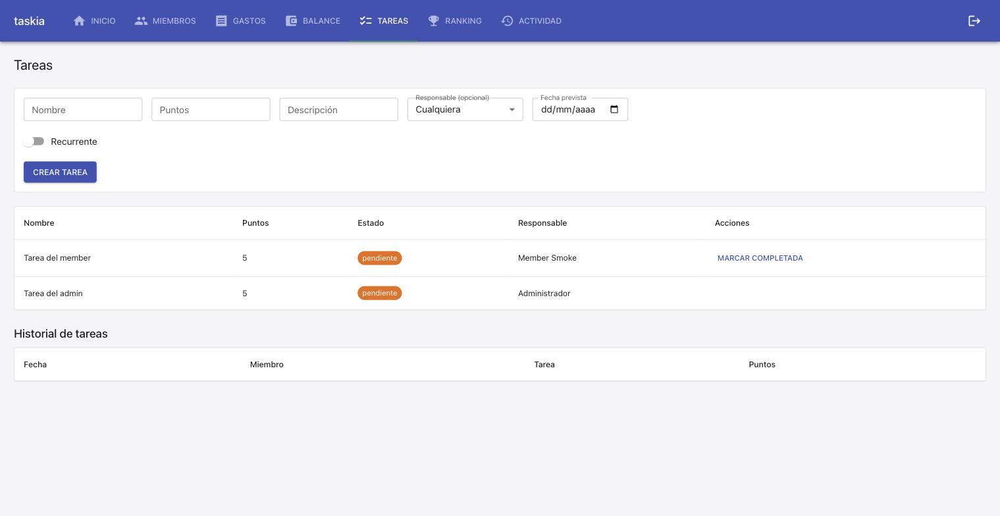
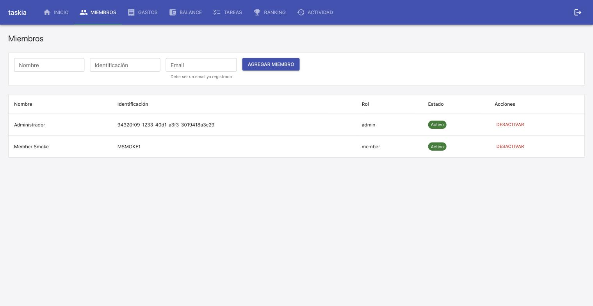

### Goal

Implementar las 3 tareas de la spec: exponer usuario_id en MiembroOut (T1), resolver rolUsuarioActual real en App.tsx cruzando usuario_id contra el sub del JWT (T2), y corregir puedeCompletar en Tareas.tsx para comparar el Miembro.id propio en vez del Usuario.id global (T3).

### Judgment

- **J001** — Deviación menor de run-plan.json: el cambio de App.tsx que asigna `miembroIdActual={miMiembro?.id ?? ""}` a <Tareas> (asignado a T3 en el plan) se implementó en la misma edición que el resto de los cambios de T2 en App.tsx, porque ambos tocan las mismas líneas contiguas y separar la edición en dos pasadas no aportaba aislamiento real (miMiembro ya se calcula en T2). Los tests de cada task se mantuvieron separados (App.test.tsx para TC-002/003/004, Tareas.test.tsx para TC-005/006) y ambos verifican independientemente su propio contrato.

### Observations

- El endpoint GET /casas/{id}/miembros ya devolvía usuario_id en filas del ORM (Miembro.usuario_id existe desde usuarios-auth); solo faltaba declararlo en el schema de respuesta Pydantic (MiembroOut) — ningún cambio de servicio/ruta fue necesario para T1, confirmando el Design Rationale del task file.

### Verification

- pytest tests/ — 131 passed (incluye la nueva TC-001).
- npm run test -- --run (vitest) — 60 passed (incluye las nuevas TC-002/003/004/005/006 y la actualización de nombre de prop en Tareas.test.tsx).
- npm run build — tsc --noEmit + vite build sin errores de tipos.
- npm run lint — eslint src/frontend limpio.

**Live smoke check** (docker-compose local, ya estaba levantado — no se reinició). Escenario pedido: loguear como member y confirmar que los controles admin-only de Miembros/Tareas están realmente ocultos.

1. Se registraron 2 Usuarios reales vía `/auth/registro` (admin-smoke@example.com, member-smoke@example.com), se creó una Casa real vía `POST /casas`, y se agregó el segundo Usuario como Miembro con rol `member` vía `POST /casas/{id}/miembros` — sin fixtures ni mocks, todo contra el backend real en :8000.
2. `GET /casas/{id}/miembros` confirmado con `usuario_id` en cada fila (TC-001 en vivo).
3. Login real en el frontend (:5173) como `member-smoke@example.com` → pantalla Miembros: NO se muestra el formulario "Agregar miembro" ni la columna "Acciones"/"Desactivar" (TC-002 en vivo). 
4. Se crearon 2 tareas reales: una con `responsableId` = Miembro.id del member, otra con `responsableId` = Miembro.id del admin. Como member: "Marcar completada" visible SOLO en la tarea propia, ausente en la del admin (TC-005/TC-006 en vivo — confirma el fix de `puedeCompletar` usando `Miembro.id`, no `Usuario.id` global). 
5. Login como `admin-smoke@example.com`: pantalla Miembros muestra el formulario "Agregar miembro" y la acción "Desactivar" para ambos miembros (TC-003 en vivo). 
6. Escenario del incidente original (member intentando desactivar admin): confirmado que el botón "Desactivar" ya ni se muestra a un member — la vía de UI hacia ese intento queda cerrada.

TC-004 (fallback a "member" sin match de usuario_id) es un estado transitorio de carga — cubierto por unit test, no reproducido en vivo (no hay forma de observar ese estado intermedio de forma estable en el navegador sin instrumentación adicional).

### Curation

- `.nybo/memory/domains/auth.md`: agregado un nuevo Pattern ("Frontend identity resolution") documentando el cruce `usuario_id` (MiembroOut) x `obtenerUsuarioIdActual()` para resolver rol y Miembro.id propio en el cliente, con el fallback seguro a `"member"` como regla explícita.
- `.nybo/memory/domains/auth.md`: la Gotcha de `usuarios-auth` sobre `puedeCompletar()` comparando el Usuario.id global se marcó resuelta (tachada, con referencia al Pattern nuevo) en vez de eliminarse — mantiene el rastro histórico del bug y su fix.
- No se crearon dominios nuevos ni ADRs — el cambio encaja completamente en los dominios `auth`/`frontend` ya existentes.
