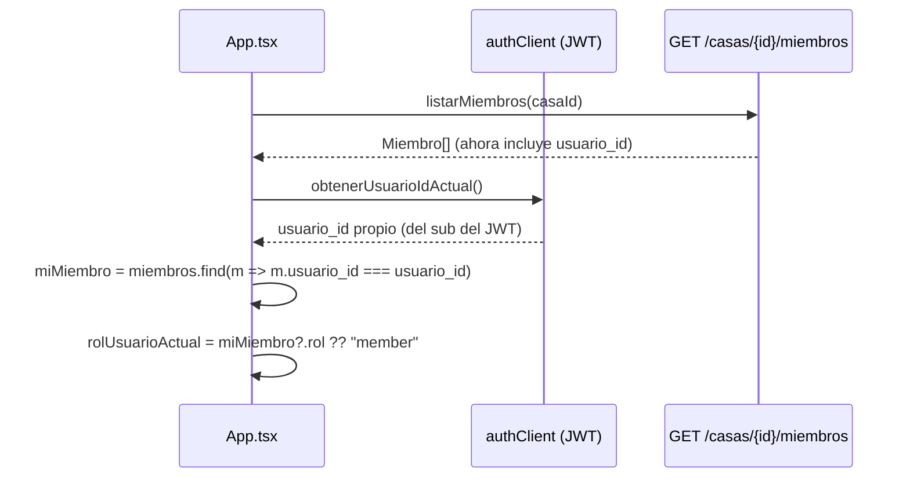

# Solution Overview — Resolver el rol real del Usuario en la casa

## File Index
- [../spec.md](../spec.md)
- [10-verify.md](10-verify.md)
- [99-progress.md](99-progress.md)

### Task Index

| Task | File | Description | Dependencies |
|---|---|---|---|
| T1 | [01-plan-01-exponer-usuario-id.md](01-plan-01-exponer-usuario-id.md) | `MiembroOut` expone `usuario_id` | — |
| T2 | [01-plan-02-resolver-rol-app.md](01-plan-02-resolver-rol-app.md) | `App.tsx` resuelve el rol real y lo pasa en vez del valor hardcodeado | T1 |
| T3 | [01-plan-03-fix-puede-completar.md](01-plan-03-fix-puede-completar.md) | `Tareas.tsx` compara el `Miembro.id` propio, no el `Usuario.id` global | T2 |

## Problema y solución
Hoy no existe ningún dato en el cliente que conecte "quién soy" (el
`sub` del JWT, un `Usuario.id` global) con "cuál es mi fila `Miembro` en
esta casa" (que tiene el `rol` real). `Casa`/`MiembroOut` nunca
expusieron `usuario_id` porque, antes de `usuarios-auth`, `Miembro.id`
YA era la identidad del actor — no había nada que cruzar. `usuarios-auth`
introdujo la separación Usuario-global/Miembro-por-casa pero no cerró
este último cruce en el frontend, dejando `"admin"` hardcodeado como
placeholder.

## Arquitectura
Sin componentes nuevos — se extiende el modelo de datos ya devuelto por
un endpoint existente (T1) y se agrega una resolución derivada en
`App.tsx`, el mismo lugar que ya calcula `usuarioId` hoy (T2). T3 corrige
un consumidor existente (`Tareas.tsx`) para usar el dato correcto que T2
deja disponible.

## Tradeoffs
- **Cruzar en el cliente vs. un endpoint dedicado `GET
  /casas/{id}/mi-membresia`**: se eligió el cruce en cliente porque
  `App.tsx` ya carga la lista completa de miembros para otros fines
  (`Gastos`), evitando un request adicional; un endpoint dedicado queda
  como alternativa si en el futuro la lista de miembros dejara de
  cargarse siempre.
- **Fallback a `"member"` (nunca `"admin"`)**: un fallback inseguro
  reabriría exactamente el problema que esta feature cierra — más vale
  ocultar temporalmente un control legítimo (mientras carga) que
  mostrar uno indebido.

## API/Data Contracts
- `MiembroOut` (`src/api/schemas.py`): agrega `usuario_id:
  Optional[UUID] = None` — campo nuevo, ningún consumidor existente se
  rompe (aditivo).
- `Miembro` (`src/frontend/api/casasClient.ts`): agrega `usuario_id:
  string | null`.
- `AppNav`/`Miembros`/`Tareas` no cambian su propia forma de props más
  allá del VALOR de `rolUsuarioActual` que reciben — mismo tipo `Rol` ya
  existente.
