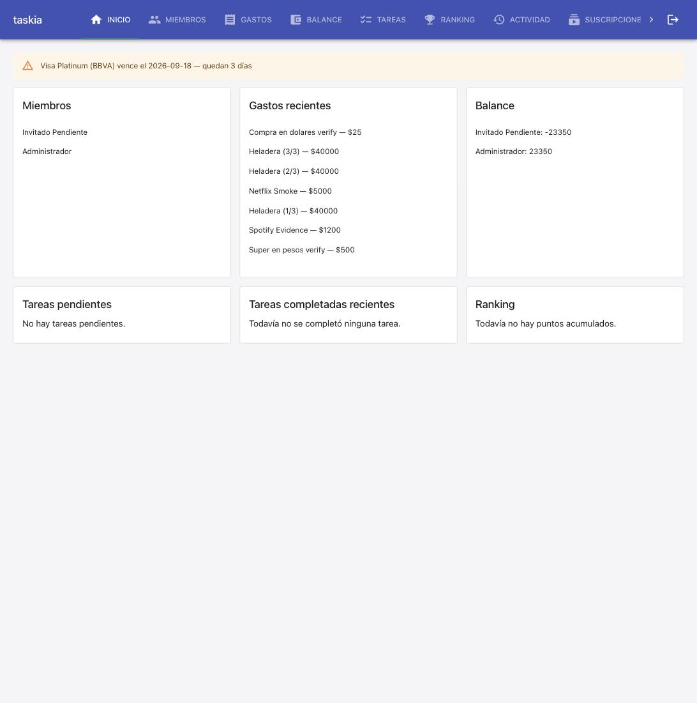

### Goal

Implementar la spec tarjetas-credito completa: T1 modelo TarjetaCredito + migración 0011, T2 tarjeta_service (CRUD + obtener_tarjetas_con_alerta), T3 rutas API + dashboard, T4 pantalla Tarjetas + banner en Inicio. Pre-requisito cumplido: main (con gastos-multi-moneda shipped) mergeado a la rama antes de T1, suite completa reverificada en verde.

### Judgment

- **J001** No se agregó guard de rol Administrador en `tarjeta_service` (a diferencia de `suscripcion_service`) — REQ-001 dice explícitamente "un miembro puede registrar una tarjeta", sin mención de rol. Se reutilizó `requiere_membresia_activa` (mismo criterio que `gasto_service`/`tarea_service`: cualquier miembro activo, no solo admin). Deviation dentro de la clase `spec-deviation`, settleable en L2 (trust: semi-autonomous).
- **J002** `TarjetaAlertaOut` (y `TarjetaOut`) se mantienen en snake_case sin alias en sus propios campos — solo el campo contenedor `tarjetas_con_alerta` de `DashboardOut` se camelCasea a `tarjetasConAlerta`. Mismo criterio que `GastoOut` anidado dentro de `gastosRecientes` (snake_case), no el de `RankingEntryOut` (que sí aliasa su único campo). spec.md/00-overview.md no especificaban esto explícitamente; se siguió la convención dominante del código existente.
- **J003** Migración `0011_tarjetas_credito` confirmada contra `src/db/migrate.py` real (no asumida ciegamente): `gastos-multi-moneda` había tomado `0010`, dejando `0011` como el próximo número libre — coincide con lo que el spec ya anticipaba como fallback.

### Observations

- El proyecto no tiene tooling de coverage instalado (`stack.yaml` `quality_tools.coverage.tool: null`) a pesar de que `nybo.config.yaml` declara `testing.coverage_threshold: 80` — gap preexistente detectado nuevamente durante esta spec (no introducido por ella). Remedio: `/nybo-brownfield-bootstrap --quality`, fuera del alcance de este build.

### Verification

### Verificación (cycle 1)

**Build**
- `npm run build` (`tsc --noEmit && vite build`) — sin errores. 650 módulos, bundle 480.89 kB (gzip 146.94 kB).
- `npm run lint` (`eslint src/frontend`) — sin errores.

**Tests**
- Backend: `.venv/bin/python3 -m pytest tests/` — **223 passed, 1 skipped** (el skip es `test_dsn_externa_nunca_se_toca_directamente`, que requiere `DATABASE_URL` apuntando a Postgres directo, no aplica corriendo con el fallback SQLite).
- Frontend: `npm run test -- --run` (vitest) — **91 passed** (18 archivos).
- Migración `0011_tarjetas_credito` — idempotencia verificada contra Postgres real (contenedor `postgres:16-alpine` efímero vía docker): `tests/integration/db/postgres_migrations.test.py` corre `run_migrations` 3 veces seguidas sin excepción, confirma FKs reales `tarjetas_credito.casa_id -> casas`/`tarjetas_credito.miembro_id -> miembros`, y nullability correcta (`fecha_cierre_actual`/`fecha_vencimiento_actual` NOT NULL, `saldo_actual_ars`/`saldo_actual_usd` nullable) — **2 passed, 1 skipped**.

**Test cases (spec.md, TC-001 a TC-009)** — las 9 son `[INTEGRATION]`/`[UNIT]`, ninguna `[E2E]`/`[MANUAL]`; las 9 resuelven a un test automatizado real:
| TC | Cubierta por |
|---|---|
| TC-001 | `tests/integration/services/tarjeta_service.test.py::test_tc001_...`, `tests/integration/api/tarjetas_routes.test.py::test_tc001_...` |
| TC-002 | `tarjeta_service.test.py::test_tc002_...`, `tarjetas_routes.test.py::test_tc002_...` |
| TC-003 | `tarjeta_service.test.py::test_tc003_...`, `tarjetas_routes.test.py::test_tc003_...` |
| TC-004 | `tarjeta_service.test.py::test_tc004_...`, `tarjetas_routes.test.py::test_tc004_...` |
| TC-005 | `tarjeta_service.test.py::test_tc005_vence_en_3_dias_...` |
| TC-006 | `tarjeta_service.test.py::test_tc006_ya_vencida_...` (+ caso límite "vence hoy") |
| TC-007 | `tarjeta_service.test.py::test_tc007_vence_en_20_dias_...` (+ caso límite "vence justo en el umbral") |
| TC-008 | `tests/unit/frontend/InicioCasa.test.tsx` — "renderiza el banner de alerta..." + "marca con severidad error..." |
| TC-009 | `tests/unit/frontend/Tarjetas.test.tsx` — "TC-009: crear una tarjeta desde el formulario..." |

Coverage tool: no configurado en este proyecto (`stack.yaml` `quality_tools.coverage.tool: null`) — gap preexistente, no introducido por esta spec; ver Observación abajo. `nybo.config.yaml` declara `testing.coverage_threshold: 80` pero no hay tooling instalado para medirlo — remedio: `/nybo-brownfield-bootstrap --quality` (fuera del alcance de este build).

**Live evidence (smoke manual, REQ-004/Outcome)**
Entorno ya arriba (`docker compose`, probado con `GET /health` y `GET /` antes de tocar nada — nunca reiniciado): backend (`:8000`, uvicorn `--reload`, recogió los cambios de código vía bind mount y volvió a aplicar migraciones en el restart automático — confirmado `tarjetas_credito` existe en la base real vía `psql \dt`) + frontend (`:5173`).

Ruta completa manejada con un browser real (Chrome vía extensión), un solo pase, de punta a punta:
1. Login ya activo (sesión de smoke test previa) → "Casa Smoke Test".
2. Navegación a "Tarjetas" (nueva sección en el nav, confirmada visible).
3. Alta de una tarjeta real vía el formulario: BBVA / Visa Platinum / •••• 1234 / cierre 25/08/2026 / vencimiento 18/09/2026 (3 días desde "hoy", 2026-09-15) → `POST /casas/{id}/tarjetas` → 201 → aparece en el listado (TC-009 en vivo).
4. Navegación a "Inicio" → banner de alerta renderizado: **"Visa Platinum (BBVA) vence el 2026-09-18 — quedan 3 días"**, severidad warning (naranja) — coincide textualmente con el `## Outcome` de spec.md.
5. Verificado en la base real (`psql`) que la fila persistió correctamente.
6. Limpieza: tarjeta eliminada (soft-delete) vía el botón "Eliminar" de la propia pantalla, dejando el entorno compartido de dev como estaba.

Screenshot: 

**Resultado**: OUTCOME observado — verde en todos los niveles (unit, integration, migración contra Postgres real, UI en vivo).

### Curation

Se extrajeron 2 convenciones a memoria de proyecto: [SERV-03] (services.md) — cómo decidir entre `_validar_actor_admin` y `requiere_membresia_activa` por spec, no por forma del recurso; [API-01] (api.md) — el alias camelCase de `DashboardOut` aplica solo al campo contenedor top-level, nunca a los objetos anidados (salvo que ese schema anidado ya lo declare). Ambas con confidence: medium (una sola feature las estableció hasta ahora).
