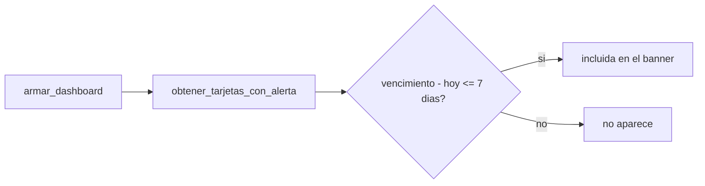

# Solution Overview — Gestión de tarjetas de crédito y alerta de vencimiento

## File Index
- [../spec.md](../spec.md)
- [10-verify.md](10-verify.md)
- [99-progress.md](99-progress.md)

### Task Index

| Task | File | Description | Dependencies |
|---|---|---|---|
| T1 | [01-plan-01-modelo-tarjeta.md](01-plan-01-modelo-tarjeta.md) | Modelo `TarjetaCredito` + migración | — |
| T2 | [01-plan-02-tarjeta-service.md](01-plan-02-tarjeta-service.md) | `tarjeta_service` (CRUD + cálculo de alerta) | T1 |
| T3 | [01-plan-03-api-tarjetas.md](01-plan-03-api-tarjetas.md) | Rutas de tarjetas; dashboard expone tarjetas con alerta | T2 |
| T4 | [01-plan-04-frontend-tarjetas.md](01-plan-04-frontend-tarjetas.md) | Pantalla "Tarjetas"; banner en Inicio | T3 |

## Problema y solución
`TarjetaCredito` es una entidad nueva e independiente (no una extensión
de `Gasto`/`Miembro`): tiene su propio ciclo de vida (alta, edición de
cierre/vencimiento, baja) que no depende de que exista ningún gasto
todavía. `tarjeta_service.obtener_tarjetas_con_alerta(casa_id)` calcula,
en tiempo real (sin job ni scheduler — mismo criterio que
`suscripcion_service.generar_gastos_pendientes`, "lazy" en vez de
programado), qué tarjetas activas vencen dentro de `UMBRAL_ALERTA_DIAS =
7` o ya vencieron. `dashboard_service.armar_dashboard` la llama junto al
resto de las secciones, y `InicioCasa.tsx` renderiza un `Alert` de MUI
por cada una.

## Arquitectura
Componente nuevo: `tarjeta_service.py` + `TarjetaCredito` (mismo patrón
que `suscripcion_service.py`/`Suscripcion` — servicio propio, no
mezclado con `gasto_service`). `dashboard_service.py` se extiende
(agrega una sección más, mismo criterio que las 5 existentes) —
`DashboardCasa` gana el campo `tarjetas_con_alerta`.

## Data Model
`TarjetaCredito` (`src/db/models/tarjeta_credito.py`, tabla `tarjetas_credito`):
- `id`, `casa_id` (FK `casas.id`), `miembro_id` (FK `miembros.id`, dueño).
- `banco: str`, `nombre: str` (ej. "Visa Platinum"), `ultimos_digitos: str(4)`.
- `fecha_cierre_actual: date`, `fecha_vencimiento_actual: date`.
- `saldo_actual_ars: Numeric(12,2), nullable`, `saldo_actual_usd: Numeric(12,2), nullable`.
- `activa: bool, default True`.
- `creado_en: datetime`.
- Migración `0011_tarjetas_credito.py` — tabla nueva, mismo patrón que `0009_suscripciones.py` (FKs reales vía SQL crudo dentro de la misma migración, porque `casas`/`miembros` ya existen para ese momento).

## Tradeoffs
- **Umbral de alerta fijo (7 días), no configurable por el usuario en
  esta spec** — mantiene el alcance acotado; una preferencia por casa/
  tarjeta queda fuera, documentado como posible mejora futura.
- **Sin job/scheduler, cálculo on-demand al armar el dashboard** — mismo
  criterio ya establecido para suscripciones; visitar solo otra pantalla
  (ej. Balance) no dispara el cálculo, limitación ya aceptada en el
  proyecto para este tipo de lógica derivada.
- **Actualización de cierre/vencimiento es manual en esta spec** — la
  actualización automática al importar un PDF es responsabilidad de
  `importar-resumen-tarjeta` (spec dependiente), no de ésta.

## API/Data Contracts
- `POST/GET/PATCH/DELETE /casas/{id}/tarjetas` — CRUD estándar, mismo
  patrón que `/casas/{id}/suscripciones`.
- `DashboardResponse.tarjetas_con_alerta: List[TarjetaAlertaOut]` —
  `{id, nombre, banco, fecha_vencimiento_actual, dias_para_vencimiento,
  vencida: bool}` (aditivo).
