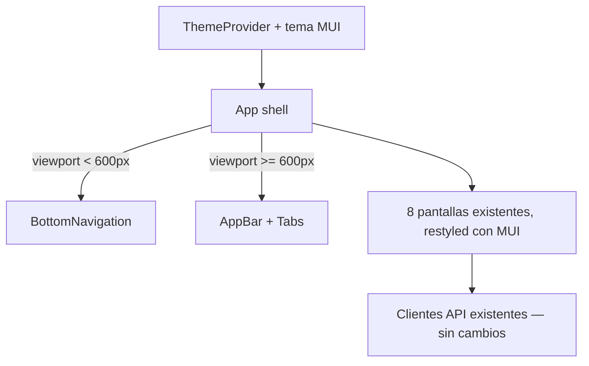

# Modernización de la UI — Solution Overview

## File Index
- [spec.md](../spec.md)
- [10-verify.md](10-verify.md)
- [99-progress.md](99-progress.md)

### Task Index
| Task | File | Description | Dependencies |
|---|---|---|---|
| T1 | [01-plan-01-design-system-shell.md](01-plan-01-design-system-shell.md) | MUI + tema + shell responsivo (bottom nav / top bar) + CrearCasa | — |
| T2 | [01-plan-02-gastos-screens.md](01-plan-02-gastos-screens.md) | Restyle: Miembros, Gastos, Balance | T1 |
| T3 | [01-plan-03-tareas-dashboard-screens.md](01-plan-03-tareas-dashboard-screens.md) | Restyle: Tareas, Ranking, InicioCasa, HistorialActividad | T1 |
| T4 | [01-plan-04-responsive-polish.md](01-plan-04-responsive-polish.md) | Pulido responsivo + adaptar tests existentes + docs | T2, T3 |

## Problem & Solution
- La UI actual es HTML plano (sin CSS) con una fila de botones como navegación — inutilizable cómodamente en mobile.
- Se instala Material UI (`@mui/material`, `@mui/icons-material`, `@emotion/react`, `@emotion/styled`) y se define un tema único (`src/frontend/theme.ts`) con paleta y tipografía consistentes.
- El shell de navegación (`App.tsx`) usa `useMediaQuery` sobre el breakpoint `sm` de MUI para decidir entre `BottomNavigation` (mobile) y una `AppBar` con tabs (desktop) — mismas 7 secciones, mismo estado de navegación ya existente.
- Cada pantalla se reconstruye con componentes MUI (`TextField`, `Button`, `List`, `Table`, `Card`) manteniendo exactamente las mismas llamadas a los clientes de API ya existentes (`casasClient.ts`, `gastosClient.ts`, `tareasClient.ts`, `dashboardClient.ts`) — solo cambia el markup/estilo, nunca la lógica de datos.

## Architecture

## UX/UI
- **Mobile (< 600px)**: `BottomNavigation` fija al pie con 7 íconos (Inicio, Miembros, Gastos, Balance, Tareas, Ranking, Actividad), contenido scrolleable arriba.
- **Desktop (≥ 600px)**: `AppBar` superior con las mismas 7 secciones como tabs horizontales.
- Formularios (`CrearCasa`, alta de miembro, registro de gasto, alta de tarea) usan `TextField`/`Select`/`Checkbox` de MUI con validación visual inline (helper text) en vez de errores solo por texto plano.
- Listas y tablas (miembros, gastos, tareas, ranking, actividad) usan `List`/`Table` de MUI con espaciado y tipografía consistentes.
- No se agrega ninguna pantalla de login/registro — eso es scope de la spec de Auth siguiente, que reutiliza este mismo tema y componentes.

## Tradeoffs
- Se elige Material UI sobre Chakra (ambas eran opciones válidas) por su componente `BottomNavigation` nativo, que resuelve directamente el patrón de navegación pedido sin construirlo a mano.
- Se elige un componente de librería (MUI) sobre Tailwind: prioriza velocidad de entrega con componentes accesibles ya resueltos sobre control fino de cada clase CSS — aceptable dado que no hay un sistema de diseño propio previo que preservar.
- El breakpoint de MUI (`sm`, 600px) se usa tal cual, sin definir uno custom — evita una decisión de diseño no pedida por el usuario.

## API/Data Contracts
Ninguno nuevo — esta spec no toca el backend ni los contratos de API existentes.

## Service Integrations
Ninguna — reutiliza los clientes de API ya existentes (`src/frontend/api/*.ts`) sin modificarlos.
