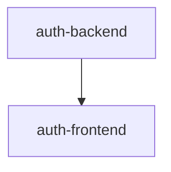

# Plan — Usuarios y Autenticación

feature_kind: multi_spec

## Feature Branch
`feat/usuarios-auth`

## Sub-Spec DAG

| Spec | Branch | Depends on |
|---|---|---|
| auth-backend | feat/usuarios-auth--auth-backend | — |
| auth-frontend | feat/usuarios-auth--auth-frontend | auth-backend |

## Split Rationale

**auth-backend** — pasa las tres pruebas: es un entregable independiente (JWT, registro y login son probables y usables vía API sin que exista ninguna pantalla); es revisable de forma independiente (el esquema de Usuario, el flujo de JWT y la migración de las rutas existentes se entienden sin leer la spec de frontend); separa una preocupación real — la superficie de API/autenticación — de la superficie de UI.

**auth-frontend** — entregable independiente en el sentido de que las pantallas de login/registro y el manejo de sesión son un cambio de UI concreto y revisable por sí solo (aunque solo cobran valor real una vez que `auth-backend` existe, exactamente como el ejemplo canónico "OAuth backend + settings-page UI"); revisable sin necesidad de leer el detalle del hashing de contraseñas o el esquema JWT del backend; separa la preocupación de presentación/sesión de la de autenticación en el servidor.

## Dependencia externa (fuera del DAG de esta feature)

`auth-frontend` reutiliza el sistema de diseño (tema MUI, shell de navegación) de la feature `ui-modernization` — no es una dependencia del DAG de `usuarios-auth` (es de otra feature), pero condiciona el orden de build real: `ui-modernization` debe estar mergeada antes de construir `auth-frontend`, tal como el usuario ya definió el orden (Docker/Make → UI moderna → Auth).

## Alcance y ruptura de compatibilidad

Esta feature reemplaza el mecanismo placeholder `X-Usuario-Id` (usado por las 4 specs ya shippeadas de `gestion-domestica`) por autenticación real vía JWT. Es un cambio de ruptura deliberado sobre código ya shippeado — no un bug ni un tweak, sino la implementación de un requerimiento nuevo (autenticación) que necesariamente toca las rutas existentes. Ningún comportamiento de negocio de esas 4 specs cambia (mismas reglas de roles, balance, puntos, etc.) — solo cómo se identifica al actor.
