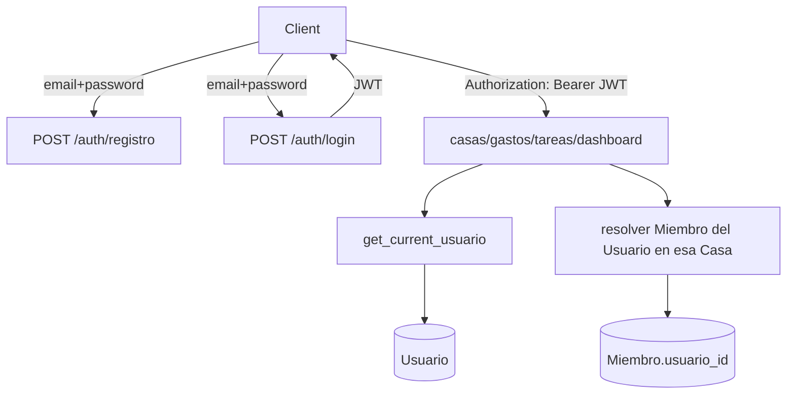
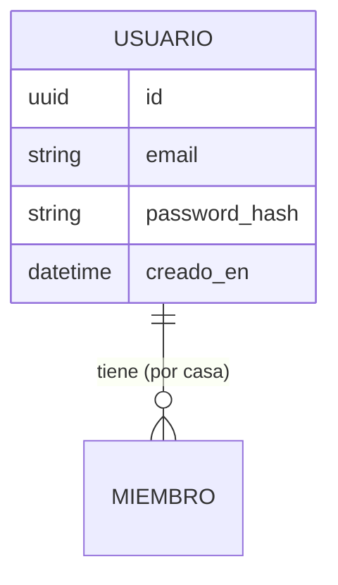

# Autenticación — Backend — Solution Overview

## File Index
- [spec.md](../spec.md)
- [10-verify.md](10-verify.md)
- [99-progress.md](99-progress.md)

### Task Index
| Task | File | Description | Dependencies |
|---|---|---|---|
| T1 | [01-plan-01-usuario-model.md](01-plan-01-usuario-model.md) | Modelo Usuario + migración + FK Miembro.usuario_id | — |
| T2 | [01-plan-02-auth-service.md](01-plan-02-auth-service.md) | Servicio de registro, login, hashing y JWT | T1 |
| T3 | [01-plan-03-auth-routes-migration.md](01-plan-03-auth-routes-migration.md) | Endpoints /auth/* + migrar las 4 rutas existentes a JWT | T2 |
| T4 | [01-plan-04-multi-casa-linking.md](01-plan-04-multi-casa-linking.md) | crear_casa/agregar_miembro vinculan al Usuario real + GET /casas/mias | T3 |

## Problem & Solution
- Hoy `X-Usuario-Id` acepta cualquier UUID sin verificar identidad — no hay autenticación real.
- Se agrega `Usuario` (tabla nueva: id, email único, password_hash) y `Miembro.usuario_id` (FK nueva, nullable en la migración por los datos ya sembrados manualmente en pruebas, pero requerida para todo alta nueva).
- `POST /auth/registro` crea un Usuario; `POST /auth/login` verifica credenciales y emite un JWT (`sub` = usuario_id, expiración corta).
- Un `get_current_usuario` (dependency de FastAPI) decodifica el JWT en cada request y reemplaza el `Header(..., alias="X-Usuario-Id")` que hoy usan `casas.py`, `gastos.py`, `tareas.py` y `dashboard.py`.
- `crear_casa`/`agregar_miembro` (ya existentes en `casas-miembros`) se ajustan para vincular el Miembro creado al `usuario_id` real en vez de aceptar cualquier UUID del cliente.

## Architecture

## Data Model

## Tradeoffs
- Nuevas dependencias: `pyjwt` (emitir/verificar JWT) y `bcrypt` (hashear contraseñas) — ninguna estaba en `requirements.txt`; se agregan porque el mecanismo de auth elegido (email+contraseña, JWT) las requiere directamente, no son una elección de conveniencia.
- El JWT no se invalida server-side (sin lista de revocación) — expiración corta (ej. 24h) como mitigación simple; una lista de revocación queda fuera de alcance de esta primera versión.
- `Miembro.usuario_id` se agrega como columna nullable en la migración (no se fuerza un backfill de datos históricos, ya que este proyecto no tiene datos de producción reales) pero el código de aplicación siempre la completa en toda alta nueva.

## API/Data Contracts
| Método | Ruta | Body | Respuesta |
|---|---|---|---|
| POST | /auth/registro | `{email, password, nombre}` | `{id, email}` (201) o 409 si el email ya existe |
| POST | /auth/login | `{email, password}` | `{access_token, token_type: "bearer"}` (200) o 401 |
| GET | /casas/mias | — | `Casa[]` donde el usuario autenticado tiene un Miembro activo |
| * | /casas, /casas/{id}/... (todas las rutas existentes) | — | Ahora requieren `Authorization: Bearer <jwt>` en vez de `X-Usuario-Id`; 401 sin JWT válido |

## Service Integrations
Ninguna externa — JWT y hashing son locales, sin proveedor de identidad de terceros (decisión ya tomada: no OAuth social en esta primera versión).
