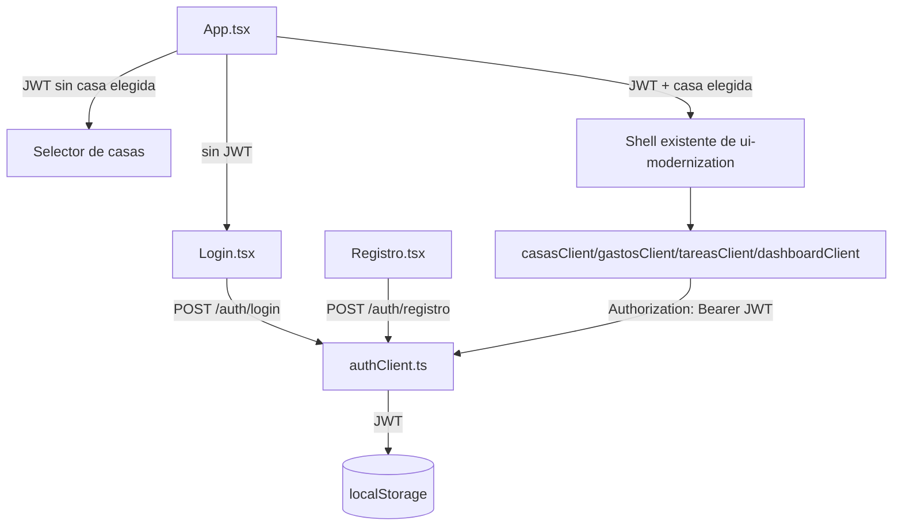

# Autenticación — Frontend — Solution Overview

## File Index
- [spec.md](../spec.md)
- [10-verify.md](10-verify.md)
- [99-progress.md](99-progress.md)

### Task Index
| Task | File | Description | Dependencies |
|---|---|---|---|
| T1 | [01-plan-01-login-registro-screens.md](01-plan-01-login-registro-screens.md) | Pantallas Login y Registro (MUI) | — |
| T2 | [01-plan-02-session-jwt.md](01-plan-02-session-jwt.md) | Sesión JWT: guardar, enviar, logout automático en 401 | T1 |
| T3 | [01-plan-03-selector-casas-shell-gate.md](01-plan-03-selector-casas-shell-gate.md) | Selector de casas + gate del shell existente | T2 |
| T4 | [01-plan-04-tests-docs.md](01-plan-04-tests-docs.md) | Adaptar tests existentes + docs | T3 |

## Problem & Solution
- Hoy `App.tsx` genera un `usuarioId` aleatorio en cada carga (`crypto.randomUUID()`) — sin sesión real.
- Se agregan pantallas `Login.tsx`/`Registro.tsx` (Material UI, mismo tema de `ui-modernization`) que llaman a `POST /auth/login`/`POST /auth/registro` del backend de `auth-backend`.
- El JWT recibido se guarda en `localStorage`; un nuevo `authClient.ts` centraliza el fetch con el header `Authorization: Bearer <jwt>` en vez de `X-Usuario-Id`, y todos los clientes existentes (`casasClient.ts`, `gastosClient.ts`, `tareasClient.ts`, `dashboardClient.ts`) pasan a usarlo.
- `App.tsx` pasa a ser un gate: sin JWT → `Login`; con JWT y sin casa seleccionada → selector de casas; con casa seleccionada → el shell existente (sin cambios de esta spec en su lógica de navegación interna, ya resuelta por `ui-modernization`).

## Architecture

## UX/UI
- **Login**: email + contraseña (`TextField` MUI), botón "Ingresar", link a Registro.
- **Registro**: nombre + email + contraseña (`TextField` MUI), botón "Crear cuenta", link a Login.
- **Selector de casas**: lista (`List`/`Card`) de las casas del usuario + botón "Crear nueva casa" (reutiliza `CrearCasa.tsx` de `ui-modernization`).
- Ambas pantallas nuevas usan el mismo `theme.ts` de `ui-modernization` — ninguna paleta/tipografía nueva.

## Tradeoffs
- El JWT se guarda en `localStorage` (no una cookie httpOnly) — más simple de implementar en un cliente 100% SPA sin backend-for-frontend, aceptando el tradeoff de exposición a XSS que una cookie httpOnly evitaría; fuera de alcance de esta versión endurecer eso.
- No hay refresh token — al expirar el JWT (24h, definido en `auth-backend`), el usuario simplemente vuelve a loguearse. Aceptable para una primera versión.

## API/Data Contracts
Ninguno nuevo — consume los endpoints de `auth-backend`: `POST /auth/registro`, `POST /auth/login`, y `GET /casas/mias` (agregado en `auth-backend` T4 específicamente para que este selector tenga de dónde leer).

## Service Integrations
Ninguna externa.
